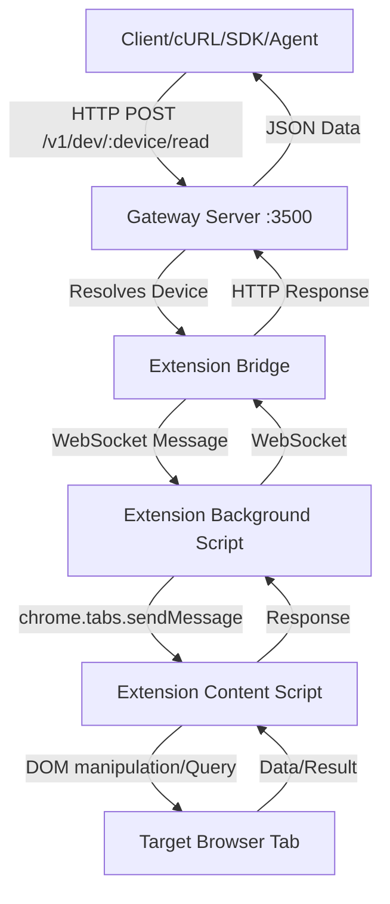

# PingOS Codebase Deep Dive

## 1. Architectural Overview & Data Flow
**PingOS** turns the web into a programmable API using an ahead-of-time web-to-API compilation model.

### Data Flow Diagram

### The Onboarding Story
1. **Installation**: A user clones the repo and runs `npm install` & `npm run build`.
2. **Startup**: The user runs `npx pingos up`. This starts the gateway server (Fastify) on port 3500 and launches a Chrome instance with the MV3 extension loaded.
3. **Discovery**: The user shares a tab via the extension popup. The tab connects to the gateway via WebSocket, registering a `deviceId` (e.g., `chrome-123`).
4. **Execution**: The user sends HTTP requests to the gateway (`curl -X POST http://localhost:3500/v1/dev/chrome-123/extract`).
5. **Automation**: Users can generate 'PingApps' (compiled website drivers) so that subsequent interactions use cached selectors instead of LLM inference.

### Key Configuration Options & Environment Variables
- **`PINGOS_PORT`**: The port the gateway runs on (default: `3500`).
- **`OPENROUTER_API_KEY`**, **`ANTHROPIC_API_KEY`**, **`OPENAI_API_KEY`**: API keys for AI extraction and self-healing.
- **`PINGOS_STORE_DIR`**: Path to store cached configurations, PingApps, and pipelines (default: `~/.pingos` or `.pingos/`).
Configuration is centrally loaded in `packages/std/src/config.ts`.

### Key API Endpoints
- **`GET /v1/health`**: Gateway health status.
- **`GET /v1/devices`**: Lists connected browser tabs.
- **`POST /v1/dev/:device/:op`**: Generic device operation (e.g., `extract`, `click`, `type`, `read`).
- **`POST /v1/pipelines/run`**: Run a cross-tab data pipeline.
- **`POST /v1/functions/:app/call`**: Call a Tab-as-a-Function registered PingApp endpoint.

### Key Design Decisions & Patterns
- **Ahead-of-Time (AOT) Compilation**: Avoids LLM costs at runtime by pre-compiling site interaction flows.
- **Shadow DOM Piercing**: A custom `>>>` combinator ensures extraction works seamlessly across modern web components.
- **CDP Fallback**: When Content Security Policies block script execution or inline evaluation, operations automatically fall back to the Chrome DevTools Protocol via the background script.
- **Self-Healing Selectors**: If a selector fails at runtime, an LLM repairs it based on the current DOM context, and the fix is cached.

--- 

## 2. File-by-File Codebase Analysis

### Standard Library / Gateway (packages/std/src)

#### `packages/std/src/__tests__/discover-engine.test.ts`
- **Purpose**: @pingdev/std — Tests for Zero-Shot Site Adaptation (discover engine)
- **Architecture Fit**: Core Gateway component providing services, caching, or logic for web automation.
- **Key Exports**: (None or internal)
- **Dependencies**: `vitest`, `../discover-engine.js`

#### `packages/std/src/__tests__/ext-bridge.test.ts`
- **Purpose**: @pingdev/std — Extension bridge integration tests Tests WebSocket communication and device routing
- **Architecture Fit**: Core Gateway component providing services, caching, or logic for web automation.
- **Key Exports**: (None or internal)
- **Dependencies**: `vitest`, `fastify`, `ws`, `../gateway.js`, `../registry.js`, `../ext-bridge.js`

#### `packages/std/src/__tests__/function-registry.test.ts`
- **Purpose**: @pingdev/std — Tests for Tab-as-a-Function (function registry)
- **Architecture Fit**: Core Gateway component providing services, caching, or logic for web automation.
- **Key Exports**: (None or internal)
- **Dependencies**: `vitest`, `../function-registry.js`

#### `packages/std/src/__tests__/gateway.test.ts`
- **Purpose**: @pingdev/std — Gateway integration tests Tests the Fastify gateway end-to-end with the live Gemini PingApp on :3456
- **Architecture Fit**: Core Gateway component providing services, caching, or logic for web automation.
- **Key Exports**: (None or internal)
- **Dependencies**: `vitest`, `fastify`, `node:http`, `../gateway.js`, `../registry.js`, `../drivers/pingapp-adapter.js`

#### `packages/std/src/__tests__/lmstudio.test.ts`
- **Purpose**: @pingdev/std — LM Studio adapter unit tests Tests constructor, health, listModels, and execute with mocked fetch
- **Architecture Fit**: Core Gateway component providing services, caching, or logic for web automation.
- **Key Exports**: (None or internal)
- **Dependencies**: `vitest`, `../drivers/lmstudio.js`, `../types.js`

#### `packages/std/src/__tests__/novel-features.test.ts`
- **Purpose**: @pingdev/std — Novel features integration tests Tests request validation (400) and device-not-found (404) for: POST /v1/dev/:device/query POST /v1/dev/:device/watch POST /v1/dev/:device/diff GET  /v1/dev/:device/discover POST /v1/apps/generate Uses Fastify inject() for fast, network-free assertions. Imports from dist/ to pick up the latest compiled gateway (the src/*.js files may be stale when gateway.ts has been updated).
- **Architecture Fit**: Core Gateway component providing services, caching, or logic for web automation.
- **Key Exports**: (None or internal)
- **Dependencies**: `vitest`, `fastify`, `../registry.js`, `../gateway.js`, `../types.js`

#### `packages/std/src/__tests__/openai.test.ts`
- **Purpose**: Build a minimal adapter with the given overrides.
- **Architecture Fit**: Core Gateway component providing services, caching, or logic for web automation.
- **Key Exports**: (None or internal)
- **Dependencies**: `vitest`, `../drivers/openai.js`, `../types.js`

#### `packages/std/src/__tests__/pingapp-generator.test.ts`
- **Purpose**: @pingdev/std — Tests for PingApp Generator
- **Architecture Fit**: Core Gateway component providing services, caching, or logic for web automation.
- **Key Exports**: (None or internal)
- **Dependencies**: `vitest`, `../pingapp-generator.js`, `../types.js`

#### `packages/std/src/__tests__/pipeline-engine.test.ts`
- **Purpose**: @pingdev/std — Tests for Cross-Tab Data Pipes (pipeline engine)
- **Architecture Fit**: Core Gateway component providing services, caching, or logic for web automation.
- **Key Exports**: (None or internal)
- **Dependencies**: `vitest`, `../pipeline-engine.js`, `../types.js`

#### `packages/std/src/__tests__/replay-engine.test.ts`
- **Purpose**: @pingdev/std — Tests for Record/Replay Engine
- **Architecture Fit**: Core Gateway component providing services, caching, or logic for web automation.
- **Key Exports**: (None or internal)
- **Dependencies**: `vitest`, `../replay-engine.js`, `../types.js`

#### `packages/std/src/__tests__/unit.test.ts`
- **Purpose**: @pingdev/std — Unit tests (NO external services required) Tests: registry, routing strategies, error construction, capability matching, gateway with mock driver
- **Architecture Fit**: Core Gateway component providing services, caching, or logic for web automation.
- **Key Exports**: (None or internal)
- **Dependencies**: `vitest`, `fastify`, `../registry.js`, `../gateway.js`

#### `packages/std/src/__tests__/watch-manager.test.ts`
- **Purpose**: @pingdev/std — Tests for Real-Time Page Subscriptions (watch manager)
- **Architecture Fit**: Core Gateway component providing services, caching, or logic for web automation.
- **Key Exports**: (None or internal)
- **Dependencies**: `vitest`, `../watch-manager.js`, `../types.js`

#### `packages/std/src/app-routes.ts`
- **Purpose**: PingApp Routes — High-level app actions mounted on the gateway Pattern: /v1/app/:appName/:action Each app is a "device driver" for a website — named actions instead of raw selectors. Currently: aliexpress Future: claude, amazon, perplexity, twitter, etc.
- **Architecture Fit**: Core Gateway component providing services, caching, or logic for web automation.
- **Key Exports**: `const PINGAPP_FUNCTION_DEFS`, `function registerAppRoutes`
- **Dependencies**: `fastify`

#### `packages/std/src/cdp-fallback.ts`
- **Purpose**: Resolve a PingOS deviceId (e.g. "chrome-1234") to a CDP target.
- **Architecture Fit**: Core Gateway component providing services, caching, or logic for web automation.
- **Key Exports**: `interface CDPFallbackResult`
- **Dependencies**: `./gw-log.js`

#### `packages/std/src/config.ts`
- **Purpose**: @pingdev/std — Configuration types and loader Config location: ~/.pingos/config.json
- **Architecture Fit**: Core Gateway component providing services, caching, or logic for web automation.
- **Key Exports**: `interface DriverConfig`, `interface LLMProviderConfig`, `interface PingOSConfig`, `const DEFAULT_CONFIG`
- **Dependencies**: `node:fs/promises`, `node:path`, `node:os`, `./types.js`

#### `packages/std/src/discover-engine.ts`
- **Purpose**: Zero-Shot Site Adaptation — Heuristic page-type detection and schema generation. Runs entirely in the gateway by analyzing DOM data returned from the extension's content script. No LLM calls needed — pure heuristic pattern matching in <100ms. The content script sends back a lightweight DOM snapshot (via the "discover" op) containing: visible text, tag structure, meta tags, JSON-LD, and interactive elements. This module classifies the page type and generates extraction schemas.
- **Architecture Fit**: Core Gateway component providing services, caching, or logic for web automation.
- **Key Exports**: `function buildDiscoverSummaryForLLM`, `function discoverPage`
- **Dependencies**: `./types.js`, `./local-mode.js`

#### `packages/std/src/drivers/anthropic.ts`
- **Purpose**: @pingdev/std — Anthropic driver adapter Direct Anthropic API access with streaming and thinking support
- **Architecture Fit**: Core Gateway component providing services, caching, or logic for web automation.
- **Key Exports**: `interface AnthropicAdapterOptions`, `class AnthropicAdapter`
- **Dependencies**: `../errors.js`

#### `packages/std/src/drivers/index.ts`
- **Purpose**: @pingdev/std — Driver adapter exports
- **Architecture Fit**: Core Gateway component providing services, caching, or logic for web automation.
- **Key Exports**: (None or internal)
- **Dependencies**: (None)

#### `packages/std/src/drivers/lmstudio.ts`
- **Purpose**: @pingdev/std — LM Studio driver adapter Local LM Studio server with OpenAI-compatible API
- **Architecture Fit**: Core Gateway component providing services, caching, or logic for web automation.
- **Key Exports**: `interface LMStudioAdapterOptions`, `class LMStudioAdapter`
- **Dependencies**: `../errors.js`

#### `packages/std/src/drivers/openai-compat.ts`
- **Purpose**: @pingdev/std — OpenAI-compatible driver adapter Works with Ollama, LM Studio, OpenRouter, and any OpenAI-format API
- **Architecture Fit**: Core Gateway component providing services, caching, or logic for web automation.
- **Key Exports**: `interface OpenAICompatAdapterOptions`, `class OpenAICompatAdapter`
- **Dependencies**: `../errors.js`

#### `packages/std/src/drivers/openai.ts`
- **Purpose**: @pingdev/std — OpenAI Direct driver adapter Direct OpenAI API access with streaming support
- **Architecture Fit**: Core Gateway component providing services, caching, or logic for web automation.
- **Key Exports**: `interface OpenAIAdapterOptions`, `class OpenAIAdapter`
- **Dependencies**: `../errors.js`

#### `packages/std/src/drivers/openrouter.ts`
- **Purpose**: @pingdev/std — OpenRouter driver Extends OpenAICompatAdapter with OpenRouter-specific headers.
- **Architecture Fit**: Core Gateway component providing services, caching, or logic for web automation.
- **Key Exports**: `interface OpenRouterAdapterOptions`, `class OpenRouterAdapter`
- **Dependencies**: `../errors.js`

#### `packages/std/src/drivers/pingapp-adapter.ts`
- **Purpose**: @pingdev/std — PingApp driver adapter Wraps existing PingApps running on localhost ports via their HTTP API
- **Architecture Fit**: Core Gateway component providing services, caching, or logic for web automation.
- **Key Exports**: `interface PingAppAdapterOptions`, `class PingAppAdapter`
- **Dependencies**: `../errors.js`

#### `packages/std/src/errors.ts`
- **Purpose**: @pingdev/std — POSIX-style error constructors and HTTP mapping Dual-error design: errno for machine routing + code for human debugging
- **Architecture Fit**: Core Gateway component providing services, caching, or logic for web automation.
- **Key Exports**: `function mapErrnoToHttp`, `function ENOENT`, `function EACCES`, `function EBUSY`, `function ETIMEDOUT`, `function EAGAIN`, `function ENOSYS`, `function ENODEV`, `function EOPNOTSUPP`, `function EIO`, `function ECANCELED`
- **Dependencies**: `./types.js`

#### `packages/std/src/ext-bridge.ts`
- **Purpose**: @pingdev/std — Chrome Extension Auth Bridge (Gateway-side) Manages WebSocket connections from the PingOS Chrome extension and forwards HTTP /v1/dev/:device/:op calls to the owning extension client.
- **Architecture Fit**: Core Gateway component providing services, caching, or logic for web automation.
- **Key Exports**: `interface ExtSharedTab`, `interface ExtHello`, `interface ExtShareUpdate`, `interface ExtDeviceRequest`, `interface ExtDeviceResponse`, `interface ExtPing`, `interface ExtPong`, `class ExtensionBridge`
- **Dependencies**: `node:crypto`, `node:http`, `node:stream`, `ws`, `./errors.js`, `./types.js`, `./gw-log.js`

#### `packages/std/src/function-registry.ts`
- **Purpose**: Tab-as-a-Function — Function Registry Auto-registers PingApps and browser tabs as callable functions. Each tab becomes a set of named functions with typed parameters. Generic tabs get: extract, click, type, read, eval PingApps get their specific endpoints exposed as functions.
- **Architecture Fit**: Core Gateway component providing services, caching, or logic for web automation.
- **Key Exports**: `interface PingAppFunctionDef`, `interface ResolveFunctionResult`, `class FunctionRegistry`
- **Dependencies**: `./types.js`, `./ext-bridge.js`

#### `packages/std/src/gateway.ts`
- **Purpose**: @pingdev/std — Gateway server Fastify-based HTTP gateway that routes requests through the ModelRegistry
- **Architecture Fit**: Control plane: The primary HTTP server that routes client requests to connected devices or AI drivers.
- **Key Exports**: `interface GatewayOptions`, `const gwRec`
- **Dependencies**: `fastify`, `node:url`, `node:crypto`, `node:fs`, `./registry.js`, `./errors.js`, `./types.js`, `./ext-bridge.js`, `./gw-log.js`, `./config.js`, `./selector-cache.js`, `./self-heal.js`, `./app-routes.js`, `./llm.js`, `./local-mode.js`, `./local-prompts.js`, `./json-repair.js`, `./discover-engine.js`, `./function-registry.js`, `./watch-manager.js`, `./pipeline-engine.js`, `./replay-engine.js`, `./pingapp-generator.js`, `./paginate-extract.js`, `./visual-extract.js`, `./cdp-fallback.js`

#### `packages/std/src/gw-log.ts`
- **Purpose**: @pingdev/std — Gateway logging helpers Centralized, ultra-defensive logging. This gateway has been observed to exit silently in some failure modes (e.g. unhandled EventEmitter 'error' events).
- **Architecture Fit**: Core Gateway component providing services, caching, or logic for web automation.
- **Key Exports**: `const GATEWAY_LOG_PATH`, `const CRASH_LOG_PATH`, `function serializeError`, `function logGateway`, `function logCrash`
- **Dependencies**: `node:fs`

#### `packages/std/src/index.ts`
- **Purpose**: @pingdev/std — barrel exports
- **Architecture Fit**: Core Gateway component providing services, caching, or logic for web automation.
- **Key Exports**: (None or internal)
- **Dependencies**: (None)

#### `packages/std/src/json-repair.ts`
- **Purpose**: @pingdev/std — JSON repair helpers for local-model outputs
- **Architecture Fit**: Core Gateway component providing services, caching, or logic for web automation.
- **Key Exports**: `function stripThinkBlocks`, `function stripCodeFences`, `function extractJsonFromText`, `function repairLLMJson`
- **Dependencies**: (None)

#### `packages/std/src/llm.ts`
- **Purpose**: @pingdev/std — Universal LLM caller module Re-uses the fetch-based OpenAI-compatible pattern from self-heal.ts.
- **Architecture Fit**: Core Gateway component providing services, caching, or logic for web automation.
- **Key Exports**: `interface CallLLMOptions`, `interface SuggestResult`, `function extractJSON`, `function getLLMConfig`, `interface VisionContent`, `interface TextContent`, `type MessageContent`, `interface CallLLMVisionOptions`
- **Dependencies**: `./gw-log.js`, `./self-heal.js`, `./local-prompts.js`, `./json-repair.js`

#### `packages/std/src/local-mode.ts`
- **Purpose**: @pingdev/std — Local mode configuration and helpers
- **Architecture Fit**: Core Gateway component providing services, caching, or logic for web automation.
- **Key Exports**: `interface LocalModeConfig`, `function getLocalConfig`, `function isLocalMode`, `function getTimeoutForFeature`, `function getModelForFeature`, `function truncateDom`, `function compressPrompt`
- **Dependencies**: (None)

#### `packages/std/src/local-prompts.ts`
- **Purpose**: @pingdev/std — Prompt templates (cloud + local variants)
- **Architecture Fit**: Core Gateway component providing services, caching, or logic for web automation.
- **Key Exports**: `interface PromptTemplate`, `function getQueryPrompt`, `function getHealPrompt`, `function getSuggestPrompt`, `function getGeneratePrompt`, `function getDiscoverPrompt`, `function getExtractPrompt`, `function getVisualPrompt`, `function getPaginatePrompt`
- **Dependencies**: (None)

#### `packages/std/src/main.ts`
- **Purpose**: @pingdev/std — Gateway entrypoint Starts the HTTP + WebSocket gateway on port 3500 (defaults to dual-stack host ::).
- **Architecture Fit**: Core Gateway component providing services, caching, or logic for web automation.
- **Key Exports**: (None or internal)
- **Dependencies**: `./gateway.js`, `./registry.js`, `./ext-bridge.js`, `./gw-log.js`, `./config.js`, `./drivers/openrouter.js`, `./drivers/openai-compat.js`, `./drivers/anthropic.js`, `./drivers/openai.js`, `./drivers/lmstudio.js`, `./local-mode.js`

#### `packages/std/src/paginate-extract.ts`
- **Purpose**: Multi-Page Extract — orchestrates extraction across paginated content Runs on the gateway side, coordinating extension calls for pagination + extraction.
- **Architecture Fit**: Core Gateway component providing services, caching, or logic for web automation.
- **Key Exports**: `interface PaginateExtractOptions`, `interface PaginateExtractResult`
- **Dependencies**: `./ext-bridge.js`, `./llm.js`, `./local-mode.js`, `./local-prompts.js`, `./json-repair.js`

#### `packages/std/src/pingapp-generator.ts`
- **Purpose**: PingApp Generator — Auto-generate PingApp definitions from recordings. Takes a recording (sequence of user actions with selectors) and produces: - manifest.json with site metadata - workflows/.json with the recorded workflow - selectors.json with all captured selectors - A basic test definition
- **Architecture Fit**: Core Gateway component providing services, caching, or logic for web automation.
- **Key Exports**: `interface GeneratedPingApp`, `interface GeneratePingAppViaLLMInput`, `class PingAppGenerator`
- **Dependencies**: `./types.js`, `./llm.js`, `./local-mode.js`, `./local-prompts.js`, `./json-repair.js`

#### `packages/std/src/pipeline-engine.ts`
- **Purpose**: Cross-Tab Data Pipes — Pipeline Engine Unix pipe-style data flow between browser tabs. Supports: - Sequential and parallel step execution - Variable interpolation between steps ({{variable}} syntax) - Transform steps (string templates, no tab needed) - Error handling per step: skip, abort, retry Pipeline format: { name, steps: [{ id, tab?, op, schema?, template?, input?, output?, onError? }], parallel?: string[] } Pipe shorthand: "extract:amazon:.price | transform:'Deal: {{value}}' | type:slack:#msg"
- **Architecture Fit**: Core Gateway component providing services, caching, or logic for web automation.
- **Key Exports**: `class PipelineEngine`
- **Dependencies**: `./types.js`, `./ext-bridge.js`, `./workflow-engine.js`

#### `packages/std/src/protocol.ts`
- **Purpose**: Operations supported by the content script bridge
- **Architecture Fit**: Core Gateway component providing services, caching, or logic for web automation.
- **Key Exports**: `type BridgeOp`, `interface ReadPayload`, `interface ClickPayload`, `interface TypePayload`, `interface EvalPayload`, `interface ExtractPayload`, `interface WaitForPayload`, `interface NavigatePayload`, `interface ScrollPayload`, `interface BridgeResponse`, `interface HelloMessage`, `interface ShareUpdateMessage`, `interface DeviceRequest`, `interface DeviceResponse`, `interface PingMessage`, `interface PongMessage`
- **Dependencies**: (None)

#### `packages/std/src/registry.ts`
- **Purpose**: @pingdev/std — ModelRegistry: driver registration, lookup, health monitoring
- **Architecture Fit**: Core Gateway component providing services, caching, or logic for web automation.
- **Key Exports**: `class ModelRegistry`
- **Dependencies**: `./errors.js`, `./routing/index.js`

#### `packages/std/src/replay-engine.ts`
- **Purpose**: Record → Replay Engine Takes a recorded action sequence and replays it via the extension bridge. Features: - Selector resilience: tries primary selector, falls back to alternatives - Variable extraction: detects repeated patterns for parameterization - Timing: replay at configurable speed (instant, real-time, custom delays)
- **Architecture Fit**: Core Gateway component providing services, caching, or logic for web automation.
- **Key Exports**: `interface ReplayStepResult`, `interface ReplayResult`, `class ReplayEngine`
- **Dependencies**: `./ext-bridge.js`, `./types.js`

#### `packages/std/src/routing/index.ts`
- **Purpose**: @pingdev/std — Routing module barrel export
- **Architecture Fit**: Core Gateway component providing services, caching, or logic for web automation.
- **Key Exports**: (None or internal)
- **Dependencies**: (None)

#### `packages/std/src/routing/strategies.ts`
- **Purpose**: Mutable state for round-robin rotation.
- **Architecture Fit**: Core Gateway component providing services, caching, or logic for web automation.
- **Key Exports**: `interface RoutingState`, `function resolveStrategy`
- **Dependencies**: `../types.js`

#### `packages/std/src/selector-cache.ts`
- **Purpose**: @pingdev/std — Selector repair cache Persists successful selector repairs to disk for fast retries.
- **Architecture Fit**: Core Gateway component providing services, caching, or logic for web automation.
- **Key Exports**: `interface SelectorCacheEntry`, `interface SelectorCacheFile`, `interface SelectorCacheOptions`, `class SelectorCache`
- **Dependencies**: `node:fs/promises`, `node:path`, `node:os`

#### `packages/std/src/self-heal.ts`
- **Purpose**: @pingdev/std — JIT selector self-healing Attempts to repair broken CSS selectors using a DOM excerpt + an LLM.
- **Architecture Fit**: Core Gateway component providing services, caching, or logic for web automation.
- **Key Exports**: `interface HealRequest`, `interface HealResult`, `interface LLMConfig`, `interface SelfHealConfig`, `const DEFAULT_SELF_HEAL_CONFIG`, `function configureSelfHeal`
- **Dependencies**: `./ext-bridge.js`, `./registry.js`, `./gw-log.js`, `./local-mode.js`, `./local-prompts.js`, `./json-repair.js`

#### `packages/std/src/template-learner.ts`
- **Purpose**: Template Learning — learn extraction templates from successful extractions, store them, and auto-apply on future visits to matching URLs.
- **Architecture Fit**: Core Gateway component providing services, caching, or logic for web automation.
- **Key Exports**: `interface ExtractionTemplate`, `interface TemplateStore`, `function loadTemplate`, `function saveTemplate`, `function deleteTemplate`, `function listTemplates`, `function exportTemplate`, `function importTemplate`, `function findTemplateForUrl`
- **Dependencies**: `node:fs`, `node:path`, `node:os`, `./ext-bridge.js`, `./gw-log.js`, `./json-repair.js`

#### `packages/std/src/types.ts`
- **Purpose**: Discriminates browser-backed PingApps from API-native and local providers.
- **Architecture Fit**: Core Gateway component providing services, caching, or logic for web automation.
- **Key Exports**: `type BackendType`, `type RoutingStrategy`, `interface DriverCapabilities`, `type ContentPart`, `interface Message`, `interface DriverRegistration`, `type HealthStatus`, `interface DriverHealth`, `interface ModelInfo`, `interface DeviceRequest`, `interface DeviceResponse`, `interface TokenUsage`, `interface Artifact`, `interface StreamChunk`, `type PingErrno`, `interface PingError`, `type PageType`, `interface SchemaField`, `interface DiscoveredSchema`, `interface DiscoverResult`, `interface FunctionParam`, `interface FunctionDef`, `interface WatchRequest`, `interface WatchEvent`, `interface PipelineStep`, `interface PipelineDef`, `interface PipelineResult`, `interface RecordedAction`, `interface Recording`, `interface ReplayOptions`, `interface Driver`
- **Dependencies**: (None)

#### `packages/std/src/visual-extract.ts`
- **Purpose**: Visual Extract — screenshot-based extraction using vision models Triggered when DOM extract returns empty and fallback: "visual" is set, or explicitly via strategy: "visual", or for canvas/SVG content.
- **Architecture Fit**: Core Gateway component providing services, caching, or logic for web automation.
- **Key Exports**: `interface VisualExtractOptions`, `interface VisualExtractResult`
- **Dependencies**: `./ext-bridge.js`, `./llm.js`, `./gw-log.js`, `./local-mode.js`, `./local-prompts.js`, `./json-repair.js`

#### `packages/std/src/watch-manager.ts`
- **Purpose**: Real-Time Page Subscriptions — Watch Manager Manages active watches on page elements. Each watch monitors a selector via the extension bridge and emits change events to connected SSE clients. Watches use MutationObserver-based detection in the content script with polling fallback. The manager tracks all active watches and provides lifecycle management.
- **Architecture Fit**: Core Gateway component providing services, caching, or logic for web automation.
- **Key Exports**: `interface ActiveWatch`, `class WatchManager`
- **Dependencies**: `node:crypto`, `./ext-bridge.js`, `./types.js`

#### `packages/std/src/workflow-engine.ts`
- **Purpose**: WorkflowEngine — condition evaluation, template resolution, and workflow ops. TypeScript counterpart of packages/python-sdk/pingos/template_engine.py + workflow runner. Supports: if, loop, set, assert, error recovery (retry/skip/fallback/abort).
- **Architecture Fit**: Core Gateway component providing services, caching, or logic for web automation.
- **Key Exports**: `interface WorkflowStep`, `interface WorkflowDefaults`, `interface StepResult`, `interface ErrorLogEntry`, `interface WorkflowResult`, `function resolveTemplate`, `function resolveValue`, `function evaluateCondition`, `type OpExecutor`, `class WorkflowEngine`
- **Dependencies**: (None)

### CLI Tools (packages/cli/src)

#### `packages/cli/src/index.ts`
- **Purpose**: PingDev / PingOS CLI — create local API shims for any website. Commands: pingdev init [url]       — scaffold a new PingApp (wizard or auto-recon) pingdev app list         — list pre-built PingApps pingdev app install <n>  — install a pre-built PingApp config pingdev serve            — start the local API server pingdev health           — check system health pingdev recon <url>      — auto-map a website into a PingApp config Lifecycle (pingos): pingos up [--daemon]     — start gateway + Chrome with extension pingos down              — stop the gateway pingos status            — show gateway, extension, and tab status pingos doctor            — check system health and diagnose issues
- **Architecture Fit**: Management interface: Provides CLI commands for developers to manage the gateway and interact with devices.
- **Key Exports**: (None or internal)
- **Dependencies**: (None)

### MCP Server (packages/mcp-server/src)

#### `packages/mcp-server/src/__tests__/tools.test.ts`
- **Purpose**: @pingdev/mcp-server — Unit tests for MCP tool registration and gateway helper Tests: registerTools registers all tools, gw() makes correct fetch calls, tool handlers
- **Architecture Fit**: AI Assistant Integration: Exposes PingOS capabilities via the Model Context Protocol to clients like Claude Desktop.
- **Key Exports**: (None or internal)
- **Dependencies**: `vitest`, `../tools.js`

#### `packages/mcp-server/src/index.ts`
- **Purpose**: @pingdev/mcp-server — MCP server entry point Exposes the PingOS gateway as MCP tools and resources for Claude Desktop, Cursor, etc.
- **Architecture Fit**: AI Assistant Integration: Exposes PingOS capabilities via the Model Context Protocol to clients like Claude Desktop.
- **Key Exports**: (None or internal)
- **Dependencies**: `@modelcontextprotocol/sdk/server/mcp.js`, `@modelcontextprotocol/sdk/server/stdio.js`, `./tools.js`, `./resources.js`

#### `packages/mcp-server/src/resources.ts`
- **Purpose**: @pingdev/mcp-server — MCP resource definitions wrapping the PingOS gateway API
- **Architecture Fit**: AI Assistant Integration: Exposes PingOS capabilities via the Model Context Protocol to clients like Claude Desktop.
- **Key Exports**: `function registerResources`
- **Dependencies**: `@modelcontextprotocol/sdk/server/mcp.js`

#### `packages/mcp-server/src/tools.ts`
- **Purpose**: @pingdev/mcp-server — MCP tool definitions wrapping the PingOS gateway API
- **Architecture Fit**: AI Assistant Integration: Exposes PingOS capabilities via the Model Context Protocol to clients like Claude Desktop.
- **Key Exports**: `function registerTools`
- **Dependencies**: `zod`, `@modelcontextprotocol/sdk/server/mcp.js`

### Chrome Extension (packages/chrome-extension/src)

#### `packages/chrome-extension/src/adblock.ts`
- **Purpose**: PingOS Ad Blocker — hybrid traditional + AI approach Traditional: CSS-based hiding of known ad patterns AI: recon-based detection of promotional/clutter elements
- **Architecture Fit**: Data plane: executes operations within the browser context and handles DOM manipulation/CDP bridging.
- **Key Exports**: `function injectAdBlockCSS`, `function removeAdElements`, `function detectClutter`, `function fullCleanup`
- **Dependencies**: (None)

#### `packages/chrome-extension/src/background.ts`
- **Purpose**: Background service worker - WebSocket client + tab management
- **Architecture Fit**: Data plane: executes operations within the browser context and handles DOM manipulation/CDP bridging.
- **Key Exports**: (None or internal)
- **Dependencies**: (None)

#### `packages/chrome-extension/src/content.ts`
- **Purpose**: Content script - Bridge executor + interaction recorder
- **Architecture Fit**: Data plane: executes operations within the browser context and handles DOM manipulation/CDP bridging.
- **Key Exports**: (None or internal)
- **Dependencies**: `./types`, `./stealth`, `./adblock`, `./structured-data`, `./type-parser`

#### `packages/chrome-extension/src/ops/annotate.ts`
- **Purpose**: annotate — Visual Annotations
- **Architecture Fit**: Data plane: executes operations within the browser context and handles DOM manipulation/CDP bridging.
- **Key Exports**: (None or internal)
- **Dependencies**: `../types`, `./helpers`

#### `packages/chrome-extension/src/ops/assert.ts`
- **Purpose**: assert — Verification/Testing
- **Architecture Fit**: Data plane: executes operations within the browser context and handles DOM manipulation/CDP bridging.
- **Key Exports**: (None or internal)
- **Dependencies**: `../types`, `./helpers`

#### `packages/chrome-extension/src/ops/capture.ts`
- **Purpose**: capture — Rich Page Capture
- **Architecture Fit**: Data plane: executes operations within the browser context and handles DOM manipulation/CDP bridging.
- **Key Exports**: (None or internal)
- **Dependencies**: `../types`

#### `packages/chrome-extension/src/ops/dialog.ts`
- **Purpose**: dialog — Dialog/Modal Handler
- **Architecture Fit**: Data plane: executes operations within the browser context and handles DOM manipulation/CDP bridging.
- **Key Exports**: (None or internal)
- **Dependencies**: `../types`, `./helpers`

#### `packages/chrome-extension/src/ops/download.ts`
- **Purpose**: download — Manage Downloads
- **Architecture Fit**: Data plane: executes operations within the browser context and handles DOM manipulation/CDP bridging.
- **Key Exports**: (None or internal)
- **Dependencies**: `../types`, `./helpers`

#### `packages/chrome-extension/src/ops/fill.ts`
- **Purpose**: fill — Smart Form Filling
- **Architecture Fit**: Data plane: executes operations within the browser context and handles DOM manipulation/CDP bridging.
- **Key Exports**: (None or internal)
- **Dependencies**: `../types`, `./helpers`

#### `packages/chrome-extension/src/ops/helpers.ts`
- **Purpose**: Shared helpers for ops handlers Re-exports findElement and sleep so ops can import from here
- **Architecture Fit**: Data plane: executes operations within the browser context and handles DOM manipulation/CDP bridging.
- **Key Exports**: `function sleep`, `function findElement`, `function isVisible`, `function findVisibleElements`, `function dispatchInputEvents`
- **Dependencies**: `../types`

#### `packages/chrome-extension/src/ops/hover.ts`
- **Purpose**: hover — Trigger Hover States
- **Architecture Fit**: Data plane: executes operations within the browser context and handles DOM manipulation/CDP bridging.
- **Key Exports**: (None or internal)
- **Dependencies**: `../types`, `./helpers`

#### `packages/chrome-extension/src/ops/index.ts`
- **Purpose**: Barrel export for all ops handlers
- **Architecture Fit**: Data plane: executes operations within the browser context and handles DOM manipulation/CDP bridging.
- **Key Exports**: (None or internal)
- **Dependencies**: (None)

#### `packages/chrome-extension/src/ops/navigate.ts`
- **Purpose**: navigate — Intelligent Navigation
- **Architecture Fit**: Data plane: executes operations within the browser context and handles DOM manipulation/CDP bridging.
- **Key Exports**: (None or internal)
- **Dependencies**: `../types`, `./helpers`

#### `packages/chrome-extension/src/ops/network.ts`
- **Purpose**: network — Intercept Network Calls
- **Architecture Fit**: Data plane: executes operations within the browser context and handles DOM manipulation/CDP bridging.
- **Key Exports**: (None or internal)
- **Dependencies**: `../types`

#### `packages/chrome-extension/src/ops/paginate.ts`
- **Purpose**: paginate — Auto-Pagination
- **Architecture Fit**: Data plane: executes operations within the browser context and handles DOM manipulation/CDP bridging.
- **Key Exports**: (None or internal)
- **Dependencies**: `../types`, `./helpers`

#### `packages/chrome-extension/src/ops/select-option.ts`
- **Purpose**: selectOption — Handle Complex Dropdowns
- **Architecture Fit**: Data plane: executes operations within the browser context and handles DOM manipulation/CDP bridging.
- **Key Exports**: (None or internal)
- **Dependencies**: `../types`, `./helpers`

#### `packages/chrome-extension/src/ops/storage.ts`
- **Purpose**: storage — Browser Storage Access
- **Architecture Fit**: Data plane: executes operations within the browser context and handles DOM manipulation/CDP bridging.
- **Key Exports**: (None or internal)
- **Dependencies**: `../types`

#### `packages/chrome-extension/src/ops/table.ts`
- **Purpose**: table — Smart Table Extraction
- **Architecture Fit**: Data plane: executes operations within the browser context and handles DOM manipulation/CDP bridging.
- **Key Exports**: (None or internal)
- **Dependencies**: `../types`, `./helpers`

#### `packages/chrome-extension/src/ops/upload.ts`
- **Purpose**: upload — File Upload
- **Architecture Fit**: Data plane: executes operations within the browser context and handles DOM manipulation/CDP bridging.
- **Key Exports**: (None or internal)
- **Dependencies**: `../types`, `./helpers`

#### `packages/chrome-extension/src/ops/wait.ts`
- **Purpose**: wait — Smart Conditional Waits
- **Architecture Fit**: Data plane: executes operations within the browser context and handles DOM manipulation/CDP bridging.
- **Key Exports**: (None or internal)
- **Dependencies**: `../types`, `./helpers`

#### `packages/chrome-extension/src/popup.ts`
- **Purpose**: Popup UI logic
- **Architecture Fit**: Data plane: executes operations within the browser context and handles DOM manipulation/CDP bridging.
- **Key Exports**: `default export`
- **Dependencies**: `./types`, `@pingdev/std`

#### `packages/chrome-extension/src/protocol.ts`
- **Purpose**: No specific documentation found.
- **Architecture Fit**: Data plane: executes operations within the browser context and handles DOM manipulation/CDP bridging.
- **Key Exports**: `type ExtToGatewayMessage`, `type GatewayToExtMessage`, `interface SharedTab`, `interface ExtHello`, `interface ExtShareUpdate`, `interface ExtDeviceRequest`, `interface ExtDeviceResponse`, `type BgToContentMessage`, `type ContentToBgResponse`
- **Dependencies**: (None)

#### `packages/chrome-extension/src/stealth.ts`
- **Purpose**: Random number between min and max (inclusive)
- **Architecture Fit**: Data plane: executes operations within the browser context and handles DOM manipulation/CDP bridging.
- **Key Exports**: `function getAntiFingerprintCode`
- **Dependencies**: (None)

#### `packages/chrome-extension/src/structured-data.ts`
- **Purpose**: Extract all JSON-LD scripts from the page.
- **Architecture Fit**: Data plane: executes operations within the browser context and handles DOM manipulation/CDP bridging.
- **Key Exports**: `interface StructuredField`, `interface StructuredDataResult`, `function extractJsonLd`, `function extractOpenGraph`, `function extractMicrodata`, `function extractTwitterCards`, `function extractMetaTags`, `function extractStructuredData`
- **Dependencies**: (None)

#### `packages/chrome-extension/src/type-parser.ts`
- **Purpose**: Type-aware parsing for extracted values Auto-detects or explicitly parses: currency, date, rating, number, percentage, phone, email, url, boolean, list
- **Architecture Fit**: Data plane: executes operations within the browser context and handles DOM manipulation/CDP bridging.
- **Key Exports**: `type ParsedType`, `interface ParsedValue`, `function autoParseValue`, `function parseValueWithType`, `function parseExtractResult`, `function validateExtractResult`
- **Dependencies**: (None)

#### `packages/chrome-extension/src/types.ts`
- **Purpose**: Shared types for PingOS Chrome Extension Bridge
- **Architecture Fit**: Data plane: executes operations within the browser context and handles DOM manipulation/CDP bridging.
- **Key Exports**: `type BridgeCommand`, `interface BridgeResponse`, `interface RecordedAction`, `interface WorkflowStep`, `interface WorkflowExport`, `interface TabInfo`, `interface ConnectionStatus`, `interface DeviceRequest`, `interface DeviceResponse`, `interface ShareTabMessage`, `interface UnshareTabMessage`
- **Dependencies**: (None)

