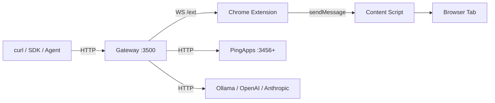

# PingOS

**Browser automation OS — control any website through a REST API.**


---

## What is PingOS?

PingOS turns any website into a programmable REST API. A POSIX-inspired gateway routes requests through a Chrome MV3 extension bridge to control real browser tabs — your already-open, already-authenticated sessions. No separate browser instance, no puppeted windows — just your Chrome, exposed as HTTP endpoints.

## Why?

Most automation tools launch a fresh browser for every task. AI web agents burn tokens on every click. PingOS takes a different approach: **ahead-of-time compilation**. An LLM analyzes a website once, generating a typed PingApp with CSS selectors, state machines, and completion signals. After that, every request is deterministic — zero AI cost at runtime.

| | PingOS | Selenium / Playwright | AI Web Agents | Screen Scrapers |
|---|---|---|---|---|
| **Uses your real browser** | ✅ Any open tab | ❌ New session each time | ❌ New session | ❌ No browser |
| **Works with auth/SSO/MFA** | ✅ Already logged in | ❌ Must re-auth | ❌ Must re-auth | ❌ No auth |
| **Runtime AI cost** | ✅ None (compiled out) | ✅ None | ❌ Every request | ✅ None |
| **Deterministic** | ✅ Selector-based | ⚠️ Script-dependent | ❌ LLM-dependent | ⚠️ Fragile |
| **Latency** | Low | High (browser startup) | Very high | Medium |
| **Self-heals broken selectors** | ✅ LLM-assisted | ❌ Manual fix | ✅ Re-infers | ❌ Breaks |

---

## See It in Action

> One gateway. Every website. Your browser sessions. Zero scraping code.

**Discover every connected tab:**


**Extract structured data with natural language:**


**Hit 3 sites in under 5 seconds:**


📽️ [Full demo index with split-screen recordings →](docs/DEMOS.md)

---

## Quick Start

```bash
git clone <repo-url> pingos && cd pingos
npm install
npm run build
# Load packages/chrome-extension/dist in chrome://extensions (Developer Mode → Load Unpacked)
npx tsx packages/std/src/main.ts
```

Verify:

```bash
curl http://localhost:3500/v1/health
# {"status":"healthy","timestamp":"..."}
```

Share a browser tab via the extension popup, then:

```bash
curl -X POST http://localhost:3500/v1/dev/chrome-{tabId}/recon
```

See [docs/INSTALL.md](docs/INSTALL.md) for the full setup guide.

---

## Feature Matrix

| Feature | Status | Description |
|---|---|---|
| **32 device operations** | ✅ Stable | click, type, read, fill, select, hover, scroll, navigate, press, wait, assert, and 21 more |
| Smart Extract (10 levels) | ✅ Stable | L1 CSS, L2 zero-config, L3 semantic, L4 JSON-LD, L5 multi-page, L6 nested, L7 typed, L8 shadow DOM, L9 visual, L10 template |
| Act engine | ✅ Stable | Click, type, navigate, upload — stealth mode |
| PingApps | ✅ Stable | Compiled website drivers (AliExpress, Amazon, Claude) |
| CDP fallback | ✅ Stable | Automatic DevTools Protocol fallback for CSP-restricted pages |
| Self-heal | 🔶 Beta | LLM-assisted selector repair with caching |
| Recorder + Replay | ✅ Stable | Record interactions, replay with selector resilience |
| Cross-tab Pipelines | ✅ Stable | Chain operations across tabs with variable interpolation |
| Managed Watches | ✅ Stable | Real-time SSE subscriptions with field-level diffs |
| Schema Auto-Discovery | ✅ Stable | Classify page types and generate schemas (no LLM, <100ms) |
| Tab-as-a-Function | ✅ Stable | Call tab operations as typed functions with params |
| PingApp Generator | ✅ Stable | Generate PingApps from recorded workflows |
| MCP Server | ✅ Stable | 15 tools + 3 resources for Claude Desktop / Cursor |
| LLM routing | ✅ Stable | 4 providers — OpenRouter, Anthropic, OpenAI, LM Studio |
| Template Learning | ✅ Stable | Learn extraction patterns per domain, auto-apply on revisit |
| Visual Extract | ✅ Stable | Screenshot + vision model extraction for canvas/SVG content |
| Ad blocking / page cleanup | ✅ Stable | Remove clutter before extraction |
| Recon (snapshot + analysis) | ✅ Stable | Full-page interactive element discovery |

---

## Architecture



The gateway is the single entry point. It routes requests to:

- **Extension bridge** — controls real Chrome tabs via WebSocket (`chrome-{tabId}` devices)
- **PingApps** — compiled website drivers with persistent browser sessions
- **LLM adapters** — local (Ollama, LM Studio) and cloud (OpenAI, Anthropic) models

---

## API Quick Reference

All endpoints served on `http://localhost:3500`.

### Core Gateway

| Endpoint | Method | Description |
|---|---|---|
| `/v1/health` | GET | Gateway health check |
| `/v1/registry` | GET | List all registered drivers |
| `/v1/devices` | GET | List shared browser tabs |
| `/v1/apps` | GET | List registered PingApps |
| `/v1/dev/:device/status` | GET | Device connection status |
| `/v1/dev/:device/:op` | POST | Generic device operation (click, type, read, eval, recon, clean, ...) |
| `/v1/dev/:device/suggest` | POST | LLM-assisted suggestion for a device |
| `/v1/dev/llm/prompt` | POST | Send prompt to best available driver |
| `/v1/dev/llm/chat` | POST | Multi-turn chat with message history |

### Recording & Replay

| Endpoint | Method | Description |
|---|---|---|
| `/v1/record/start` | POST | Start recording interactions on a device |
| `/v1/record/stop` | POST | Stop recording |
| `/v1/record/export` | POST | Export recording as workflow |
| `/v1/record/status` | GET | Check recording status |
| `/v1/recordings/replay` | POST | Replay a recording against a device |
| `/v1/recordings/generate` | POST | Generate PingApp from recording |
| `/v1/recordings/save` | POST | Save a recording |
| `/v1/recordings` | GET | List saved recordings |
| `/v1/recordings/:id` | DELETE | Delete a recording |

### Pipelines

| Endpoint | Method | Description |
|---|---|---|
| `/v1/pipelines/run` | POST | Execute a cross-tab pipeline |
| `/v1/pipelines/validate` | POST | Validate a pipeline definition |
| `/v1/pipelines` | GET | List saved pipelines |
| `/v1/pipelines/save` | POST | Save a named pipeline |
| `/v1/pipelines/pipe` | POST | Execute pipe shorthand |

### Managed Watches

| Endpoint | Method | Description |
|---|---|---|
| `/v1/dev/:device/watch/start` | POST | Start a managed watch |
| `/v1/watches/:watchId/events` | GET | SSE event stream |
| `/v1/watches/:watchId` | DELETE | Stop a watch |
| `/v1/watches` | GET | List active watches |

### Self-Heal

| Endpoint | Method | Description |
|---|---|---|
| `/v1/heal/cache` | GET | View cached selector repairs |
| `/v1/heal/stats` | GET | Self-heal success rates |

### PingApp Routes

| Endpoint | Method | Description |
|---|---|---|
| `/v1/app/aliexpress/search` | POST | Search AliExpress products |
| `/v1/app/aliexpress/product` | POST | Get product details |
| `/v1/app/aliexpress/cart` | GET | View cart |
| `/v1/app/aliexpress/cart/add` | POST | Add current product to cart |
| `/v1/app/aliexpress/cart/remove` | POST | Remove item from cart |
| `/v1/app/aliexpress/orders` | GET | List orders |
| `/v1/app/aliexpress/wishlist` | GET | View wishlist |
| `/v1/app/amazon/search` | POST | Search Amazon products |
| `/v1/app/amazon/product` | POST | Get product by ASIN |
| `/v1/app/amazon/cart` | GET | View cart |
| `/v1/app/amazon/cart/add` | POST | Add to cart |
| `/v1/app/amazon/orders` | GET | List orders |
| `/v1/app/amazon/deals` | GET | View deals page |
| `/v1/app/claude/chat` | POST | Send message to Claude |
| `/v1/app/claude/chat/new` | POST | Start new conversation |
| `/v1/app/claude/chat/read` | GET | Read last response |
| `/v1/app/claude/conversations` | GET | List conversations |
| `/v1/app/claude/model` | GET/POST | Get or set current model |
| `/v1/app/claude/projects` | GET | List projects |
| `/v1/app/claude/artifacts` | GET | List artifacts |
| `/v1/app/claude/search` | GET | Search conversations |
| `/v1/extension/reload` | POST | Reload the Chrome extension |

See [docs/API.md](docs/API.md) for full schemas, request/response examples, and error codes.

---

## PingApp Showcase

Search Amazon from the command line:

```bash
curl -s -X POST http://localhost:3500/v1/app/amazon/search \
  -H "Content-Type: application/json" \
  -d '{"query": "mechanical keyboard"}' | jq '.products[:2]'
```

```json
[
  {
    "asin": "B09HKF1DQM",
    "title": "Keychron K2 V2 Wireless Mechanical Keyboard",
    "price": "AED 349.00",
    "rating": "4.6 out of 5 stars",
    "prime": true,
    "url": "https://www.amazon.ae/dp/B09HKF1DQM"
  },
  {
    "asin": "B0CLKV25Z1",
    "title": "Royal Kludge RK84 Pro Wireless Mechanical Gaming Keyboard",
    "price": "AED 189.00",
    "rating": "4.4 out of 5 stars",
    "prime": true,
    "url": "https://www.amazon.ae/dp/B0CLKV25Z1"
  }
]
```

---

## Featured in NVIDIA's Official Guide

PingOS is featured in **NVIDIA's DGX Spark developer guide** as a reference architecture for local AI infrastructure. The DGX Spark's 128 GB unified memory enables running PingOS gateway + local LLMs (Ollama) + multiple browser sessions on a single machine — an always-on local AI stack with no cloud dependency.

---

## Battle Test Results

Tested across **9 live production websites** (YouTube, Hacker News, Amazon, Reddit, Gmail, Wikipedia, GitHub, Google, Claude) with compound extract, act, and click operations.

**~92% overall pass rate** across all battle test rounds.

---

## v0.2 — What's New

### MCP Server

PingOS now includes a Model Context Protocol server, letting Claude Desktop, Cursor, and other MCP clients control your browser directly. 15 tools, 3 resources, stdio + SSE transport.

```bash
pingdev mcp              # stdio mode (Claude Desktop)
pingdev mcp --sse        # SSE mode (web clients)
```

See [docs/MCP.md](docs/MCP.md) for setup instructions.

### Multi-Provider LLM Routing

4 LLM providers with automatic registration:

| Provider | Type | Auto-registered |
|----------|------|:-:|
| OpenRouter | Cloud (100+ models) | When `OPENROUTER_API_KEY` is set |
| Anthropic | Cloud (Claude models) | When `ANTHROPIC_API_KEY` is set |
| OpenAI | Cloud (GPT/o-series) | When `OPENAI_API_KEY` is set |
| LM Studio | Local | Always (gracefully offline) |

See [docs/DRIVERS.md](docs/DRIVERS.md) for configuration.

### New in v0.3 — 32 Operations + Smart Extract

15 new device operations for comprehensive browser automation:

| Operation | Description |
|-----------|-------------|
| `fill` | Smart form filling — auto-detects fields by label, placeholder, name |
| `wait` | Wait for conditions: visible, hidden, networkIdle, domStable, text |
| `table` | Extract structured data from HTML tables and grids |
| `dialog` | Detect and dismiss modals, cookie banners, paywalls |
| `paginate` | Auto-detect and navigate pagination (links, buttons, infinite scroll) |
| `select` | Text selection — range or full element |
| `navigate` | Go to URL or find/click links by keyword |
| `hover` | Trigger hover states — reveal tooltips, menus, previews |
| `assert` | DOM verification (exists, visible, text, count, attribute) |
| `network` | Capture and inspect network requests (fetch + XHR) |
| `storage` | Read/write localStorage, sessionStorage, cookies |
| `capture` | Rich page capture (DOM, PDF, MHTML, HAR) |
| `upload` | File upload to file inputs |
| `download` | Trigger downloads by URL or clicking elements |
| `annotate` | Add visual annotations (boxes, highlights, arrows) |

See [docs/operations.md](docs/operations.md) for all 32 operations with curl examples.

### Smart Extract (10 Levels)

| Level | Name | Description |
|-------|------|-------------|
| L1 | Basic CSS | Standard `querySelector` extraction |
| L2 | Zero-Config | Auto-detect page type, apply default schema |
| L3 | Semantic | LLM generates selectors from natural language |
| L4 | JSON-LD | Extract from Schema.org structured data |
| L5 | Multi-Page | Paginate and extract across pages |
| L6 | Nested | Hierarchical container-based extraction |
| L7 | Type-Aware | Auto-parse values (currency, date, rating, etc.) |
| L8 | Shadow DOM | Pierce Web Component shadow boundaries |
| L9 | Visual | Screenshot + vision model extraction |
| L10 | Template | Learn and reuse extraction patterns per domain |

See [docs/smart-extract.md](docs/smart-extract.md) for details on each level.

### Novel Features

| Feature | Endpoint | Description |
|---------|----------|-------------|
| Natural Language Query | `POST /v1/dev/:device/query` | Ask questions about any page — LLM finds the right selector |
| Live Data Streams | `POST /v1/dev/:device/watch` | SSE stream of page data changes |
| Diff Extraction | `POST /v1/dev/:device/diff` | Track field-level changes between extractions |
| Schema Auto-Discovery | `GET /v1/dev/:device/discover` | Classify page type and generate schemas (no LLM, <100ms) |
| PingApp Generator | `POST /v1/apps/generate` | Generate a complete PingApp definition from URL + description |
| Tab-as-a-Function | `GET /v1/functions` | Call browser tab operations as typed functions |
| CDP Fallback | Automatic | Chrome DevTools Protocol fallback for CSP-restricted sites |

See [docs/NOVEL-FEATURES.md](docs/NOVEL-FEATURES.md) for examples and usage.

---

## Package Structure

```
packages/
  core/           @pingdev/core     PingApp engine (CDP, BullMQ, state machine)
  std/            @pingdev/std      Gateway, drivers, pipelines, watches, replay, functions
  cli/            pingdev           CLI tools (snapshot, generate, mcp)
  recon/          @pingdev/recon    Snapshot engine + PingApp code generator
  chrome-extension                  Chrome MV3 extension (auth bridge, recorder, ad block)
  mcp-server/                       MCP server (stdio + SSE) for AI assistants
  dashboard/      @pingdev/dash     React 19 monitoring dashboard
  python-sdk/                       Python SDK for PingOS
```

### Key Commands

| Command | Description |
|---|---|
| `npm run build` | Build all packages |
| `npm run dev` | Watch mode for all packages |
| `npm test` | Run all tests (vitest) |
| `npm run lint` | TypeScript type check (`tsc --noEmit`) |
| `npm run clean` | Remove all `dist/` directories |

---

## Documentation

| Document | Description |
|---|---|
| [Installation Guide](docs/INSTALL.md) | From zero to first API call |
| [Architecture](docs/ARCHITECTURE.md) | System design, data flows, all engines |
| [API Reference](docs/API.md) | Full HTTP API with schemas and examples |
| [**Operations Reference**](docs/operations.md) | All 32 device operations with params and curl examples |
| [**Smart Extract**](docs/smart-extract.md) | 10-level extraction pipeline (L1-L10) |
| [**CDP Fallback**](docs/cdp-fallback.md) | Chrome DevTools Protocol fallback for CSP-restricted sites |
| [Extract Engine](docs/EXTRACT-ENGINE.md) | Deep dive into the extract engine internals |
| [Act Engine](docs/ACT-ENGINE.md) | Click, type, navigate — stealth interaction |
| [PingApps Guide](docs/PINGAPPS.md) | Building and running compiled website drivers |
| [LLM Drivers](docs/DRIVERS.md) | 4 LLM providers — OpenRouter, Anthropic, OpenAI, LM Studio |
| [Novel Features](docs/NOVEL-FEATURES.md) | Query, Watch, Diff, Discover, Generator |
| [MCP Server](docs/MCP.md) | AI assistant integration (Claude Desktop, Cursor) |

---

## License

[MIT](LICENSE)
