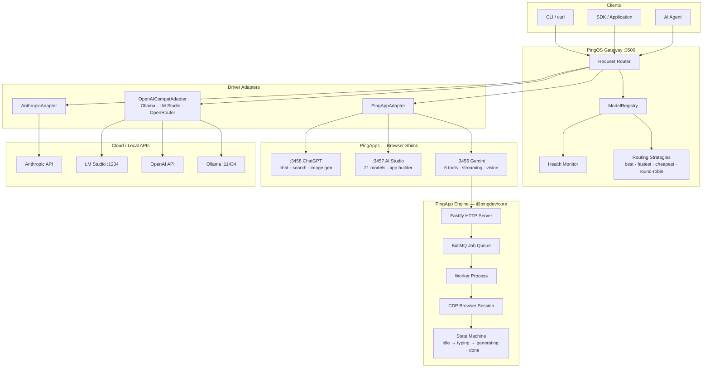

# PingOS

**An Ahead-of-Time Web-to-API Compiler — the operating system for the web.**

<!--  -->
<!--  -->
<!--  -->
<!--  -->
<!--  -->

PingOS turns any website into a programmable REST API — at compile time, not runtime. Instead of scraping pages on every request, PingOS **compiles** a website's UI into a structured "PingApp": a browser-automated shim that maps CSS selectors, state machines, and completion signals into a clean HTTP contract. A central POSIX-inspired gateway routes requests across browser-backed PingApps, local models (Ollama, LM Studio), and cloud APIs (OpenAI, Anthropic) using capability-based routing, health monitoring, and session affinity. One API. Every AI on the web.

---

## Why PingOS?

Most "web automation" tools work at runtime: they launch a browser, navigate to a page, click buttons, and scrape the result — every single time. AI web agents go further, burning tokens on every interaction to figure out what to click. This is slow, fragile, and expensive.

PingOS takes a fundamentally different approach: **ahead-of-time compilation**.

1. **Snapshot** — Capture a website's interactive surface once: buttons, inputs, dynamic regions, ARIA tree, state indicators
2. **Analyze** — An LLM reads the snapshot and produces a `SiteDefinition`: tiered CSS selectors, action mappings, state machines, completion signals
3. **Generate** — A code generator scaffolds a complete TypeScript PingApp with typed action handlers, tests, and health checks
4. **Run** — The PingApp runs as a persistent daemon with a live browser session. No AI inference at runtime — just deterministic selector lookups and state machine transitions

The result: **zero AI tax at runtime**. The LLM does its work once during compilation. After that, every request is a fast, deterministic browser automation — no token costs, no hallucination risk, no latency from model inference.

### How PingOS compares

| Approach | Runtime AI? | Browser per request? | Deterministic? | Latency |
|----------|-------------|---------------------|----------------|---------|
| Selenium/Playwright scripts | No | Yes (new session) | Depends on script | High |
| AI web agents (Browser Use, etc.) | **Yes, every request** | Yes | No | Very high |
| Screen-scraping APIs | No | No | Fragile | Medium |
| **PingOS** | **No (compiled out)** | **No (persistent session)** | **Yes** | **Low** |

---

## Architecture



---

## Concepts

### PingApps

A PingApp is a browser-automated shim that turns a website into a REST API. Each PingApp:

- Runs as a standalone Node.js process on its own port
- Maintains a persistent Chrome browser session via CDP (Chrome DevTools Protocol)
- Exposes standardized HTTP endpoints: `/v1/health`, `/v1/chat`, `/v1/jobs`
- Uses a compiled `SiteDefinition` that maps CSS selectors to interactive elements
- Manages concurrency through BullMQ job queues (typically single-concurrency for browser-backed apps)
- Has a state machine that tracks UI state: `idle → typing → generating → done`

PingApps are created through the **recon pipeline**: snapshot a website, analyze the snapshot with an LLM, generate the TypeScript project. See [docs/ARCHITECTURE.md](docs/ARCHITECTURE.md) for the full data flow.

### Drivers

A Driver is any backend that can handle a `DeviceRequest` and return a `DeviceResponse`. The gateway treats all drivers identically through a unified interface:

| Type | Examples | How it works | Concurrency |
|------|----------|--------------|-------------|
| `pingapp` | Gemini, AI Studio, ChatGPT | HTTP → BullMQ → CDP browser automation | Single (1 browser tab) |
| `api` | OpenAI, Anthropic, OpenRouter | Direct HTTP API call | High (parallel) |
| `local` | Ollama, LM Studio | Local inference server (OpenAI-compatible) | Depends on hardware |

### Capabilities

Every driver declares what it can do through a `DriverCapabilities` object:

| Capability | Description | Example drivers |
|------------|-------------|-----------------|
| `llm` | Natural language prompt → text response | All |
| `streaming` | Streaming partial responses via SSE | Gemini, Ollama, OpenAI |
| `vision` | Image understanding (multimodal input) | Gemini, GPT-4o |
| `toolCalling` | Function/tool calling support | Gemini, Claude, GPT |
| `imageGen` | Image generation | Gemini, ChatGPT, DALL-E |
| `search` | Web search and retrieval | Gemini, ChatGPT |
| `deepResearch` | Multi-step autonomous research | Gemini, ChatGPT |
| `thinking` | Reasoning chain / chain-of-thought | Gemini, Claude, DeepSeek |

When you send a request with `"require": {"thinking": true, "vision": true}`, the gateway only considers drivers that have both capabilities.

### Routing Strategies

When multiple drivers match the required capabilities, the gateway applies a routing strategy:

| Strategy | Algorithm | Best for |
|----------|-----------|----------|
| `best` (default) | Lowest priority number among healthy (online) drivers | Production — favors your preferred driver |
| `fastest` | Lowest latency from recent health checks | Latency-sensitive applications |
| `cheapest` | Lowest priority number (priority = cost rank) | Cost optimization |
| `round-robin` | Rotates through all matching drivers | Load distribution across providers |

---

## Current PingApps

| PingApp | Port | Website | Tools | Tests | Status |
|---------|------|---------|-------|-------|--------|
| **Gemini** | 3456 | gemini.google.com | Chat, Deep Think, Deep Research, Image Gen, Canvas, Learning | 19/19 | Active |
| **AI Studio** | 3457 | aistudio.google.com | 10 actions, 13 features, app builder, 21 models | — | Active |
| **ChatGPT** | 3458 | chatgpt.com | Chat, Search, Image Gen, Deep Research | — | In Progress |

---

## Getting Started from Scratch

This guide takes you from zero to a running PingOS gateway in about 10 minutes.

### Step 0: Prerequisites

| Dependency | Version | Purpose | Install |
|------------|---------|---------|---------|
| **Node.js** | 20+ | Runtime | [nodejs.org](https://nodejs.org) or `nvm install 20` |
| **npm** | 10+ | Package manager | Bundled with Node.js |
| **Redis** | 7.0+ | Job queue backend (for PingApps) | `sudo apt install redis-server` / `brew install redis` |
| **Chrome/Chromium** | Latest | Browser for PingApps | `sudo apt install chromium-browser` / already installed on macOS |
| **TypeScript** | 5.9+ | Compiler (installed via npm) | Included in devDependencies |

**Runtime dependencies (installed via `npm install`):**

| Package | Version | Purpose |
|---------|---------|---------|
| `fastify` | ^5.7.4 | HTTP server for gateway and PingApps |
| `bullmq` | ^5.69.1 | Job queue for browser automation pipeline |
| `ioredis` | ^5.6.1 | Redis client |
| `playwright` | ^1.58.2 | Browser automation (used by `@pingdev/core`) |
| `pino` | ^10.3.1 | Structured JSON logger |
| `uuid` | ^13.0.0 | Job ID generation |

**Dev dependencies:**

| Package | Version | Purpose |
|---------|---------|---------|
| `typescript` | ^5.9.3 | TypeScript compiler |
| `vitest` | ^4.0.18 | Test framework |
| `@types/node` | ^25.2.3 | Node.js type definitions |

### Step 1: Clone and install

```bash
git clone <repo-url> pingos
cd pingos
npm install
```

### Step 2: Build all packages

```bash
npm run build
```

This compiles TypeScript across all workspace packages (`core`, `std`, `cli`, `recon`, `dashboard`).

### Step 3: Start Redis

PingApps use BullMQ which requires Redis:

```bash
# Check if Redis is already running
redis-cli ping
# Should respond: PONG

# If not running:
# Linux
sudo systemctl start redis-server

# macOS
brew services start redis

# Docker
docker run -d --name redis -p 6379:6379 redis:7-alpine
```

### Step 4: Start Chrome with remote debugging

PingApps control Chrome via CDP (Chrome DevTools Protocol):

```bash
# Linux
google-chrome --remote-debugging-port=9222 --user-data-dir=/tmp/pingos-chrome &

# macOS
/Applications/Google\ Chrome.app/Contents/MacOS/Google\ Chrome \
  --remote-debugging-port=9222 --user-data-dir=/tmp/pingos-chrome &

# Verify CDP is accessible
curl -s http://127.0.0.1:9222/json/version | jq .title
```

### Step 5: Start a PingApp (e.g., Gemini)

If you have a Gemini PingApp shim project:

```bash
cd ~/projects/gemini-ui-shim
npm start
# Gemini PingApp now listening on http://localhost:3456
```

Verify it's healthy:

```bash
curl -s http://localhost:3456/v1/health | jq .status
# "healthy"
```

### Step 6: Start the PingOS gateway

Create `start-gateway.ts` in the project root:

```typescript
import { createGateway, ModelRegistry, PingAppAdapter } from '@pingdev/std';

const registry = new ModelRegistry('best');

registry.register(new PingAppAdapter({
  id: 'gemini',
  name: 'Gemini PingApp',
  endpoint: 'http://localhost:3456',
  capabilities: {
    llm: true, streaming: true, vision: true, toolCalling: true,
    imageGen: true, search: true, deepResearch: true, thinking: true,
  },
  priority: 1,
}));

const app = await createGateway({ port: 3500, registry });
console.log('PingOS gateway listening on http://localhost:3500');
```

```bash
npx tsx start-gateway.ts
```

### Step 7: Verify everything works

```bash
# Health check
curl -s http://localhost:3500/v1/health | jq .
# {"status":"healthy","timestamp":"2026-02-15T..."}

# Check registered drivers
curl -s http://localhost:3500/v1/registry | jq '.drivers[].id'
# "gemini"

# Send a prompt
curl -s http://localhost:3500/v1/dev/llm/prompt \
  -H "Content-Type: application/json" \
  -d '{"prompt": "Say hello"}' | jq .text
# "Hello! How can I help you today?"
```

You're up and running.

---

## Authentication & API Keys

### Cloud API providers

Cloud API drivers authenticate via API keys passed at adapter construction time. The recommended pattern is environment variables:

```bash
# Add to your shell profile (~/.bashrc, ~/.zshrc) or .env file
export ANTHROPIC_API_KEY="sk-ant-..."
export OPENAI_API_KEY="sk-..."
export OPENROUTER_API_KEY="sk-or-..."
```

Then reference them when registering drivers:

```typescript
import { OpenAICompatAdapter, AnthropicAdapter } from '@pingdev/std';

// Anthropic
registry.register(new AnthropicAdapter({
  id: 'claude',
  name: 'Claude Sonnet',
  endpoint: 'https://api.anthropic.com',
  apiKey: process.env.ANTHROPIC_API_KEY!,
  model: 'claude-sonnet-4-5-20250929',
  capabilities: { llm: true, streaming: true, vision: true, toolCalling: true,
    imageGen: false, search: false, deepResearch: false, thinking: true },
  priority: 5,
}));

// OpenAI (or any OpenAI-compatible API)
registry.register(new OpenAICompatAdapter({
  id: 'gpt4o',
  name: 'GPT-4o',
  endpoint: 'https://api.openai.com',
  apiKey: process.env.OPENAI_API_KEY!,
  model: 'gpt-4o',
  capabilities: { llm: true, streaming: true, vision: true, toolCalling: true,
    imageGen: false, search: false, deepResearch: false, thinking: false },
  priority: 10,
}));

// Local Ollama (no API key needed)
registry.register(new OpenAICompatAdapter({
  id: 'ollama-llama3',
  name: 'Ollama Llama 3',
  endpoint: 'http://localhost:11434',
  model: 'llama3:8b',
  capabilities: { llm: true, streaming: true, vision: false, toolCalling: false,
    imageGen: false, search: false, deepResearch: false, thinking: false },
  priority: 20,
}));
```

### PingApp drivers

PingApp drivers don't use API keys — they connect to locally running PingApp processes via HTTP. Authentication to the underlying website (e.g., logging into Gemini) is handled by the browser session managed by the PingApp.

### Config file

Alternatively, configure drivers in `~/.pingos/config.json`:

```jsonc
{
  "gatewayPort": 3500,
  "defaultStrategy": "best",
  "healthIntervalMs": 30000,
  "drivers": [
    {
      "id": "gemini",
      "type": "pingapp",
      "endpoint": "http://localhost:3456",
      "priority": 1,
      "capabilities": { "llm": true, "streaming": true, "vision": true,
        "toolCalling": true, "imageGen": true, "search": true,
        "deepResearch": true, "thinking": true }
    },
    {
      "id": "claude",
      "type": "anthropic",
      "endpoint": "https://api.anthropic.com",
      "apiKeyEnv": "ANTHROPIC_API_KEY",
      "model": "claude-sonnet-4-5-20250929",
      "priority": 5
    },
    {
      "id": "ollama-llama3",
      "type": "openai_compat",
      "endpoint": "http://localhost:11434",
      "model": "llama3:8b",
      "priority": 20
    }
  ]
}
```

---

## Environment Variables

| Variable | Required | Default | Used by | Description |
|----------|----------|---------|---------|-------------|
| `PINGDEV_CDP_URL` | No | `http://127.0.0.1:9222` | `@pingdev/core`, `@pingdev/cli`, `@pingdev/recon` | Chrome DevTools Protocol WebSocket URL for browser automation |
| `PINGDEV_LLM_URL` | No | Auto-detected | `@pingdev/recon` | LLM endpoint for snapshot analysis (recon pipeline) |
| `PINGDEV_LLM_MODEL` | No | Auto-detected | `@pingdev/recon` | Model name for snapshot analysis |
| `ANTHROPIC_API_KEY` | For Anthropic driver | — | `@pingdev/std`, `@pingdev/recon` | Anthropic API key for Claude models |
| `OPENAI_API_KEY` | For OpenAI driver | — | `@pingdev/std`, `@pingdev/recon` | OpenAI API key (also used by OpenRouter if compatible) |
| `OPENROUTER_API_KEY` | For OpenRouter | — | `@pingdev/std` | OpenRouter API key |
| `REDIS_URL` | No | `redis://127.0.0.1:6379` | `@pingdev/core` | Redis connection URL for BullMQ job queue |

---

## API Quick Reference

All endpoints are served on port `3500` by default. See [docs/API.md](docs/API.md) for full schemas.

### POST /v1/dev/llm/prompt

Send a prompt, get a response from the best available driver.

```bash
curl -s http://localhost:3500/v1/dev/llm/prompt \
  -H "Content-Type: application/json" \
  -d '{"prompt": "Explain quantum entanglement in one paragraph"}' | jq .
```

```json
{
  "text": "Quantum entanglement is a phenomenon where two particles become linked...",
  "driver": "gemini",
  "durationMs": 12345
}
```

### POST /v1/dev/llm/chat

Multi-turn chat with full message history.

```bash
curl -s http://localhost:3500/v1/dev/llm/chat \
  -H "Content-Type: application/json" \
  -d '{
    "prompt": "Now explain it to a 5-year-old",
    "messages": [
      {"role": "user", "content": "Explain quantum entanglement"},
      {"role": "assistant", "content": "Quantum entanglement is..."},
      {"role": "user", "content": "Now explain it to a 5-year-old"}
    ]
  }' | jq .
```

### GET /v1/registry

List all registered drivers with capabilities.

```bash
curl -s http://localhost:3500/v1/registry | jq '.drivers[] | {id, type, capabilities}'
```

### GET /v1/health

Gateway health check.

```bash
curl -s http://localhost:3500/v1/health | jq .
# {"status":"healthy","timestamp":"2026-02-15T12:00:00.000Z"}
```

### Capability-based routing

```bash
# Only route to drivers with thinking support
curl -s http://localhost:3500/v1/dev/llm/prompt \
  -H "Content-Type: application/json" \
  -d '{"prompt": "Think step by step: what is 127 * 43?", "require": {"thinking": true}}' | jq .

# Choose the fastest driver
curl -s http://localhost:3500/v1/dev/llm/prompt \
  -H "Content-Type: application/json" \
  -d '{"prompt": "Quick answer: capital of France?", "strategy": "fastest"}' | jq .

# Target a specific driver by ID
curl -s http://localhost:3500/v1/dev/llm/prompt \
  -H "Content-Type: application/json" \
  -d '{"prompt": "Hello", "driver": "gemini"}' | jq .
```

### Error responses

```bash
# Request an impossible capability combination
curl -s http://localhost:3500/v1/dev/llm/prompt \
  -H "Content-Type: application/json" \
  -d '{"prompt": "test", "require": {"snapshotting": true}}' | jq .
```

```json
{
  "errno": "ENOENT",
  "code": "ping.router.no_driver",
  "message": "No driver available for test",
  "retryable": false
}
```

---

## Troubleshooting

### Gateway won't start: "EADDRINUSE: address already in use :::3500"

Port 3500 is already occupied. Find and kill the process:

```bash
lsof -ti:3500 | xargs kill -9
# Or use a different port:
# createGateway({ port: 3501, registry })
```

### PingApp health check fails: "Connection refused" or "ECONNREFUSED"

The PingApp process is not running or is on a different port.

```bash
# Verify PingApp is running
curl -s http://localhost:3456/v1/health | jq .

# If not running, start it
cd ~/projects/gemini-ui-shim && npm start
```

### PingApp returns `ETIMEDOUT` after 120 seconds

The browser automation is hanging. Common causes:
- Chrome is not running with `--remote-debugging-port=9222`
- The website requires re-authentication (login session expired)
- A modal/popup is blocking the page

```bash
# Verify Chrome CDP is reachable
curl -s http://127.0.0.1:9222/json/version | jq .

# Check PingApp health for details
curl -s http://localhost:3456/v1/health | jq .
```

### Redis connection error: "ECONNREFUSED 127.0.0.1:6379"

Redis is not running. PingApps require Redis for BullMQ job queues.

```bash
# Start Redis
sudo systemctl start redis-server   # Linux
brew services start redis            # macOS
docker run -d -p 6379:6379 redis:7-alpine  # Docker

# Verify
redis-cli ping
# PONG
```

### TypeScript compilation errors after `npm install`

Try a clean build:

```bash
npm run clean
npm run build
```

If errors persist in `tsconfig.tsbuildinfo` files:

```bash
rm -f packages/*/tsconfig.tsbuildinfo
npm run build
```

### Tests fail with "fetch failed" or "ECONNREFUSED"

Integration tests in `packages/std` require a live Gemini PingApp on port 3456. Make sure it's running before running tests:

```bash
# Verify
curl -s http://localhost:3456/v1/health | jq .status
# "healthy"

# Then run tests
cd packages/std && npm test
```

### "No driver available" (ENOENT) even though drivers are registered

The driver's capabilities don't match the request's `require` field. Check what's registered:

```bash
curl -s http://localhost:3500/v1/registry | jq '.drivers[] | {id, capabilities}'
```

And compare with what you're requesting. The `require` field does exact boolean matching — if you require `{ "imageGen": true }`, only drivers with `imageGen: true` qualify.

---

## Package Structure

```
packages/
  core/          @pingdev/core     Browser PingApp engine (CDP, BullMQ, state machine)
  std/           @pingdev/std      POSIX layer — types, registry, gateway, drivers, routing
  cli/           @pingdev/cli      CLI tools (snapshot, generate, recon)
  recon/         @pingdev/recon    Snapshot engine + PingApp code generator
  dashboard/     @pingdev/dash     React 19 monitoring dashboard
```

### Key commands

| Command | Description |
|---------|-------------|
| `npm run build` | Build all packages |
| `npm run dev` | Watch mode for all packages |
| `npm test` | Run all tests (vitest) |
| `npm run test:watch` | Watch mode for tests |
| `npm run lint` | TypeScript type checking (`tsc --noEmit`) |
| `npm run clean` | Remove all `dist/` directories |

---

## Documentation

| Document | Description |
|----------|-------------|
| [Architecture](docs/ARCHITECTURE.md) | System design, data flows, capability routing, browser lifecycle |
| [API Reference](docs/API.md) | Full HTTP API with schemas, examples, and error codes |
| [Drivers](docs/DRIVERS.md) | Driver catalog with capabilities, config, and limitations |
| [Contributing](docs/CONTRIBUTING.md) | How to add drivers and PingApps, code style, PR process |
| [Phase 1 Requirements](requirements/PHASE1.md) | Architecture decisions, success criteria, build order |
| [Changelog](CHANGELOG.md) | Version history |

---

## License

[MIT](LICENSE)
