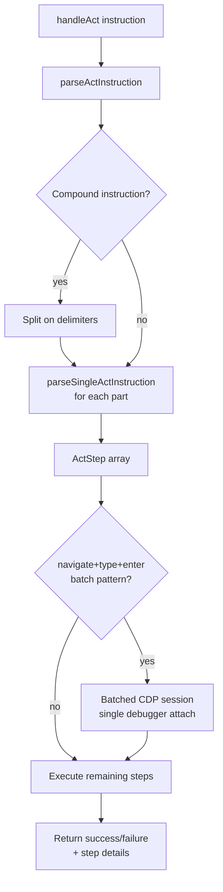
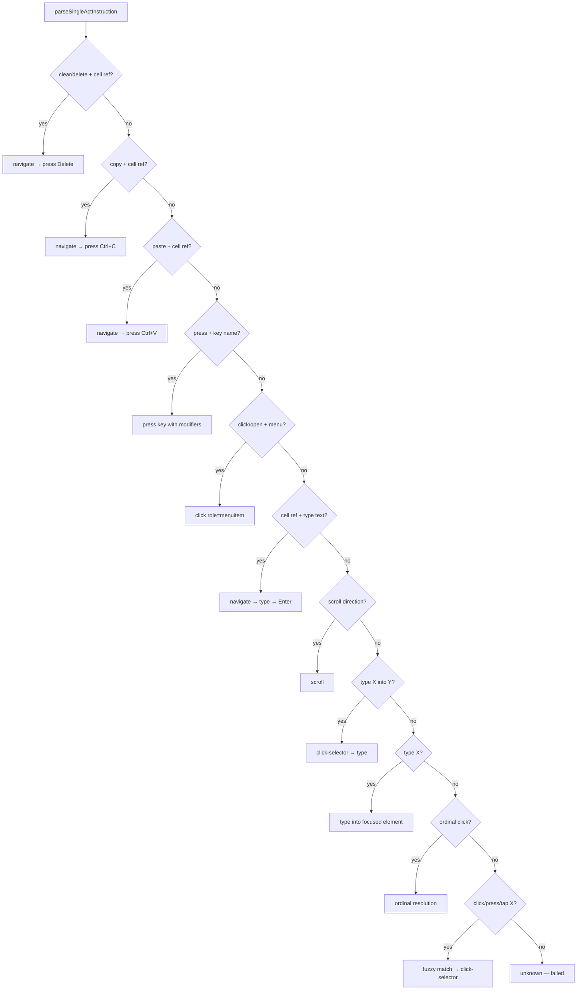
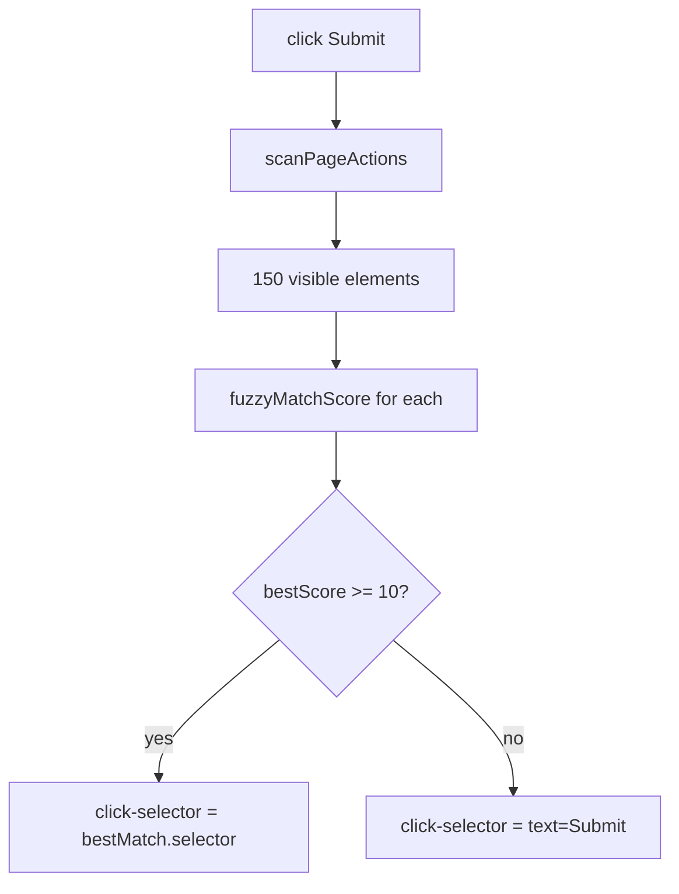
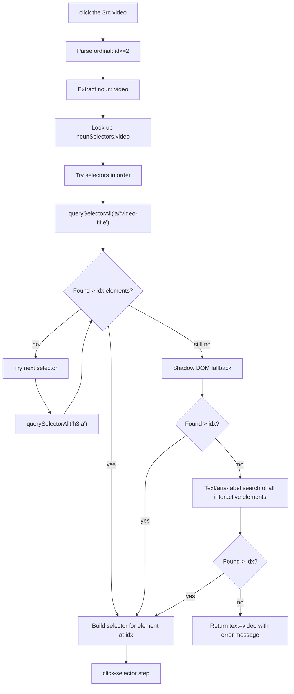

# Act Engine — Deep Dive

The Act Engine translates natural language instructions like "click the 3rd video" or "type Hello in B2 then press Enter" into executable browser actions. It parses instructions into typed steps, resolves element references via fuzzy matching and ordinal selectors, and executes them sequentially with CDP trusted events.

**Source**: `packages/chrome-extension/src/content.ts` (lines 1954–2571)

## Table of Contents

- [How NL Instructions Become Executable Steps](#how-nl-instructions-become-executable-steps)
- [Compound Instruction Splitting](#compound-instruction-splitting)
- [Supported Step Types](#supported-step-types)
- [Click Resolution](#click-resolution)
- [Ordinal Click Deep Dive](#ordinal-click-deep-dive)
- [Key Normalization](#key-normalization)
- [Sheets/Canvas Optimization](#sheetscanvas-optimization)
- [Quote Handling](#quote-handling)
- [Execution Pipeline](#execution-pipeline)
- [Known Limitations and Failure Modes](#known-limitations-and-failure-modes)

---

## How NL Instructions Become Executable Steps

The act engine processes instructions in three phases:



### The ActStep Type

Every parsed instruction becomes an array of `ActStep` objects:

```typescript
interface ActStep {
  op: string;           // 'click' | 'type' | 'press' | 'scroll' | 'navigate' | 'click-selector' | 'unknown'
  ref?: string;         // Cell reference (e.g., 'A1') for navigate ops
  text?: string;        // Text to type or scroll direction
  key?: string;         // Key name for press ops (e.g., 'Enter', 'Tab')
  modifiers?: string[]; // Modifier keys: ['ctrl'], ['shift', 'alt']
  selector?: string;    // CSS/text= selector for click-selector ops
  target?: string;      // Target element hint (e.g., 'formulaBar')
  status: 'pending' | 'done' | 'failed';
  error?: string;       // Error message if failed
}
```

---

## Compound Instruction Splitting

`parseActInstruction()` splits multi-step instructions before parsing each part individually.

### Splitting Patterns

```typescript
const compoundSplit = instruction.trim().split(
  /\s+and\s+then\s+|\s+then\s+|\s+and\s+(?=(?:press|click|tap|scroll|select|open|type|enter|hit)\s)/i
);
// Then also split on semicolons:
finalParts.push(...part.split(/\s*;\s*/));
```

| Delimiter | Regex | Example |
|-----------|-------|---------|
| `and then` | `\s+and\s+then\s+` | "click Search **and then** type hello" |
| `then` | `\s+then\s+` | "type hello **then** press Enter" |
| `and` + action verb | `\s+and\s+(?=press\|click\|...)` | "type hello **and press** Enter" |
| `;` | `\s*;\s*` | "type hello**;** press Enter" |

**Important**: The `and` delimiter only triggers when followed by an action verb (`press`, `click`, `tap`, `scroll`, `select`, `open`, `type`, `enter`, `hit`). This prevents splitting "click search and rescue" into two parts.

### Examples

| Input | Splits into |
|-------|------------|
| `"type Hello in B2 then press Tab"` | `["type Hello in B2", "press Tab"]` |
| `"click Search and then type laptop"` | `["click Search", "type laptop"]` |
| `"navigate to A1; type =SUM(B1:B5); press Enter"` | `["navigate to A1", "type =SUM(B1:B5)", "press Enter"]` |
| `"type hello and press Enter"` | `["type hello", "press Enter"]` |
| `"click the search and rescue button"` | `["click the search and rescue button"]` (no split) |

---

## Supported Step Types

`parseSingleActInstruction()` recognizes these patterns, checked in order:



### Spreadsheet-Specific Patterns

| Pattern | Example | Steps generated |
|---------|---------|----------------|
| Clear cell | `"clear cell A1"` | `navigate(A1)` → `press(Delete)` |
| Copy cell | `"copy A1"` | `navigate(A1)` → `press(Ctrl+C)` |
| Paste into cell | `"paste into B2"` | `navigate(B2)` → `press(Ctrl+V)` |
| Navigate + type | `"type Hello in B2"` | `navigate(B2)` → `type("Hello")` → `press(Enter)` |

### Generic Patterns

| Pattern | Example | Steps generated |
|---------|---------|----------------|
| Press key | `"press Enter"` | `press(Enter)` |
| Press combo | `"press Ctrl+C"` | `press(C, [ctrl])` |
| Click menu | `"open Format menu"` | `click(role=menuitem:Format)` |
| Scroll | `"scroll down"` | `scroll(down)` |
| Scroll to | `"scroll to top"` | `scroll(top)` |
| Type into target | `"type hello into search box"` | `click-selector(search box)` → `type("hello")` |
| Type (no target) | `"type hello"` | `type("hello")` |
| Ordinal click | `"click the 3rd video"` | `click-selector(resolved element)` |
| Click by name | `"click Submit"` | `click-selector(fuzzy match)` |

---

## Click Resolution

When the act engine encounters `"click X"`, it needs to find the right element. This happens through `scanPageActions()` + `fuzzyMatchScore()`.

### `scanPageActions()`

Scans all visible interactive elements on the page and returns a list of `{ selector, label, purpose, tag }`:

```typescript
function scanPageActions(): Array<{
  selector: string;
  label: string;
  purpose: string;  // 'action' | 'search' | 'input'
  tag: string;
}>
```

**Elements scanned** (in order):
- `button:not([disabled])`
- `[role="button"]`
- `a[href]`
- `input:not([type="hidden"])`, `textarea`, `select`
- `[contenteditable="true"]`
- `[role="textbox"]`, `[role="combobox"]`, `[role="searchbox"]`
- `[role="menuitem"]`, `[role="tab"]`, `[role="link"]`

**Visibility filter**: Skips elements with zero width/height or outside the viewport.

**Selector generation priority**:
1. `#id` (if not auto-generated like `a-1b2c3d`)
2. `[data-testid="..."]`
3. `tag[aria-label="..."]`
4. `tag[name="..."]`
5. `a[href="..."]` (for links)
6. `text=label` (fallback)

### `fuzzyMatchScore()`

Scores how well a user's description matches an element's label:

```typescript
function fuzzyMatchScore(query: string, candidate: string): number
```

| Match type | Score | Example |
|-----------|-------|---------|
| Exact match | 1000 | `"Submit"` vs `"Submit"` |
| Query in candidate | 500 + len | `"Submit"` in `"Submit Form"` |
| Candidate in query | 400 + len | `"Form"` in `"Submit Form Button"` |
| Word overlap (exact) | 10/word | `"search box"` vs `"search input box"` |
| Word overlap (partial) | 5/word | `"search"` vs `"searching"` |
| No match | 0 | `"login"` vs `"submit"` |

**Threshold**: A match score must be ≥10 to be used. Below that, the engine falls back to a `text=` selector.

### Resolution flow for `"click Submit"`



---

## Ordinal Click Deep Dive

The ordinal click pattern resolves instructions like "click the 3rd video" or "click the 1st result".

### Pattern matching

```typescript
const ordinalMatch = instr.match(
  /\b(?:click|press|tap|select|open|hit)\s+(?:on\s+)?(?:the\s+)?
  (first|second|third|fourth|fifth|1st|2nd|3rd|4th|5th|\d+(?:st|nd|rd|th))\s+(.+)$/i
);
```

### Ordinal parsing

| Input | Parsed index (0-based) |
|-------|----------------------|
| `first`, `1st` | 0 |
| `second`, `2nd` | 1 |
| `third`, `3rd` | 2 |
| `fourth`, `4th` | 3 |
| `fifth`, `5th` | 4 |
| `6th` – `99th` | Parsed from number - 1 |

### Noun-to-selector mappings

The `nounSelectors` map provides site-aware selectors for common content types:

```typescript
const nounSelectors: Record<string, string[]> = {
  video:   ['a#video-title', 'h3 a', 'a[href*="watch"]', 'a[href*="video"]'],
  product: ['[data-component-type="s-search-result"] h2 a', '.s-result-item h2 a', 'h2 a[href*="/dp/"]'],
  post:    ['a[slot="title"]', 'a[href*="/comments/"]', '[data-testid="post-title"]'],
  link:    ['a[href]'],
  result:  ['h3 a', '.result a', '[data-testid="result"] a', 'h2 a'],
  item:    ['li a', '.item a', 'article a'],
  email:   ['tr[role="row"] td a', 'tr td .y6 span', '[role="row"]'],
  story:   ['.titleline > a', 'a.storylink', '.athing .title a'],
  repo:    ['a[href*="github.com/"]', 'h3 a', '[data-hovercard-type="repository"] a'],
  button:  ['button', '[role="button"]'],
};
```

### Resolution flow



**Scoping**: The search is scoped to `getMainContentArea()` to avoid matching sidebar/nav elements. Elements are filtered for visibility (non-zero dimensions, within 3x viewport height).

**Shadow DOM**: If noun-specific selectors don't find enough elements, the engine also tries `deepQuerySelectorAll()` to pierce shadow roots.

---

## Key Normalization

The `normalizeKeyName()` function cleans up user-specified key names:

```typescript
function normalizeKeyName(raw: string): string
```

### Transformation rules

1. Strip leading "the": `"the Tab key"` → `"Tab key"`
2. Strip trailing "key": `"Tab key"` → `"Tab"`
3. Look up in `KEY_ALIASES`
4. Capitalize first letter

### Known keys

The `KNOWN_KEYS` set prevents key names from being interpreted as text to type:

```
tab, enter, return, escape, esc, backspace, delete, del,
arrowup, arrowdown, arrowleft, arrowright, up, down, left, right,
space, home, end, pageup, pagedown, insert, f1–f12
```

### Key aliases

```typescript
const KEY_ALIASES: Record<string, string> = {
  tab: 'Tab',
  enter: 'Enter',
  return: 'Enter',
  escape: 'Escape',
  esc: 'Escape',
  backspace: 'Backspace',
  delete: 'Delete',
  del: 'Delete',
  space: ' ',
  arrowup: 'ArrowUp',
  up: 'ArrowUp',
  // ... etc
};
```

### Modifier handling

The press pattern captures modifiers from `Ctrl+`, `Shift+`, `Alt+`, `Meta+`, `Cmd+` prefixes:

```
"press Ctrl+C" → key="C", modifiers=["ctrl"]
"press Shift+Tab" → key="Tab", modifiers=["shift"]
```

Modifiers are encoded as a bitmask for CDP:
- Alt: 1
- Ctrl: 2
- Meta/Cmd: 4
- Shift: 8

---

## Sheets/Canvas Optimization

For Google Sheets and other canvas-based apps, the act engine has a critical optimization: **batched CDP sessions**.

### The Problem

Sheets requires trusted (`isTrusted: true`) keyboard events, which only CDP can produce. Each CDP call attaches/detaches the debugger. With the naive approach:

1. `navigateToCell("B2")` — attach debugger, send keys, detach
2. `type("Hello")` — attach debugger, send keys, detach
3. `press("Enter")` — attach debugger, send keys, detach

This causes timing issues: the debugger detach from step 1 may not complete before step 2 tries to reattach.

### The Solution

When `handleAct()` detects the pattern `navigate + type + (optional Enter)`, it batches everything into a **single CDP session**:

```typescript
if (steps.length >= 2 && steps[0].op === 'navigate' && steps[1].op === 'type') {
  const cdpSteps = [
    // Click canvas for focus
    { action: 'mouseClick', x: canvasX, y: canvasY },
    { action: 'pause' },
    // Click name-box
    { action: 'mouseClick', x: nameBoxX, y: nameBoxY },
    { action: 'pause' },
    // Select all + type cell ref + Enter
    { action: 'keyDown', key: 'a', modifiers: 2 /* ctrl */ },
    { action: 'keyUp', key: 'a', modifiers: 2 },
    { action: 'insertText', text: 'B2' },
    { action: 'pause' },
    { action: 'keyDown', key: 'Enter' },
    { action: 'keyUp', key: 'Enter' },
    // Wait for navigation (6 pauses ≈ 300ms)
    { action: 'pause' }, { action: 'pause' }, { action: 'pause' },
    { action: 'pause' }, { action: 'pause' }, { action: 'pause' },
    // Type the value
    { action: 'insertText', text: 'Hello' },
    // Press Enter to commit
    { action: 'pause' },
    { action: 'keyDown', key: 'Enter' },
    { action: 'keyUp', key: 'Enter' },
  ];
  await cdpKeys(cdpSteps);  // Single debugger session
}
```

### CDP Actions

| Action | Purpose |
|--------|---------|
| `mouseClick` | Click at x,y coordinates (for name-box, canvas) |
| `keyDown` / `keyUp` | Press/release a key with optional modifier bitmask |
| `insertText` | Type a string (IME-compatible, generates trusted input events) |
| `pause` | ~50ms pause between operations (controlled by background script) |

### `cdpKeys()`

```typescript
async function cdpKeys(
  steps: Array<{ action: string; text?: string; key?: string; modifiers?: number; x?: number; y?: number }>
): Promise<boolean>
```

Sends the step array to the background script via `chrome.runtime.sendMessage({ type: 'cdp_keys', steps })`. The background script attaches the Chrome DevTools Protocol debugger, executes all steps in sequence, then detaches. Returns `true` on success.

---

## Quote Handling

Quoted text in instructions is preserved exactly as-is, preventing the parser from mangling special characters or splitting the text.

### How it works

```typescript
const quotedPattern = /["']([^"']+)["']/;
const quotedMatch = instr.match(quotedPattern);
```

The parser checks for quoted text early and prefers it over regex-extracted text:

```typescript
// If quoted text is available, override regex-extracted text
if (quotedMatch) {
  textToType = quotedMatch[1];
}
```

### Examples

| Instruction | Without quotes | With quotes |
|------------|---------------|-------------|
| `type =SUM(B1:B5) in A1` | May corrupt formula | N/A |
| `type "=SUM(B1:B5)" in A1` | N/A | `=SUM(B1:B5)` preserved |
| `type 'hello world' into search` | May split on spaces | `hello world` preserved |

### Where quotes matter

- **Formulas**: `=SUM(...)`, `=VLOOKUP(...)` — parentheses and colons can confuse the regex parser
- **Text with special chars**: Colons, semicolons, commas in the text to type
- **Multi-word text**: Without quotes, "type" followed by text can be ambiguous with target descriptions

---

## Execution Pipeline

### `executeActStep()`

Each `ActStep` is executed by `executeActStep()`:

```typescript
async function executeActStep(step: ActStep): Promise<void>
```

| Op | Execution | Fallback |
|----|-----------|----------|
| `navigate` | `navigateToCell(ref)` via CDP name-box | Synthetic events on name-box |
| `type` | `cdpKeys([{ action: 'insertText', text }])` | `handleType()` on focused element |
| `press` | `cdpKeys([{ action: 'keyDown/keyUp', key, modifiers }])` | `handlePress()` synthetic events |
| `click` | `handleClick(selector)` | — |
| `click-selector` | `findElement(selector)` → `handleClick(selector)` | — |
| `scroll` | `handleScroll({ direction })` or `handleScroll({ to })` | — |
| `unknown` | Immediately fails | — |

### Sequential execution with 250ms gaps

```typescript
for (const step of steps) {
  if (step.status === 'failed') break;        // Stop on first failure
  if (step.status === 'done') { completed++; continue; }  // Skip batch-handled steps
  await executeActStep(step);
  if (step.status === 'done') completed++;
  else break;                                  // Stop on failure
  await sleep(250);                            // UI settle time + CDP detach
}
```

### Response format

```typescript
{
  success: true,        // true only if ALL steps completed
  data: {
    instruction: "type Hello in B2 then press Tab",
    steps: [
      { op: 'navigate', ref: 'B2', status: 'done' },
      { op: 'type', text: 'Hello', target: 'formulaBar', status: 'done' },
      { op: 'press', key: 'Enter', status: 'done' },
      { op: 'press', key: 'Tab', status: 'done' }
    ],
    stepsCompleted: 4,
    stepsTotal: 4
  }
}
```

On failure, the response includes the error from the first failed step:

```typescript
{
  success: false,
  error: "Element not found: text=NonexistentButton",
  data: {
    steps: [...],
    stepsCompleted: 2,
    stepsTotal: 3
  }
}
```

---

## Known Limitations and Failure Modes

### Parsing Limitations

| Issue | Example | What happens |
|-------|---------|-------------|
| **Ambiguous "and"** | `"click search and filter"` | May split into `"click search"` + `"filter"` if followed by an action verb pattern |
| **Nested quotes** | `"type 'he said "hello"'"` | Inner quotes break the regex |
| **No conditional logic** | `"if the button is visible, click it"` | Parsed literally, likely fails |
| **No loops** | `"click Next 5 times"` | Parsed as a single click on "Next 5 times" |
| **Long instructions** | 10+ compound steps | Each split part is parsed independently — context doesn't flow between parts |

### Execution Limitations

| Issue | Description |
|-------|-------------|
| **Fixed delays** | 250ms between steps. Too fast for slow-loading pages, too slow for simple clicks |
| **First failure stops** | If step 2 of 5 fails, steps 3–5 never execute. No skip/retry mechanism |
| **CDP-or-nothing for canvas** | If CDP isn't available (debugger in use), canvas app operations fail entirely |
| **Single element resolution** | `"click search"` picks the *best* match. If there are multiple "search" buttons, you can't control which one without ordinals |
| **No viewport scrolling** | If the target element is below the fold, `scanPageActions()` won't find it (filters to viewport) |

### Element Resolution Failures

| Scenario | Why it fails | Workaround |
|----------|-------------|------------|
| Dynamically loaded elements | `scanPageActions()` runs once before matching | Wait for page load, then retry |
| Shadow DOM buttons | `scanPageActions()` only queries the light DOM | Use CSS selectors directly with `click-selector` |
| Identical labels | Two "Submit" buttons → picks the first found | Use ordinal: "click the 2nd Submit" |
| Generated IDs | Elements like `#a-1b2c3d` produce poor selectors | Falls back to `text=` selector |
| iframes | Content inside iframes is not scanned | No workaround — iframes are a separate context |

### CDP-Specific Issues

| Issue | Description |
|-------|-------------|
| **Debugger conflicts** | Only one debugger can attach per tab. DevTools open → CDP fails |
| **Detach timing** | After `cdpKeys()` returns, the debugger needs time to fully detach before the next attach |
| **Trusted event requirement** | Google Sheets ignores synthetic (`isTrusted: false`) events. Only CDP events work |
| **Pause granularity** | Each `pause` action is ~50ms. Hard to calibrate for different network/rendering speeds |
