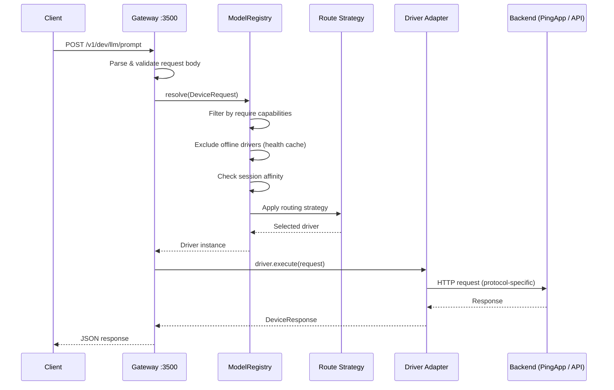
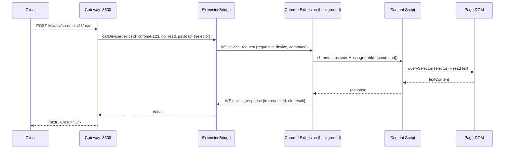
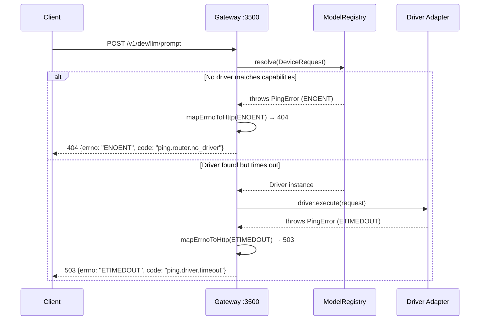
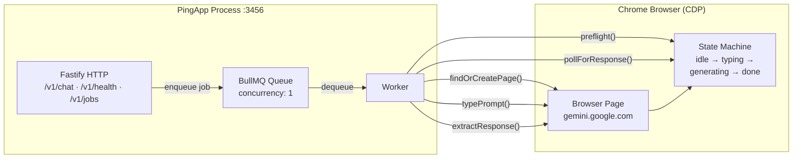
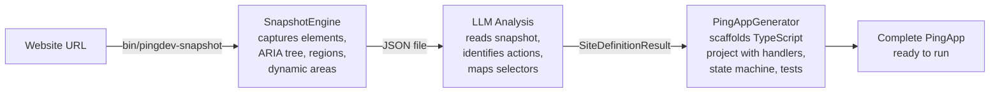
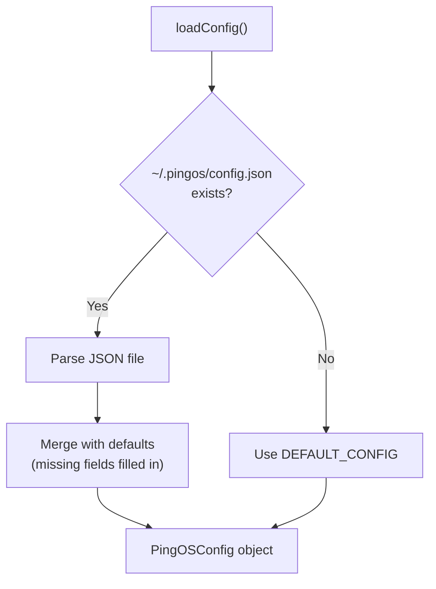
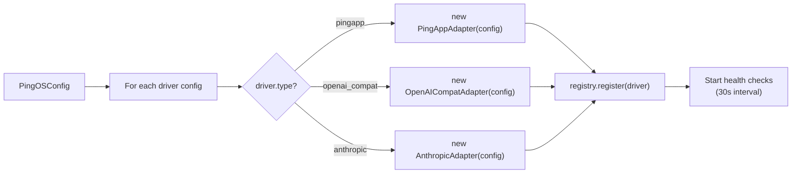

# PingOS Architecture

## Overview

PingOS is a POSIX-inspired device layer that provides unified programmatic access to AI capabilities across web applications, cloud APIs, and local models. The system has three architectural layers:

1. **Gateway** — Fastify HTTP server that receives requests and routes them to the right backend
2. **Registry + Router** — Tracks available drivers, their capabilities, health status, and applies routing strategy
3. **Drivers** — Adapters that execute requests against backends (PingApps, cloud APIs, local models)
4. **Extension Bridge** — WebSocket bridge (`/ext`) that turns *authenticated Chrome tabs* into controllable devices (`chrome-{tabId}`)

The key insight is **separation of concerns**: the gateway knows about routing, the drivers know about protocols, and the PingApp engine knows about browsers. No layer reaches into another's domain.

---

## Dual Execution Paths: CDP PingApps vs Authenticated Chrome Tabs

PingOS supports two fundamentally different ways to automate the web:

1. **PingApp path (CDP / headless-ish automation)**
   - Gateway routes to a registered `Driver` (e.g. `PingAppAdapter`).
   - The PingApp uses CDP/Playwright to control a managed browser context.
   - Best for: deterministic, compiled automation with stable selectors/state machines.

2. **Chrome Extension path (real authenticated browser)**
   - Gateway forwards requests to the Chrome extension over WebSocket `/ext`.
   - The extension executes commands inside a *real user tab* via a content script.
   - Best for: sites that require real user auth, MFA, anti-bot checks, or are already logged in.

```mermaid
flowchart LR
  Client[Client / curl / SDK] -->|HTTP :3500| Gateway

  subgraph Gateway[PingOS Gateway :3500]
    HTTP[HTTP Router]
    Registry[ModelRegistry + Strategies]
    Ext[ExtensionBridge\nWebSocket /ext]
  end

  %% PingApp / registry path
  HTTP -->|/v1/dev/llm/*| Registry --> Driver[Driver Adapter] --> Backend[PingApp / API / Local]

  %% Extension path
  HTTP -->|/v1/dev/chrome-{tabId}/*| Ext --> WS[WebSocket client\n(Chrome MV3 background)] --> CS[Content Script] --> DOM[DOM]
```

### Device naming

Shared tabs are addressable as:

- `chrome-{tabId}` (example: `chrome-2114771645`)

Where `{tabId}` is the Chrome tab ID surfaced in the extension popup.

### WebSocket protocol (`/ext`)

The gateway accepts WebSocket upgrades on `/ext`. The Chrome extension background service worker connects as a client.

Message types:

| Direction | type | Purpose |
|-----------|------|---------|
| Extension → Gateway | `hello` | Initial connect + full shared tab list |
| Extension → Gateway | `share_update` | Shared tab list changed |
| Gateway → Extension | `device_request` | Execute an operation on a shared tab |
| Extension → Gateway | `device_response` | Result of a `device_request` |

Minimal message shapes:

```json
{ "type": "hello", "clientId": "uuid", "version": "0.1.0", "tabs": [{"deviceId":"chrome-123","tabId":123,"url":"...","title":"..."}] }
```

```json
{ "type": "device_request", "requestId": "uuid", "device": "chrome-123", "command": {"type":"read","selector":"h1"} }
```

```json
{ "type": "device_response", "id": "uuid", "ok": true, "result": "Example Domain" }
```

---

## System Data Flow

### Request lifecycle



### Request lifecycle (Chrome extension tab)

For extension-owned devices, the gateway does **not** consult the driver registry. Instead it forwards the request to the owning extension client.



### Error flow



---

## How PingApps Work

A PingApp is a browser-automated shim that turns a website into a REST API. This is the core innovation of PingOS — websites are compiled into deterministic automation programs at build time, not interpreted at runtime.

### PingApp internal architecture



### PingApp execution pipeline (step by step)

1. **HTTP Request** — Client sends `POST /v1/chat` with `{ prompt, tool?, conversation_id? }`
2. **Enqueue** — Fastify handler pushes a job onto the BullMQ queue
3. **Dequeue** — Worker picks up the job (concurrency: 1 for browser-backed apps)
4. **findOrCreatePage()** — Worker finds an existing browser tab or creates a new one via CDP
5. **preflight()** — Checks page is in the expected state (idle), handles modals/popups
6. **switchTool()** — If `tool` was specified, clicks the appropriate tool selector (e.g., Deep Research)
7. **typePrompt()** — Types the prompt into the input field using the compiled CSS selector
8. **submitPrompt()** — Clicks the submit button or presses Enter
9. **pollForResponse()** — Monitors the state machine, waiting for transition from `generating` → `done`
10. **extractResponse()** — Reads the response from the output area using the compiled output selector
11. **Return** — Worker returns `DeviceResponse` through BullMQ → Fastify → HTTP

### SiteDefinition — the compiled artifact

Every PingApp is built from a `SiteDefinition` that maps the website's UI to structured selectors:

```typescript
// Simplified — see packages/recon/src/types.ts for full schema
interface SiteDefinition {
  name: string;                    // "gemini"
  url: string;                     // "https://gemini.google.com"
  selectors: {
    'chat-input': {
      tiers: ['#prompt-textarea', 'textarea[aria-label="Enter a prompt"]']
    },
    'send-button': {
      tiers: ['button[data-testid="send-button"]', 'button[aria-label="Send"]']
    },
    'response-area': {
      tiers: ['div.response-container', 'div.markdown']
    }
  };
  actions: [{
    name: 'sendMessage',
    inputSelector: 'chat-input',
    submitTrigger: 'send-button',
    outputSelector: 'response-area',
    completionSignal: 'hash_stability'
  }];
  states: [
    { name: 'idle', transitions: ['loading'] },
    { name: 'loading', transitions: ['generating', 'error'] },
    { name: 'generating', transitions: ['done', 'error'] },
    { name: 'done', transitions: ['idle'] }
  ];
}
```

Selectors use **tiered fallback**: the runtime tries each selector in order and uses the first visible match. This provides resilience against minor UI changes.

### PingApp creation pipeline (recon)



---

## Driver vs Model Distinction

PingOS uses a unified `Driver` interface, but recognizes fundamentally different backend types. Understanding this distinction is critical for routing and operational decisions:

| Aspect | PingApp (Browser Driver) | API Backend (Model) |
|--------|--------------------------|---------------------|
| **`type`** | `'pingapp'` | `'api'` or `'local'` |
| **State** | Stateful (browser sessions, cookies, login, tab context) | Stateless (every request is independent) |
| **Concurrency** | Typically 1 (one browser tab per PingApp) | High (parallel API calls, limited by provider) |
| **Latency** | 5-120 seconds (browser automation, page rendering, streaming) | 0.5-30 seconds (API round-trip) |
| **Session affinity** | Required — same tab must handle follow-up requests | Not needed — any instance can serve any request |
| **Failure modes** | Browser crash, page not loading, selector not found, login expired, modal popup blocking | Connection refused, auth error, rate limit, model overloaded |
| **Cost** | Free (uses your logged-in browser session) | Per-token or per-request pricing |
| **Capabilities** | Rich (web search, deep research, image gen, tool use — whatever the website offers) | Depends on model (usually LLM + sometimes vision/tools) |

Both implement the same interface:

```typescript
interface Driver {
  readonly registration: DriverRegistration;    // ID, name, type, capabilities, endpoint, priority
  health(): Promise<DriverHealth>;              // Is this driver online/degraded/offline?
  execute(request: DeviceRequest): Promise<DeviceResponse>;  // Send prompt, get response
  stream?(request: DeviceRequest): AsyncIterable<StreamChunk>;  // Optional streaming
  listModels?(): Promise<ModelInfo[]>;          // Optional model listing (API drivers)
}
```

---

## Capability-Based Routing — Step by Step

When a `DeviceRequest` arrives at the gateway, the `ModelRegistry.resolve()` method executes this algorithm:

### Step 1: Direct driver targeting

If the request includes `driver: "gemini"`, the registry looks up that exact driver ID. If found, it's returned immediately — no further routing. If not found, throws `ENOENT`.

### Step 2: Capability filtering

If `require` is set (e.g., `{ thinking: true, vision: true }`), the registry filters the candidate list to only drivers whose capabilities satisfy every required flag.

```typescript
// Example: require = { thinking: true, vision: true }
// Gemini: { thinking: true, vision: true, ... } → MATCHES
// Ollama llama3: { thinking: false, vision: false, ... } → EXCLUDED
```

Boolean flags must be `true` on the driver to match a `true` requirement. Numeric fields (like `maxContextTokens`) use `>=` comparison.

### Step 3: Health filtering

Drivers with `status: 'offline'` in the health cache are excluded. Drivers with `status: 'degraded'`, `'online'`, or `'unknown'` (never checked) remain in the candidate pool.

### Step 4: Session affinity

If the request includes `affinity: { key: "user:emile", sticky: true }`, the registry checks if a previous request with the same affinity key was routed to a specific driver. If so, and that driver is still in the candidate pool, it's returned — ensuring browser tab state continuity.

### Step 5: Apply routing strategy

The remaining candidates are ranked by the selected strategy:

| Strategy | Algorithm |
|----------|-----------|
| `best` | Among `online` drivers, pick the one with the lowest `priority` number. If no driver is strictly `online`, fall back to `cheapest`. |
| `fastest` | Pick the driver with the lowest `latencyMs` from the most recent health check. Drivers without latency data sort to the end. |
| `cheapest` | Pick the driver with the lowest `priority` number (priority is treated as a cost rank). |
| `round-robin` | Maintain a rotating counter across requests. Pick `candidates[counter % candidates.length]`. |

### Step 6: Record affinity

If the request had `affinity.sticky: true`, the registry records the mapping `affinityKey → driverId` for future requests.

---

## How PingAppAdapter Translates Protocols

The `PingAppAdapter` bridges the gateway's `DeviceRequest/DeviceResponse` protocol and the PingApp's existing HTTP API:

### Request translation

```
Gateway DeviceRequest              PingApp /v1/chat request
─────────────────────              ─────────────────────────
prompt          ──────────────────→  prompt
conversation_id ──────────────────→  conversation_id
timeout_ms      ──────────────────→  timeout_ms
tool            ──────────────────→  tool
```

Fields like `driver`, `require`, `strategy`, and `affinity` are consumed by the gateway's router and never reach the PingApp.

### Response translation

```
PingApp /v1/chat response          Gateway DeviceResponse
─────────────────────────          ─────────────────────
response        ──────────────────→  text
job_id          (consumed internally)
status          (consumed internally)
thinking        ──────────────────→  thinking
conversation_id ──────────────────→  conversation_id
timing.total_ms ──────────────────→  durationMs
error           ──────────────────→  throws PingError (EIO)
```

### Health translation

```
PingApp /v1/health response        Driver DriverHealth
───────────────────────────        ────────────────────
status: "healthy"   ──────────────→  status: "online"
status: "degraded"  ──────────────→  status: "degraded"
status: "unhealthy" ──────────────→  status: "offline"
(HTTP latency)      ──────────────→  latencyMs
```

---

## Browser Lifecycle Management

### Chrome session setup

PingApps connect to a running Chrome instance via CDP (Chrome DevTools Protocol). Chrome must be started with remote debugging enabled:

```bash
google-chrome --remote-debugging-port=9222 --user-data-dir=/tmp/pingos-chrome
```

The `--user-data-dir` flag creates an isolated profile, preserving login sessions between restarts. The PingApp connects to `http://127.0.0.1:9222` (configurable via `PINGDEV_CDP_URL`).

### Tab management

Each PingApp manages one or more browser tabs:
- **On first request**: `findOrCreatePage()` navigates to the target URL and waits for the page to load
- **On subsequent requests**: Reuses the existing tab (session affinity), checking page state first
- **On page crash/navigation**: Detects the issue during `preflight()` and recreates the tab

### Login and authentication

Website authentication is handled by the browser session itself. The user logs in once through the Chrome instance, and the PingApp reuses that session. If the session expires, the PingApp's health check detects the issue (page shows login form instead of expected content).

---

## Configuration Loading and Driver Registration

### Config resolution



### Default configuration

If no config file exists, PingOS uses a built-in default that pre-registers three PingApps:

| Driver | Type | Endpoint | Priority |
|--------|------|----------|----------|
| `gemini` | pingapp | `http://localhost:3456` | 1 |
| `ai-studio` | pingapp | `http://localhost:3457` | 2 |
| `chatgpt` | pingapp | `http://localhost:3458` | 3 |

### Driver registration flow



---

## Error Model — Dual-Error Design

PingOS uses a dual-error design synthesized from three independent architecture assessments:

- **errno** (from POSIX) — machine-parseable error category for routing, retry logic, and monitoring
- **code** (domain-specific) — human-readable error identifier for debugging and self-healing

This gives both worlds: automated systems parse `errno` for retry decisions, while developers and logs use `code` for root cause analysis.

### Error flow through the stack

```
Backend error (connection refused, HTTP 500, timeout)
    ↓
Driver adapter catches error
    ↓
Driver throws PingError { errno: 'EIO', code: 'ping.driver.io_error', retryable: true }
    ↓
Gateway catches PingError
    ↓
Gateway calls mapErrnoToHttp('EIO') → 502
    ↓
Client receives HTTP 502 with PingError JSON body
```

### Error constructor pattern

Each errno has a named constructor in `errors.ts` with appropriate defaults:

```typescript
ENOENT(device)          → { errno: 'ENOENT', code: 'ping.router.no_driver', retryable: false }
EBUSY(driver)           → { errno: 'EBUSY', code: 'ping.driver.concurrency_exceeded', retryable: true, retryAfterMs: 5000 }
ETIMEDOUT(driver, ms)   → { errno: 'ETIMEDOUT', code: 'ping.driver.timeout', retryable: true }
EAGAIN(driver, retryMs) → { errno: 'EAGAIN', code: 'ping.driver.rate_limited', retryable: true, retryAfterMs }
EACCES(driver, reason)  → { errno: 'EACCES', code: 'ping.driver.auth_required', retryable: false }
EIO(driver, details?)   → { errno: 'EIO', code: 'ping.driver.io_error', retryable: true }
```

---

## Package Dependencies

```
@pingdev/std  (POSIX layer — types, registry, gateway, drivers)
    │
    │  communicates via HTTP (does NOT import core)
    ▼
@pingdev/core (PingApp engine — browser automation, job queue)
    │
    │  uses CDP and BullMQ
    ▼
Individual PingApps (Gemini, AI Studio, ChatGPT — each a standalone process)
```

The `@pingdev/std` gateway does NOT import `@pingdev/core` directly. It communicates with PingApps exclusively over HTTP, keeping the layers cleanly separated. This means:

- PingApps can run without the gateway (direct HTTP access)
- The gateway can run without any PingApps (API-only drivers)
- New PingApps can be added without modifying the gateway
- The gateway and PingApps can be deployed on different machines
