# PingOS Architecture

> A comprehensive technical reference for developers working on or integrating with PingOS.

## Table of Contents

- [System Overview](#system-overview)
- [Package Structure](#package-structure)
- [Request Lifecycle](#request-lifecycle)
- [Chrome Extension Bridge](#chrome-extension-bridge)
- [Content Script Engine](#content-script-engine)
- [Extract Engine Deep Dive](#extract-engine-deep-dive)
- [Act / NL Parser](#act--nl-parser)
- [Self-Heal System](#self-heal-system)
- [Recorder](#recorder)
- [PingApp Architecture](#pingapp-architecture)
- [Security Model](#security-model)

---

## System Overview

PingOS turns authenticated browser tabs into programmable devices. Any website you can see in Chrome becomes a REST API endpoint. The system bridges HTTP clients (curl, Python SDK, AI agents) to live DOM manipulation inside real browser tabs — preserving cookies, sessions, and login state.

```mermaid
flowchart LR
    Client["Client\ncurl / Python SDK / AI Agent"]
    Gateway["Gateway\nFastify :3500"]
    ExtBridge["ExtensionBridge\nWebSocket /ext"]
    Background["background.ts\nChrome MV3 Service Worker"]
    Content["content.ts\nContent Script"]
    DOM["Page DOM\n(any website)"]

    Client -->|"HTTP POST\n/v1/dev/chrome-{tabId}/read"| Gateway
    Gateway -->|"owns device?"| ExtBridge
    ExtBridge -->|"WebSocket\ndevice_request"| Background
    Background -->|"chrome.tabs.sendMessage"| Content
    Content -->|"querySelector\ndispatchEvent"| DOM
    DOM -->|"textContent\nevent result"| Content
    Content -->|"sendResponse"| Background
    Background -->|"WebSocket\ndevice_response"| ExtBridge
    ExtBridge -->|"resolve promise"| Gateway
    Gateway -->|"JSON response"| Client
```

### Key Design Principles

1. **Authenticated by default** — Uses real Chrome sessions. No headless browser login flows needed.
2. **POSIX-inspired device model** — Tabs are devices (`chrome-{tabId}`), operations are syscall-like (`read`, `click`, `type`, `extract`, `act`).
3. **Two execution paths** — Extension path for authenticated tabs; PingApp/CDP path for deterministic automation.
4. **Progressive intelligence** — Raw DOM ops → NL extract → NL act → Self-healing selectors → Recorded workflows.

---

## Package Structure

```
packages/
├── std/              Gateway server, driver registry, extension bridge
├── chrome-extension/ Chrome MV3 extension (background + content + popup)
├── core/             Shared types (SelectorDef, SiteDefinition, ActionContext)
├── cli/              CLI tool: pingdev recon|validate|heal|serve|record|suggest
├── recon/            Site analysis pipeline: snapshot → analyze → generate
├── python-sdk/       Python client library for PingOS gateway
└── dashboard/        (future) Web dashboard for monitoring
```

### Package Details

| Package | Purpose | Key Files | Dependencies |
|---------|---------|-----------|--------------|
| **@pingdev/std** | HTTP gateway (Fastify), WebSocket bridge, driver registry, routing strategies, self-heal, PingApp routes | `gateway.ts` (682L), `ext-bridge.ts`, `app-routes.ts` (814L), `self-heal.ts`, `registry.ts` | Fastify, ws |
| **chrome-extension** | Chrome MV3 extension — WebSocket client, tab management, DOM interaction, ad blocking, recording | `background.ts` (965L), `content.ts` (4154L), `stealth.ts`, `adblock.ts` | Chrome APIs |
| **@pingdev/core** | Shared TypeScript types for the entire system | `types.ts` — `SelectorDef`, `SiteDefinition`, `ActionHandler`, `UIState`, `JobResult` | None |
| **@pingdev/cli** | CLI entry point for developers | `index.ts` — `recon`, `validate`, `heal`, `serve`, `suggest`, `record` commands | @pingdev/recon, @pingdev/core |
| **@pingdev/recon** | Site reconnaissance pipeline: snapshot capture, LLM analysis, PingApp code generation | `snapshot/`, `analyzer/`, `generator/`, `healer/`, `pipeline.ts` | Playwright, LLM API |
| **pingos (Python)** | Python SDK for interacting with the gateway | `client.py`, `browser.py`, `apps.py`, `auth.py`, `multi_tab.py`, `persistence.py` | requests |

### Dependency Graph

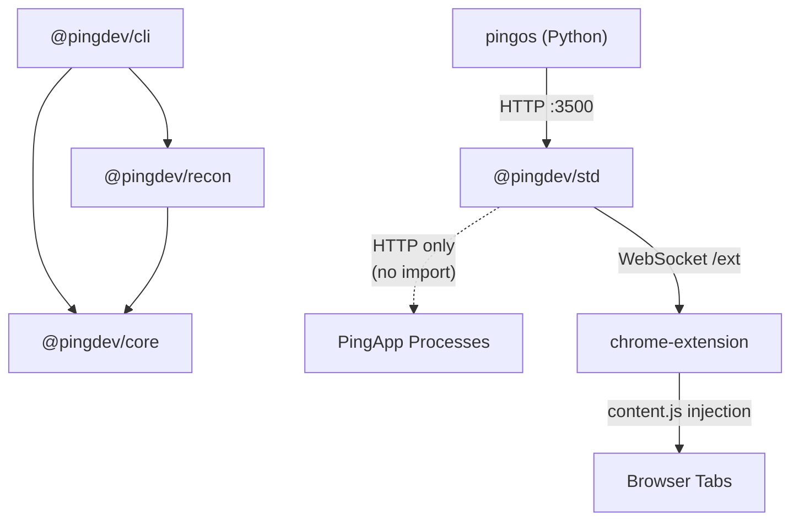

The `@pingdev/std` gateway does **not** import `@pingdev/core` directly. It communicates with PingApps exclusively over HTTP, keeping the layers decoupled. The Chrome extension is a standalone build that connects via WebSocket.

---

## Request Lifecycle

### Path 1: Extension Device (authenticated browser tab)

This is the primary path — a client sends an HTTP request to operate on a real Chrome tab.

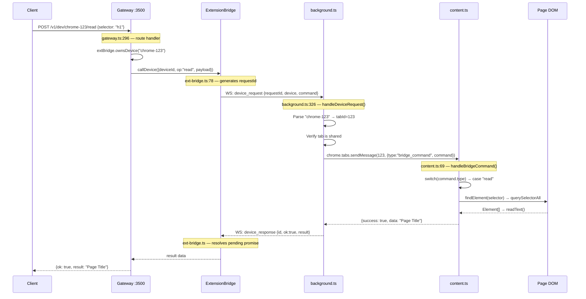

### Path 2: PingApp / LLM Driver (registry-based routing)

For devices not owned by the extension (like `llm`), the gateway consults the driver registry:

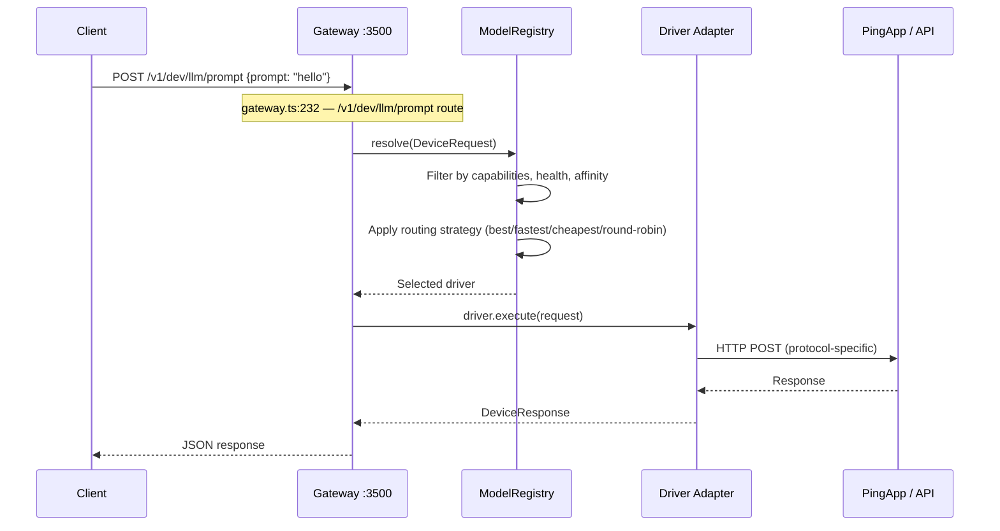

### Path 3: PingApp Routes (high-level app actions)

PingApp routes (`/v1/app/:appName/:action`) compose multiple device operations into domain-specific actions:

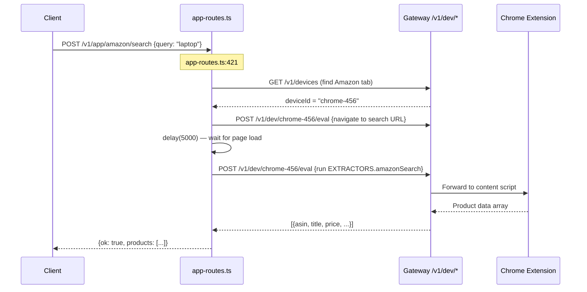

### Self-Healing Error Path

When a selector fails, the gateway attempts JIT self-healing before returning an error:

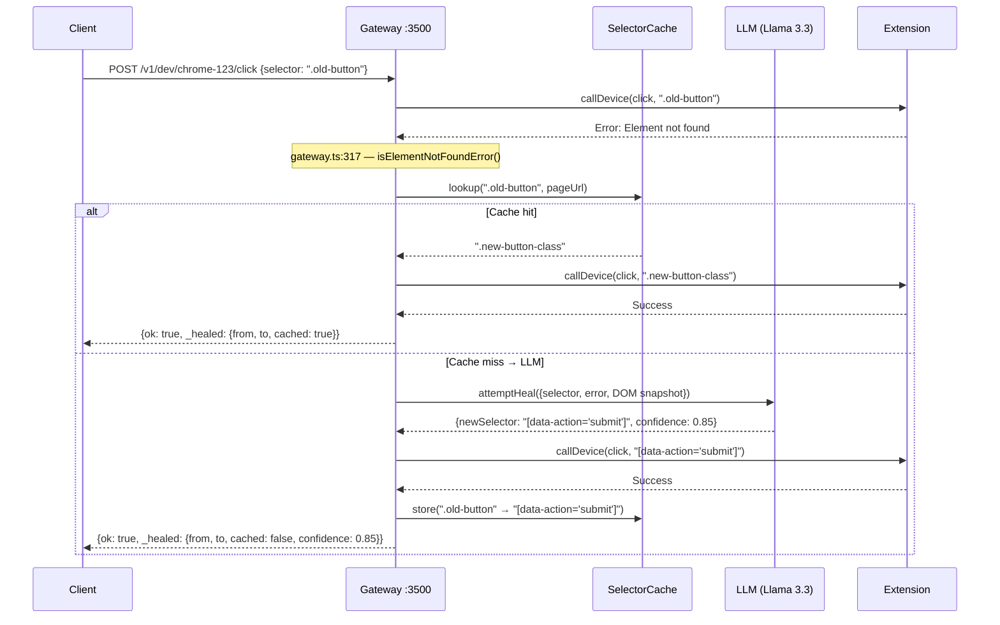

---

## Chrome Extension Bridge

The Chrome extension (`packages/chrome-extension/`) is the nervous system connecting the gateway to live browser tabs. It consists of three layers:

### background.ts — WebSocket Client & Tab Manager (965 lines)

The MV3 service worker manages the WebSocket connection and routes messages between the gateway and content scripts.

**Connection lifecycle:**

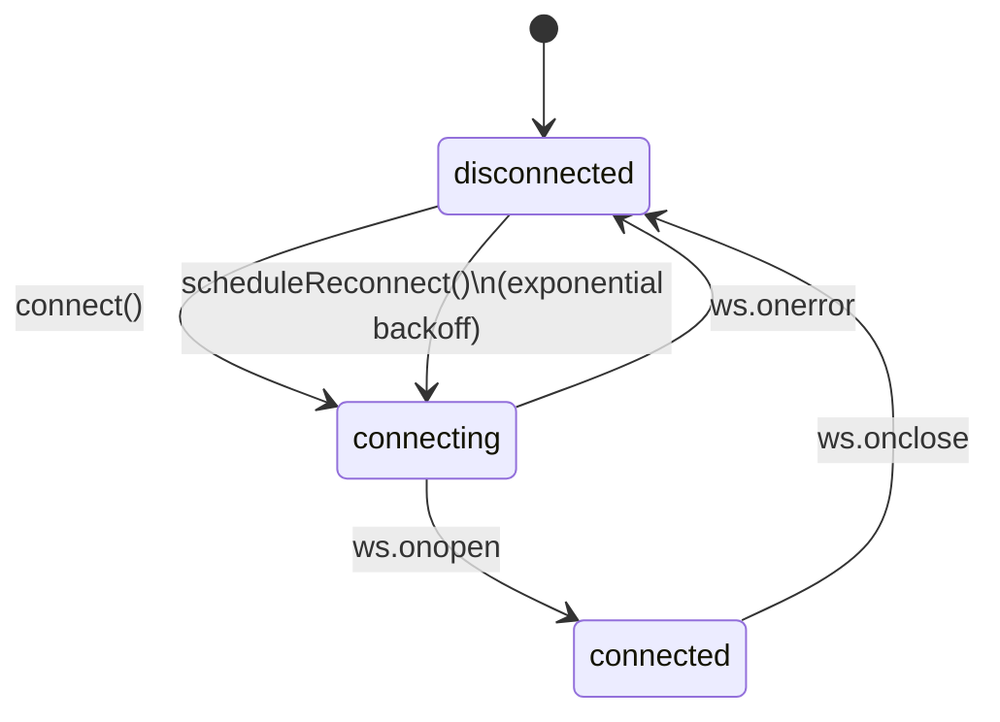

**Key responsibilities:**

1. **WebSocket management** — Connects to `ws://localhost:3500/ext` with exponential backoff reconnection (1s base, 30s max). Sends `ping` heartbeats every 30s; closes stale connections after 90s without a `pong`.

2. **Tab registry** — Auto-shares all `http://` and `https://` tabs by default. Maintains `SharedTabsState` in `chrome.storage.local`. Sends `hello` messages to gateway with full tab list on connect and after changes.

3. **Message routing** — Routes `device_request` messages from gateway to the appropriate tab's content script via `chrome.tabs.sendMessage()`. Routes responses back.

4. **CDP bypass** — For operations requiring trusted events (`eval`, `click` with coordinates, `press`, `type` with `cdp:true`), uses `chrome.debugger` API to attach CDP and execute directly, bypassing content script limitations.

5. **Content script injection** — Injects `content.js` into shared tabs on navigation, page load, and bfcache restore. Also injects anti-fingerprint overrides (`navigator.webdriver = false`).

**CDP operations handled directly in background.ts:**

| Operation | CDP Method | Why bypass content script? |
|-----------|-----------|---------------------------|
| `eval` | `Runtime.evaluate` | CSP blocks `eval()` in content scripts |
| `click` (with `cdp:true`) | `Input.dispatchMouseEvent` | Canvas apps need `isTrusted: true` events |
| `press` (with `cdp:true`) | `Input.dispatchKeyEvent` | Canvas apps reject synthetic keyboard events |
| `type` (with `cdp:true`) | `Input.insertText` | Avoids character doubling from keyDown+browser insertion |
| `navigate` | `chrome.tabs.update` | Works even when content script is orphaned |

**Content script retry logic** (`background.ts:554-604`):

```
1. Try chrome.tabs.sendMessage(tabId, command)
2. If null response OR channel error (message port closed, etc.):
   a. Re-inject content script
   b. Wait 500ms
   c. Retry sendMessage
3. If still fails → return error to gateway
```

### WebSocket Protocol

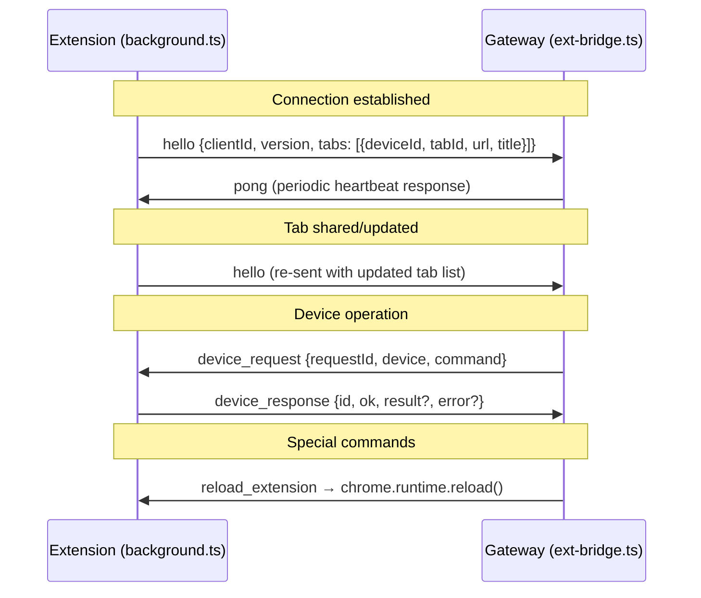

### ext-bridge.ts — Gateway-Side WebSocket Server

The `ExtensionBridge` class (`packages/std/src/ext-bridge.ts`) manages the server side:

- **WebSocket server** — `noServer: true` mode, handles HTTP upgrade on `/ext` path
- **Client tracking** — Maps `clientId → WebSocket`, `deviceId → clientId`, `clientId → ExtSharedTab[]`
- **Pending calls** — Maps `requestId → {resolve, reject, timer}` for request/response correlation
- **Timeout handling** — Default 20s timeout per device call; rejects with `ETIMEDOUT` on expiry

---

## Content Script Engine

`content.ts` (4154 lines) is the DOM interaction engine. It runs inside every shared tab and handles all operations dispatched from the background script.

### Command Dispatch (`content.ts:69-193`)

The `handleBridgeCommand()` function is the entry point — a switch on `command.type`:

| Command | Handler | Purpose |
|---------|---------|---------|
| `click` | `handleClick()` | Click element by CSS/text/role/aria/cell selector |
| `type` | `handleType()` | Type text into input/textarea/contenteditable |
| `read` | `handleRead()` | Read text content from elements |
| `extract` | `handleExtract()` | NL query extraction, schema extraction, cell range reading |
| `act` | `handleAct()` | Parse and execute natural language instructions |
| `eval` | `handleEval()` | Execute JS via `<script>` injection + `postMessage` relay |
| `waitFor` | `handleWaitFor()` | Poll until selector appears (10s default timeout) |
| `navigate` | `handleNavigate()` | Set `window.location.href` |
| `getUrl` | — | Return `window.location.href` |
| `recon` | `handleRecon()` | Full page reconnaissance (interactive elements, forms, structure) |
| `observe` | `handleObserve()` | Lightweight scan of visible actions and inputs |
| `clean` | — | Ad/clutter removal (CSS injection, element removal, detection) |
| `press` | `handlePress()` | Dispatch keyboard events (keydown/keypress/keyup) |
| `dblclick` | `handleDblClick()` | Double-click with optional stealth timing |
| `select` | `handleSelect()` | Text selection (range, element, or selectAll) |
| `scroll` | `handleScroll()` | Directional or to-edge scrolling |

### Selector Resolution (`findElement()` — content.ts:195-320)

The `findElement()` function supports multiple selector formats:

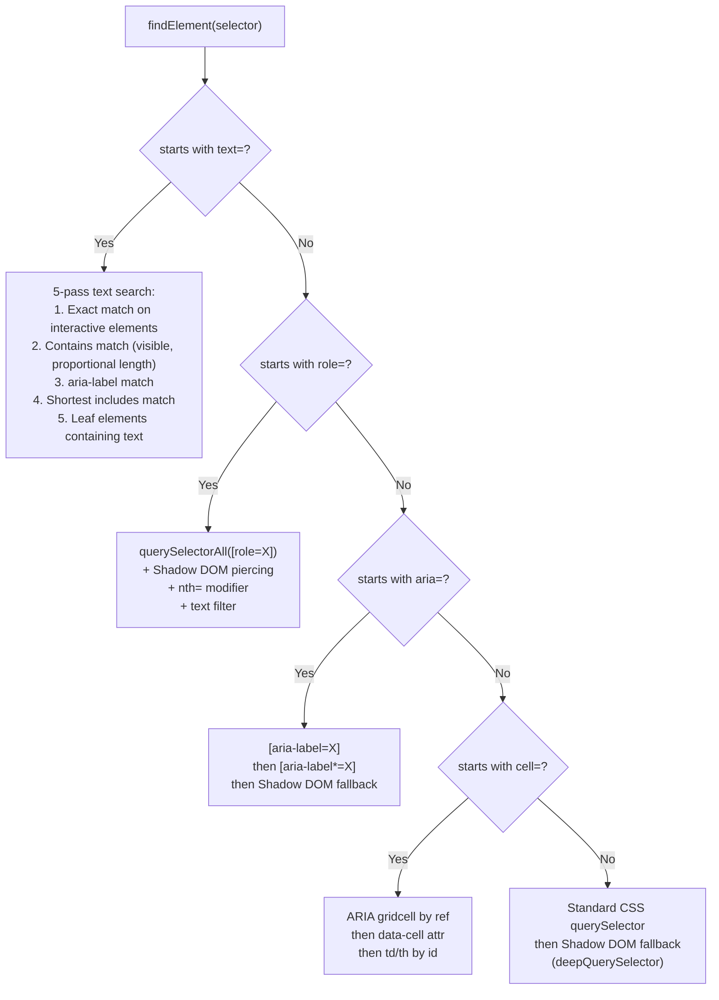

**Shadow DOM piercing** (`content.ts:539-583`): `deepQuerySelectorAll()` recursively traverses `shadowRoot` of all elements, enabling selectors to reach inside web components (critical for Reddit's `shreddit-post`, etc.).

### Stealth Mode

When `stealth: true` is passed with `click` or `type` operations:

- **Click**: `humanClick()` from `stealth.ts` — adds mouse movement, jitter in coordinates, realistic timing
- **Type**: `humanType()` — character-by-character typing with per-key random delays
- **Post-op jitter**: `withJitter()` adds random delay after any stealth operation

### Eval Bypass (`handleEval()` — content.ts:2573-2623)

Content scripts can't use `eval()` due to CSP. The workaround:

```
1. Generate unique nonce
2. Listen for window.postMessage with matching nonce
3. Create <script> element with inline code wrapper
4. Inject into document.documentElement
5. Remove <script> immediately
6. Script executes in page world, posts result back via postMessage
7. Content script receives result, resolves promise
8. Timeout after 5s
```

---

## Extract Engine Deep Dive

The extract engine (`handleExtract()` at content.ts:1830) supports three extraction modes:

1. **NL query** — `{query: "top post titles", limit: 5}` → dispatches to `extractByNaturalLanguage()`
2. **Cell range** — `{range: "A1:B5"}` → reads cells via name-box + formula-bar pattern
3. **Schema** — `{schema: {title: "h1", price: ".price-tag"}}` → maps keys to selectors or NL descriptions

### NL Extraction Pipeline (`extractByNaturalLanguage()` — content.ts:1130-1219)

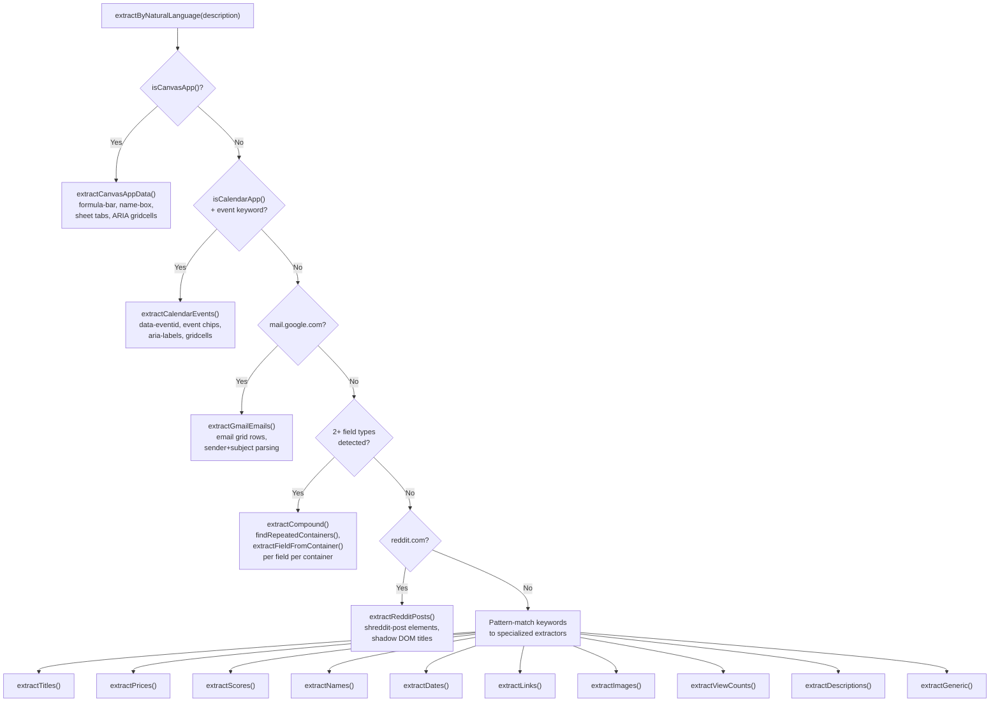

### All 20 Extraction Methods

| # | Method | Trigger | Strategy |
|---|--------|---------|----------|
| 1 | `canvas-app-formula-bar` | `isCanvasApp()` returns true | Read formula bar, name box, sheet tabs, ARIA gridcells |
| 2 | `calendar-events` | `isCalendarApp()` + event keyword | `[data-eventid]`, event chips, aria-labels, gridcells |
| 3 | `gmail-email-rows` | `mail.google.com` hostname | Grid rows → sender/subject/snippet parsing (4 strategies) |
| 4 | `reddit-shreddit-posts` | `reddit.com` hostname | `shreddit-post` attributes, shadow DOM titles, `/comments/` links |
| 5 | `compound-{fields}` | 2+ field types in query | `findRepeatedContainers()` → `extractFieldFromContainer()` per field |
| 6 | `hn-titleline` | `news.ycombinator.com` | `.titleline > a` selectors |
| 7 | `github-repo-links` | `github.com` | `article h2 a`, `a[data-hovercard-type="repository"]` |
| 8 | `amazon-product-titles` | `amazon.*` hostname | `[data-component-type="s-search-result"] h2 a span` |
| 9 | `headings+repeated-containers` | Title/headline keywords | h1-h3 in main content → repeated container links → aria headings |
| 10 | `price-regex+price-classes` | Price/cost keywords | Regex walker (`$`, `€`, `AED`, etc.) + `[class*="price"]` elements |
| 11 | `score-classes+shadow-dom` | Score/vote keywords | `[class*="score"]`, `[data-score]` + shadow DOM fallback |
| 12 | `comment-selectors` | Comment/review keywords | `[class*="comment"]` in main content area + shadow DOM |
| 13 | `time-elements+date-regex` | Date/time keywords | `<time>`, `[datetime]` elements + date pattern regex |
| 14 | `youtube-channel-names` | `youtube.com` | `ytd-channel-name a`, `a[href*="/@"]` |
| 15 | `name-classes+repeated-containers` | Author/user/channel keywords | `[class*="author"]`, `[itemprop="author"]` → repeated container links |
| 16 | `anchor-hrefs` | Link/URL keywords | All `a[href]` elements, deduplicated |
| 17 | `img-elements` | Image keywords | `img[src]` with `naturalWidth > 50` + background-image URLs |
| 18 | `view-count-classes` | View/watch keywords | `[class*="view"]`, `[aria-label*="view"]` with digit content |
| 19 | `description-selectors` | Description/summary keywords | `p`, `[class*="description"]` in repeated containers |
| 20 | `generic-repeated-containers` | No keyword match | `findRepeatedContainers()` → textContent of each |

### Site Detection Functions

- **`isCanvasApp()`** (`content.ts:639-677`): Checks for Google Sheets name-box/formula-bar, known canvas hosts (Figma, Excalidraw, Miro), or large canvas elements (>30% viewport) with minimal DOM text. Excludes video sites (YouTube, Netflix).

- **`isCalendarApp()`** (`content.ts:682-688`): Checks for `[data-eventid]`, `[data-eventchip]`, or Google Calendar hostname/title.

- **`getMainContentArea()`** (`content.ts:1587-1657`): Site-specific content scoping — Gmail grid, Reddit shreddit-feed, GitHub turbo-frames, generic `<main>` / `[role="main"]` landmarks.

### Compound Extraction

When a query mentions 2+ field types (e.g., "list stories with titles, points, and authors"):

1. **`detectCompoundFields()`** (`content.ts:965-1007`) — Regex-matches field keywords against 8 categories: title, price, score, author, date, views, link, description. Handles ambiguity: "channel names" → author (not title).

2. **`extractCompound()`** (`content.ts:1102-1128`) — Finds repeated containers, then for each container calls `extractFieldFromContainer()` for each detected field. Joins fields with `|` separator.

3. **`extractFieldFromContainer()`** (`content.ts:1009-1100`) — Per-field extraction within a single container element. For HN table layout, also checks `nextElementSibling` for the metadata row.

### Repeated Container Detection (`findRepeatedContainers()` — content.ts:1664-1787)

The core pattern for feed/list pages:

```
1. Scope to getMainContentArea() (avoids sidebar/nav)
2. Find list parents: ul, ol, table, tbody, [role="list"], [role="feed"]
3. For each parent, count child tag frequencies
4. Pick the LARGEST group of same-tag children (≥3)
5. Site-specific overrides:
   - YouTube: ytd-rich-item-renderer, ytd-video-renderer
   - Amazon: [data-component-type="s-search-result"], [data-asin]
   - Reddit: shreddit-post (via Shadow DOM)
6. Fallback: same-class divs in content area
```

---

## Act / NL Parser

The `act` command (`handleAct()` at content.ts:2478) parses natural language instructions into executable step sequences.

### Instruction Parsing Pipeline

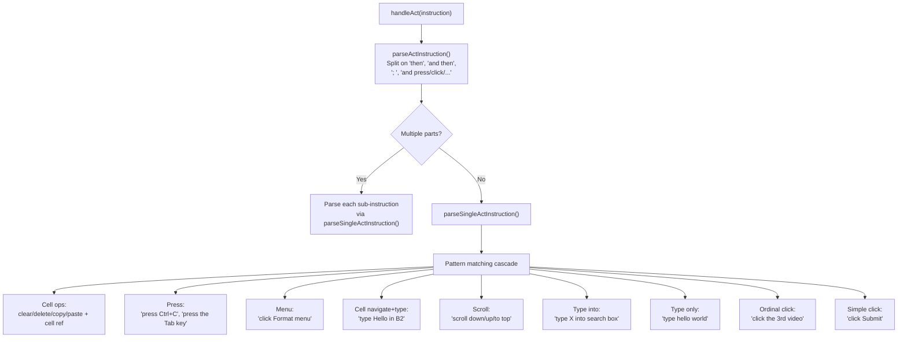

### Compound Splitting (`content.ts:2093-2112`)

Instructions like "type hello in the search box and then click Submit" are split on:
- `" and then "` / `" then "`
- `"; "`
- `" and "` followed by action verbs (`press`, `click`, `tap`, `scroll`, `select`, `open`, `type`, `enter`, `hit`)

### Key Normalization (`normalizeKeyName()` — content.ts:2080-2091)

Strips articles and suffixes: `"the Tab key"` → `"Tab"`, `"escape"` → `"Escape"`. Uses `KEY_ALIASES` map for canonical CDP names.

### Ordinal Click Resolution (`content.ts:2265-2359`)

"Click the 3rd video" resolves as:

1. Parse ordinal (`3rd` → index 2)
2. Parse noun (`video`)
3. Map noun to selector list via `nounSelectors` table:
   - `video` → `['a#video-title', 'h3 a', 'a[href*="watch"]', ...]`
   - `product` → `['[data-component-type="s-search-result"] h2 a', ...]`
   - `post` → `['a[slot="title"]', 'a[href*="/comments/"]', ...]`
   - `story` → `['.titleline > a', 'a.storylink', ...]`
4. Query main content area for all visible matches
5. Try shadow DOM if insufficient matches
6. Fallback: text/aria-label contains the noun
7. Select element at index, build selector

### Quote Handling (`content.ts:2122-2198`)

Text to type is extracted from quoted strings first (`"Hello World"` or `'Hello World'`), falling back to regex capture groups. The quoted value takes precedence over regex-matched text to avoid corruption from trailing punctuation.

### Execution Engine

Steps are executed sequentially with 250ms delay between each for UI settling:

| Step Op | Execution |
|---------|-----------|
| `navigate` | `navigateToCell()` — CDP click name-box, Ctrl+A, type ref, Enter |
| `type` | CDP `Input.insertText` → fallback to `handleType()` on focused element |
| `press` | CDP `keyDown`/`keyUp` → fallback to synthetic `KeyboardEvent` dispatch |
| `click` / `click-selector` | `handleClick()` with selector |
| `scroll` | `handleScroll()` with direction/edge |

**Batch optimization** (`content.ts:2486-2546`): When the pattern is `navigate → type → [enter]`, all steps are batched into a single CDP debugger session to avoid detach/reattach timing issues.

---

## Self-Heal System

The self-heal system automatically repairs broken CSS selectors at runtime without human intervention.

### Architecture

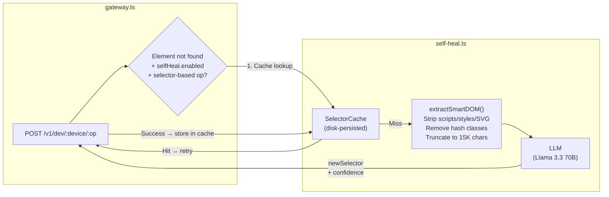

### Heal Flow (`gateway.ts:317-391`)

1. **Trigger**: `isElementNotFoundError()` on `read`, `click`, `type`, or `waitFor` ops
2. **Cache fast path**: `selectorCache.lookup(selector, pageUrl)` — if found, retry immediately
3. **LLM path**: `attemptHeal()` sends a prompt with the failed selector + DOM excerpt to the LLM
4. **Confidence gate**: Only retries if `healResult.confidence >= selfHealCfg.minConfidence` (default: 0.5)
5. **Cache update**: On successful heal, stores the mapping `oldSelector → newSelector` for future use

### Configuration (`self-heal.ts:42-56`)

```typescript
{
  enabled: true,
  maxAttempts: 2,
  domSnapshotMaxChars: 15_000,    // Smart DOM extraction limit
  minConfidence: 0.5,
  llm: {
    provider: 'openai-compat',
    baseUrl: 'https://openrouter.ai/api/v1',
    model: 'meta-llama/llama-3.3-70b-instruct',
    maxTokens: 500,
    temperature: 0.2,
    timeoutMs: 15_000,
  }
}
```

### Stats Tracking (`gateway.ts:92-99`)

The gateway tracks heal statistics exposed via `GET /v1/heal/stats`:

```typescript
{
  attempts: number,
  successes: number,
  cacheHits: number,
  cacheHitSuccesses: number,
  llmAttempts: number,
  llmSuccesses: number,
  // Computed rates: successRate, cacheHitRate, cacheHitSuccessRate, llmSuccessRate
}
```

### Smart DOM Extraction (`self-heal.ts:77-100+`)

Before sending DOM to the LLM, `extractSmartDOM()` aggressively cleans the HTML:
- Strips `<script>`, `<style>`, `<svg>`, `<noscript>` tags
- Removes hash-like class names (`css-*`, `sc-*`, random hashes)
- Keeps semantic class names (readable words)
- Truncates to `domSnapshotMaxChars` (15K)

---

## Recorder

The recorder (`content.ts:3912-4154`) captures user interactions for workflow replay.

### Architecture

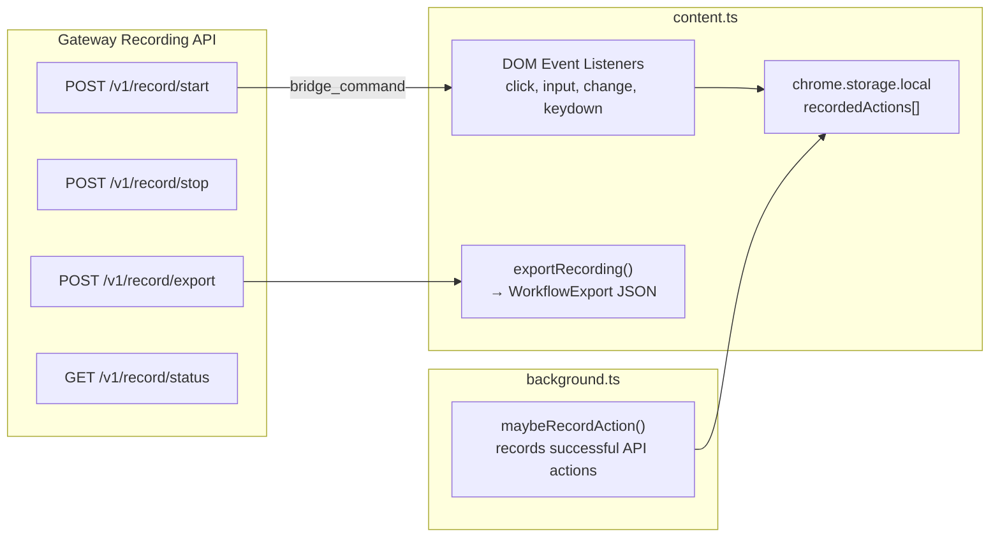

### Dual Recording Sources

1. **User interactions** (captured by DOM event listeners in content.ts):
   - `click` events → `smartSelector(target)` + timestamp
   - `input` events → debounced type recording (500ms, updates last entry for same field)
   - `change` events → select element value changes
   - `keydown` events → Enter, Escape, Tab only

2. **API-driven actions** (captured by background.ts `maybeRecordAction()`):
   - Records successful `click`, `type`, `press`, `navigate`, `scroll`, `select`, `dblclick` operations
   - Non-critical: silently fails if recorder not active

### Smart Selector Generation (`smartSelector()` — content.ts:3982-4050)

Priority order for generating stable selectors from DOM elements:

1. `aria-label` (most readable, stable across redesigns)
2. `#id` (skip hash-like IDs)
3. `[data-testid]`
4. `tagName[name]` (for inputs)
5. `[role]` (if unique)
6. `.class1.class2` (skip `css-*`, `sc-*`, hash classes)
7. `tag:nth-of-type(n)` (fallback)

### Export Format

```typescript
interface WorkflowExport {
  name: string;
  steps: Array<{
    op: string;         // click, type, press, navigate, scroll, select
    selector?: string;
    text?: string;
    url?: string;
    key?: string;
    value?: string;
  }>;
  inputs: {};
  outputs: {};
}
```

### Persistence

Recording state survives page navigations via `chrome.storage.local`:
- `recordingEnabled: boolean` — whether recording is active
- `recordedActions: RecordedAction[]` — all captured actions

On content script init, if `recordingEnabled` is true, recording resumes automatically.

---

## PingApp Architecture

PingApp routes (`app-routes.ts`, 814 lines) provide high-level, domain-specific APIs on top of raw device operations. Each "app" targets a specific website and composes multiple `deviceOp()` calls into meaningful actions.

### Registered Apps

| App | Domain | Routes | Key Operations |
|-----|--------|--------|----------------|
| **AliExpress** | `aliexpress.com` | search, product, cart (add/remove/view), orders, wishlist, clean, recon | Navigation + locale cookies + JS extractors |
| **Amazon** | `amazon.*` | search, product, cart (add/view), orders, deals, clean, recon | Domain detection + `[data-asin]` extractors |
| **Claude** | `claude.ai` | chat, new chat, read, conversations, conversation, model (get/set), projects, artifacts, upload, search, clean, recon | DOM type/click + selector-based interaction |

### Route Pattern

All app routes follow a consistent pattern:

```typescript
// 1. Find the device (tab) by domain
const deviceId = await findDeviceByDomain(gateway, 'amazon');

// 2. Navigate to the target URL
await deviceOp(gateway, deviceId, 'eval', {
  expression: `window.location.href = "https://..."`
});

// 3. Wait for page load
await delay(5000);

// 4. Optional: clean ads/clutter
await deviceOp(gateway, deviceId, 'clean', { mode: 'full' });

// 5. Extract structured data via inline JS evaluator
const result = await deviceOp(gateway, deviceId, 'eval', {
  expression: EXTRACTORS.searchResults  // Inline JS function
});

// 6. Return structured response
return { ok: true, products: result?.result || [] };
```

### Extractors

`EXTRACTORS` is a dictionary of inline JavaScript functions that run in the page context via `eval`. Each extractor is a self-contained IIFE that scrapes structured data:

- **`searchResults`** — AliExpress product cards from `a[href*="/item/"]`
- **`productDetails`** — Single product: title, price, rating, reviews, variants
- **`cartItems`** — Shopping cart items with title, price, quantity
- **`amazonSearch`** — Amazon `[data-asin]` product cards with smart price extraction
- **`amazonProduct`** — Amazon product page: title, price, features, images
- **`claudeResponse`** — Last assistant message from Claude.ai
- **`claudeConversations`** — Sidebar conversation list from `a[href*="/chat/"]`
- **`claudeModel`** — Current model from model selector dropdown
- **`orders`** — AliExpress order history parsing

### Device Discovery

```typescript
async function findDeviceByDomain(gateway: string, domain: string): Promise<string | null> {
  const data = await fetchJsonWithTimeout(`${gateway}/v1/devices`);
  const devices = data?.extension?.devices || [];
  return devices.find(d => d.url?.includes(domain))?.deviceId || null;
}
```

This queries the gateway's device list (populated from the extension's shared tabs) and finds the first tab matching the target domain.

---

## Security Model

### Content Script Isolation

- Content scripts run in an **isolated world** — they share the DOM with the page but have separate JS scope
- `eval` operations use a `<script>` injection + `postMessage` relay pattern to cross the isolation boundary
- Each eval uses a unique nonce to prevent result interception

### CDP Access Control

- `chrome.debugger` API requires explicit user permission (Chrome shows a "debugging" banner)
- CDP sessions are attached/detached per operation — no persistent debugging sessions
- Only shared tabs (user-consented) can be controlled

### Anti-Fingerprint

The extension injects anti-fingerprint overrides into the page world (`background.ts:916-942`):
- `navigator.webdriver` → `false`
- `navigator.plugins` → realistic mock (Chrome PDF Plugin, length: 5)

This runs in the `MAIN` world with `injectImmediately: true` to execute before page scripts.

### Network Security

- Gateway listens on `::` (IPv6 any, dual-stack) — accepts both IPv4 and IPv6 connections
- WebSocket connection is unencrypted (`ws://localhost:3500/ext`) — local-only by design
- No authentication on the gateway API — designed for local development, not production exposure
- CORS is not configured — browser requests from other origins will be blocked by default

### Error Information Leakage

The gateway returns structured `PingError` objects with `errno`, `code`, and `message` fields. Error messages may contain:
- Selector strings from failed operations
- Page URLs from device status
- Stack traces in crash logs (`/tmp/pingos-crash.log`)

This is acceptable for a local development tool but should be sanitized for any production deployment.

### Tab Sharing Model

- All `http://` and `https://` tabs are shared by default
- Users can manually unshare tabs via the popup UI
- Manual unshare state persists in `chrome.storage.local` (`manualUnsharedTabs`)
- Closed tabs are automatically cleaned from shared state
- `chrome://`, `extension://`, and other non-HTTP tabs are never shared
