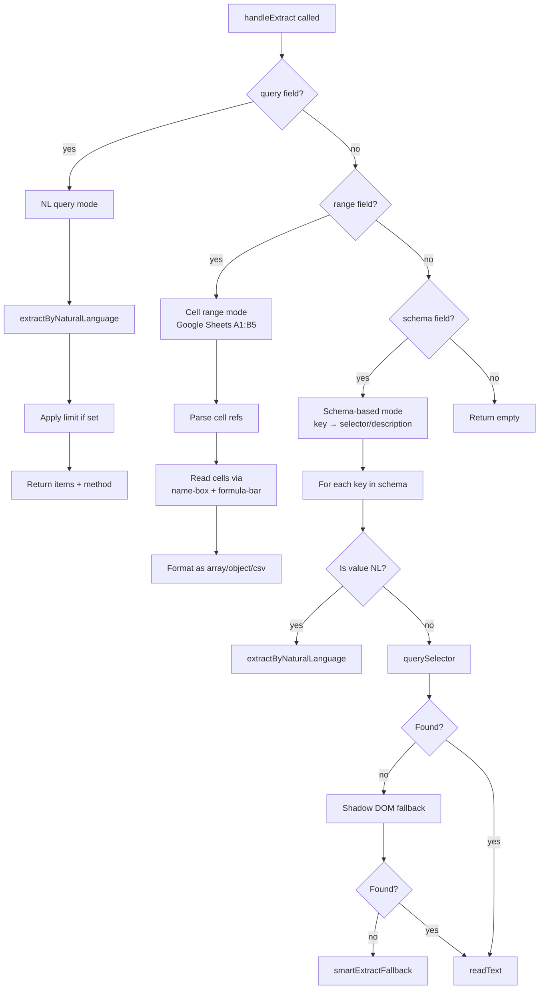
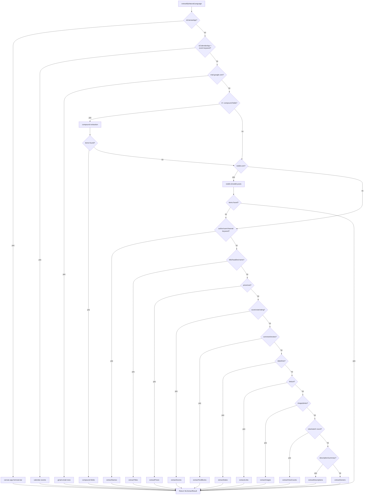

# Extract Engine — Deep Dive

The Extract Engine is PingDev's data extraction system, implemented in the Chrome extension's content script. It reads structured data from any web page using a cascade of site-specific extractors, natural language query interpretation, and generic DOM heuristics.

**Source**: `packages/chrome-extension/src/content.ts` (lines 600–1952)

## Table of Contents

- [How Extraction Works End to End](#how-extraction-works-end-to-end)
- [Entry Point: handleExtract](#entry-point-handleextract)
- [Method Selection Cascade](#method-selection-cascade)
- [Natural Language Query Detection](#natural-language-query-detection)
- [All Extraction Methods](#all-extraction-methods)
- [Compound Extraction](#compound-extraction)
- [Helper Infrastructure](#helper-infrastructure)
- [How to Add a New Extraction Method](#how-to-add-a-new-extraction-method)
- [Known Limitations](#known-limitations)

---

## How Extraction Works End to End

The extract system handles three distinct modes, selected by which fields the caller provides:



### Request format

```typescript
// NL query mode
{ type: 'extract', query: 'top post titles', limit: 10 }

// Cell range mode (Google Sheets)
{ type: 'extract', range: 'A1:B5', format: 'array' }

// Schema-based mode
{ type: 'extract', schema: { title: 'h1', prices: 'product prices' } }
```

### Response format

```typescript
// NL query response
{ success: true, data: { query: 'top post titles', items: [...], method: 'hn-titleline', count: 10 } }

// Schema response
{ success: true, data: { title: 'My Page', prices: ['$9.99', '$19.99'], _meta: { prices: 'nl:price-regex+price-classes' } } }
```

---

## Entry Point: handleExtract

```typescript
async function handleExtract(command: {
  range?: string;
  format?: 'array' | 'object' | 'csv';
  schema?: Record<string, string>;
  query?: string;
  limit?: number;
}): Promise<BridgeResponse>
```

The function dispatches based on which field is present:

1. **`query`** — Calls `extractByNaturalLanguage(query)`, applies `limit`, returns `{ items, method, count }`.
2. **`range`** — Parses `A1:B5` notation, iterates cells via `readCellViaFormulaBar()`, returns grid data in the requested `format`.
3. **`schema`** — Iterates `{ key: selectorOrDescription }` entries. For each value:
   - If `isNaturalLanguageQuery(value)` → routes to `extractByNaturalLanguage`
   - Otherwise → CSS `querySelector`, with shadow DOM and smart fallback

---

## Method Selection Cascade

When a natural language query arrives, `extractByNaturalLanguage()` runs a priority-ordered cascade of site detectors and keyword matchers:



**Key design decisions:**

- Site-specific extractors (canvas, calendar, Gmail, Reddit) run **before** keyword dispatch — they're more reliable for their target sites.
- Compound extraction runs **before** single-field dispatch — "titles, scores, and authors" extracts all three per container instead of choosing one.
- Each extractor returns early with its method name. If a site-specific extractor produces 0 items, it falls through to the next check.

---

## Natural Language Query Detection

The function `isNaturalLanguageQuery()` determines whether a string is a human description or a CSS selector:

```typescript
function isNaturalLanguageQuery(value: string): boolean
```

**Not NL** (returns `false`):
- Starts with `.`, `#`, `[` (CSS selector characters)
- Matches tag-like patterns (`div.class`, `a#id`)
- Contains CSS combinators (`>`, `+`, `~`) without surrounding spaces
- Is a bare HTML tag name (`div`, `span`, `h1`, etc.)

**Is NL** (returns `true`):
- Contains articles/prepositions: `the`, `a`, `an`, `of`, `on`, `in`, `for`, etc.
- Contains descriptive nouns: `titles`, `prices`, `headlines`, `comments`, `links`, etc.
- Contains 2+ words separated by spaces

**Examples:**
| Input | Result | Why |
|-------|--------|-----|
| `h1` | CSS | Bare tag name |
| `.price` | CSS | Starts with `.` |
| `product titles` | NL | Contains descriptive noun |
| `all the headlines` | NL | Contains article + noun |
| `div.content > span` | CSS | CSS combinator pattern |

---

## All Extraction Methods

### 1. `canvas-app-formula-bar`

| Property | Value |
|----------|-------|
| **Function** | `extractCanvasAppData()` |
| **Triggers when** | `isCanvasApp()` returns true |
| **Target sites** | Google Sheets, Figma, Excalidraw, Miro, Lucidchart, Draw.io, Canva |
| **Returns** | Formula bar value, current cell ref, sheet tab names, ARIA gridcell values, document title |
| **Example query** | `"cell values"`, `"sheet data"` (any query on a canvas app) |

**Detection logic** (`isCanvasApp`):
1. Google Sheets: looks for `#t-name-box` or `[aria-label="Name Box"]`
2. Formula bar: `#t-formula-bar-input` or `[aria-label="Formula input"]`
3. URL match: `docs.google.com/spreadsheets`
4. Known canvas hosts: figma.com, excalidraw.com, etc.
5. Excludes video sites (YouTube, Vimeo) that use `<canvas>` for video
6. Generic: large canvas (>30% viewport) with minimal DOM text

### 2. `calendar-events`

| Property | Value |
|----------|-------|
| **Function** | `extractCalendarEvents()` |
| **Triggers when** | `isCalendarApp()` AND query contains event/appointment/meeting/schedule/calendar |
| **Target sites** | Google Calendar |
| **Returns** | Deduplicated event labels from `[data-eventid]`, event chips, all-day sections, grid cells |
| **Example query** | `"today's events"`, `"meetings this week"` |

### 3. `gmail-email-rows`

| Property | Value |
|----------|-------|
| **Function** | `extractGmailEmails()` |
| **Triggers when** | `location.hostname === 'mail.google.com'` |
| **Target sites** | Gmail |
| **Returns** | `sender — subject — snippet` for each email row |
| **Example query** | `"emails"`, `"inbox messages"` |

Uses 4 fallback strategies:
1. Grid rows with `.yW span` (sender) + `.y6 span` (subject) + `.y2` (snippet)
2. `<tr>` elements in `[role="main"]` with 15-500 char text
3. `[role="row"]` elements with structured sender/subject parsing
4. Raw `<tr>` elements in main content area

### 4. `reddit-shreddit-posts`

| Property | Value |
|----------|-------|
| **Function** | `extractRedditPosts()` |
| **Triggers when** | `location.hostname` includes `reddit.com` |
| **Target sites** | Reddit (new, redesign, old) |
| **Returns** | Post titles |
| **Example query** | `"post titles"`, `"top posts"` |

Uses 4 strategies:
1. `shreddit-post` custom elements — reads `post-title` attribute, shadow DOM, slotted elements
2. Deep shadow DOM piercing for `[slot="title"]`
3. Reddit-specific selectors: `a[id^="post-title"]`, `a[data-click-id="body"]`, etc.
4. Links to `/comments/` paths (Reddit post URLs always contain this)

### 5. `compound-{fields}`

| Property | Value |
|----------|-------|
| **Function** | `extractCompound()` |
| **Triggers when** | `detectCompoundFields()` finds 2+ field types in the query |
| **Target sites** | Any site with repeated containers |
| **Returns** | Multi-field records joined by `|` separator |
| **Example query** | `"list stories with titles, points, and authors"` → method `compound-title+score+author` |

See [Compound Extraction](#compound-extraction) for details.

### 6. `hn-titleline`

| Property | Value |
|----------|-------|
| **Function** | `extractTitles()` (HN branch) |
| **Triggers when** | Title keyword + hostname is `news.ycombinator.com` or `hn.algolia.com` |
| **Target sites** | Hacker News |
| **Returns** | Story titles via `.titleline > a` or `a.storylink` |
| **Example query** | `"titles"`, `"headlines"` |

### 7. `github-repo-links`

| Property | Value |
|----------|-------|
| **Function** | `extractTitles()` (GitHub branch) |
| **Triggers when** | Title keyword + hostname is `github.com` |
| **Target sites** | GitHub trending, explore, search |
| **Returns** | Repository names from `article h2 a`, `a[data-hovercard-type="repository"]`, etc. |
| **Example query** | `"repo names"`, `"trending titles"` |

### 8. `amazon-product-titles`

| Property | Value |
|----------|-------|
| **Function** | `extractTitles()` (Amazon branch) |
| **Triggers when** | Title keyword + hostname includes `amazon.` |
| **Target sites** | Amazon (any region) |
| **Returns** | Product titles from `[data-component-type="s-search-result"] h2 a span` |
| **Example query** | `"product titles"`, `"product names"` |

### 9. `headings+repeated-containers`

| Property | Value |
|----------|-------|
| **Function** | `extractTitles()` (generic branch) |
| **Triggers when** | Title/headline/heading/name keyword, no site-specific match |
| **Target sites** | Any website |
| **Returns** | Headings (h1-h3), links in repeated containers, ARIA headings, titled links, shadow DOM titles |
| **Example query** | `"titles"`, `"headings"`, `"names"` |

5 fallback strategies in order:
1. `h1, h2, h3` in main content area (excluding nav/sidebar)
2. Links inside `findRepeatedContainers()` results
3. `[role="heading"]` elements
4. `a[title]` attributes
5. Shadow DOM titles (`[slot="title"]`, etc.)

### 10. `price-regex+price-classes`

| Property | Value |
|----------|-------|
| **Function** | `extractPrices()` |
| **Triggers when** | Query contains `price`, `cost`, `amount`, `fee` |
| **Target sites** | Any e-commerce or listing site |
| **Returns** | Price strings matching currency regex + elements with price-related classes |
| **Example query** | `"prices"`, `"product costs"` |

Regex pattern: `(?:[$£€¥]|USD|EUR|GBP|AED|SAR|INR)\s*[\d,]+(?:\.\d{1,2})?` (and reversed)

### 11. `score-classes+shadow-dom`

| Property | Value |
|----------|-------|
| **Function** | `extractScores()` |
| **Triggers when** | Query contains `score`, `vote`, `upvote`, `rating`, `points`, `karma` |
| **Target sites** | Reddit, HN, any site with vote/score UI |
| **Returns** | Text from elements with score/vote/karma class names or data attributes |
| **Example query** | `"scores"`, `"upvotes"`, `"ratings"` |

### 12. `comment-selectors`

| Property | Value |
|----------|-------|
| **Function** | `extractTextBlocks('comment')` |
| **Triggers when** | Query contains `comment`, `review`, `feedback`, `reply`, `response` |
| **Target sites** | Any site with comments/reviews |
| **Returns** | Text blocks from `[class*="comment"]`, `[class*="reply"]`, `[class*="post-body"]` |
| **Example query** | `"comments"`, `"reviews"`, `"replies"` |

### 13. `time-elements+date-regex`

| Property | Value |
|----------|-------|
| **Function** | `extractDates()` |
| **Triggers when** | Query contains `date`, `time`, `when`, `posted`, `published`, `ago` |
| **Target sites** | Any site with timestamps |
| **Returns** | `<time>` element values, `[datetime]` attributes, date regex matches |
| **Example query** | `"dates"`, `"posted times"`, `"when published"` |

### 14. `youtube-channel-names`

| Property | Value |
|----------|-------|
| **Function** | `extractNames()` (YouTube branch) |
| **Triggers when** | Author/channel keyword + hostname includes `youtube.com` |
| **Target sites** | YouTube |
| **Returns** | Channel names from `ytd-channel-name`, `a[href*="/@"]`, `#owner-name` |
| **Example query** | `"channel names"`, `"creators"` |

### 15. `name-classes+repeated-containers`

| Property | Value |
|----------|-------|
| **Function** | `extractNames()` (generic branch) |
| **Triggers when** | Author/user/channel/creator keyword, no site-specific match |
| **Target sites** | Any site |
| **Returns** | Text from elements with author/channel/user class names, or short links in repeated containers |
| **Example query** | `"authors"`, `"usernames"`, `"posters"` |

### 16. `anchor-hrefs`

| Property | Value |
|----------|-------|
| **Function** | `extractLinks()` |
| **Triggers when** | Query contains `link`, `url`, `href` |
| **Target sites** | Any site |
| **Returns** | Deduplicated `href` values from all `a[href]` elements (excluding `javascript:` and `#`) |
| **Example query** | `"links"`, `"urls"` |

### 17. `img-elements`

| Property | Value |
|----------|-------|
| **Function** | `extractImages()` |
| **Triggers when** | Query contains `image`, `photo`, `picture`, `thumbnail`, `avatar` |
| **Target sites** | Any site |
| **Returns** | `src` URLs from `` elements (>50px natural width) + background-image URLs |
| **Example query** | `"images"`, `"thumbnails"`, `"photos"` |

### 18. `view-count-classes`

| Property | Value |
|----------|-------|
| **Function** | `extractViewCounts()` |
| **Triggers when** | Query contains `view`, `watch`, `play`, `listen`, `stream` |
| **Target sites** | YouTube, video/audio platforms |
| **Returns** | Text/aria-labels from elements with view/watch class names that contain digits |
| **Example query** | `"view counts"`, `"views"` |

### 19. `description-selectors`

| Property | Value |
|----------|-------|
| **Function** | `extractDescriptions()` |
| **Triggers when** | Query contains `description`, `summary`, `excerpt`, `snippet`, `preview`, `subtitle` |
| **Target sites** | Any site with repeated items |
| **Returns** | Text from `p`, `[class*="description"]`, `[class*="snippet"]`, etc. inside repeated containers |
| **Example query** | `"descriptions"`, `"summaries"`, `"previews"` |

### 20. `generic-repeated-containers`

| Property | Value |
|----------|-------|
| **Function** | `extractGeneric()` |
| **Triggers when** | No keyword match — final fallback |
| **Target sites** | Any site |
| **Returns** | Text content from repeated containers, or visible paragraphs/headings from main content area |
| **Example query** | `"everything on this page"`, `"all items"` |

---

## Compound Extraction

Compound extraction activates when a query mentions 2+ field types (e.g., "list stories with titles, points, and authors").

### Field Detection

`detectCompoundFields()` scans the lowercased query for 8 field patterns:

| Field | Trigger words |
|-------|--------------|
| `title` | title, headline, heading, subject |
| `price` | price, cost, amount, fee |
| `score` | score, vote, upvote, rating, points, karma |
| `author` | author, creator, poster, username, sender, channel |
| `date` | date, timestamp, posted, published |
| `views` | view, view count |
| `link` | link, url |
| `description` | description, summary, excerpt, snippet |

**Ambiguity handling**: The word "names" is ambiguous. "Product names" = titles, "channel names" = authors. The engine adds "names" to the title field **only if** author wasn't already matched.

**Adjacency check**: "Channel names" triggers both author ("channel") and title ("names"), but since these are adjacent words forming a single concept, the engine removes the title match and keeps only author.

### Per-Container Field Extraction

`extractFieldFromContainer()` extracts a specific field from a DOM container:

```typescript
function extractFieldFromContainer(container: Element, field: string): string
```

For HN's table layout, it also searches the **next sibling `<tr>`** (metadata row) because HN splits title and metadata across two table rows.

| Field | Selectors used |
|-------|---------------|
| `title` | `h1, h2, h3, h4, .titleline > a, .storylink, #video-title, .a-text-normal` |
| `price` | `[class*="price"], [data-price], [itemprop="price"]` + currency regex |
| `score` | `.score, [class*="score"], [class*="vote"], [class*="point"]` |
| `author` | `[class*="author"], .hnuser, a[href*="user"], #channel-name, a[href*="/@"]` |
| `date` | `time, [datetime], [class*="date"], .age, [class*="ago"]` |
| `views` | `[class*="view"], [aria-label*="view"], #metadata-line` |
| `link` | First `a[href]` in container |
| `description` | `p, [class*="description"], [class*="summary"], [class*="snippet"]` |

### Output Format

Compound results join field values with ` | `:

```
"Show HN: PingDev | 142 points | user123"
```

---

## Helper Infrastructure

### `findRepeatedContainers()`

The core DOM heuristic that finds "list items" on any page. Used by compound extraction, title extraction, name extraction, descriptions, and the generic fallback.

**Algorithm:**
1. Scope to `getMainContentArea()` to avoid sidebar/nav
2. Search `<ul>`, `<ol>`, `<table>`, `<tbody>`, `[role="list"]`, `[role="feed"]`, `<section>`, `<main>`
3. For each parent, count children by tag name. If a tag appears 3+ times, those children are candidates.
4. Pick the **largest** group across all parents (avoids matching nav lists over content lists)
5. Site overrides: YouTube custom elements (`ytd-rich-item-renderer`, etc.), Amazon product cards (`[data-asin]`)
6. Shadow DOM fallback: `shreddit-post` elements
7. Last resort: find `div[class]` elements, group by identical class string, pick the largest group

### `getMainContentArea()`

Finds the main content container to scope extraction away from sidebars and navigation. Site-specific selectors:

- **Gmail**: `[role="main"] [role="grid"]`
- **Reddit**: `shreddit-feed`, `[data-testid="posts-list"]`
- **GitHub**: `[data-hpc]`, `turbo-frame#repo-content-turbo-frame`
- **Generic**: `main`, `[role="main"]`, `#content`, `article`

### `smartExtractFallback()`

When schema-based extraction fails (CSS selector doesn't match), this function infers the data type from the selector/key name and delegates to the appropriate NL extractor:

```typescript
function smartExtractFallback(selector: string, key: string): string
```

Maps `title/heading` → `extractTitles()`, `price/cost` → `extractPrices()`, etc.

### `deepQuerySelector()` / `deepQuerySelectorAll()`

Traverse shadow DOM roots to find elements hidden inside web components (Reddit's `shreddit-post`, etc.):

```typescript
function deepQuerySelectorAll(root: Document | Element | ShadowRoot, selector: string): Element[]
```

Recursively walks all elements, checking `child.shadowRoot` for each, and runs `querySelectorAll` inside every shadow root found.

---

## How to Add a New Extraction Method

### Step 1: Create the extractor function

```typescript
function extractMyNewData(description: string): NLExtractResult {
  const items: string[] = [];

  // Site-specific selectors
  const els = document.querySelectorAll('.my-data-class');
  for (const el of Array.from(els)) {
    const text = el.textContent?.trim();
    if (text && text.length > 3) items.push(text);
  }

  return { items: items.slice(0, 50), method: 'my-new-method' };
}
```

### Step 2: Add keyword trigger in `extractByNaturalLanguage()`

Insert a new keyword check in the cascade, **before** `extractGeneric()`:

```typescript
// My new data patterns
if (/\b(my-keyword|another-keyword)\b/.test(lower)) {
  return extractMyNewData(description);
}
```

**Position matters**: Place site-specific extractors early (before keyword dispatch), and keyword-based extractors before the generic fallback.

### Step 3: Add compound field support (optional)

If your data type can be part of compound queries, add it to `detectCompoundFields()`:

```typescript
['myfield', /\b(my-keywords?)\b/],
```

And add a case to `extractFieldFromContainer()`:

```typescript
case 'myfield': {
  const el = container.querySelector('.my-data');
  return el?.textContent?.trim() || '';
}
```

### Step 4: Add smart fallback (optional)

If your data type should be extractable via schema-based mode, add a branch in `smartExtractFallback()`:

```typescript
if (/my-keyword/i.test(lower)) {
  const result = extractMyNewData('');
  return result.items.join('\n');
}
```

---

## Known Limitations

### Per-Site Limitations

| Site | What works | What doesn't |
|------|-----------|--------------|
| **Google Sheets** | Formula bar value, cell ref, sheet tabs, document title | Individual cell values (canvas rendering bypasses DOM); range reads require sequential name-box navigation |
| **Gmail** | Email sender + subject + snippet from inbox grid | Email body content; labels/categories; threaded conversation parsing |
| **Reddit** | Post titles via `shreddit-post` attributes and shadow DOM | Comments within posts; vote counts on new Reddit (deeply nested shadow DOM) |
| **Hacker News** | Titles, scores, authors via compound extraction | Comment threads (deeply nested tables) |
| **YouTube** | Channel names, video titles via custom elements | View counts are unreliable (different formats across page types) |
| **Amazon** | Product titles, prices via `[data-asin]` cards | Sponsored results mixed with organic; variant prices |
| **GitHub** | Repo names on trending/explore | Code search results; file tree contents |
| **Google Calendar** | Event labels from `[data-eventid]` + chips | Multi-day events; recurring event details |

### General Limitations

- **50-item cap**: All extractors limit output to 50 items maximum to prevent response bloat.
- **Shadow DOM depth**: `deepQuerySelectorAll` traverses all shadow roots but is O(n) over all elements — slow on huge pages.
- **Canvas apps**: Only Google Sheets gets real data extraction (via formula bar). Other canvas apps (Figma, Miro) return minimal metadata.
- **Dynamic content**: Extraction reads the DOM at call time. Content loaded after extraction (infinite scroll, lazy loading) is missed.
- **Class name fragility**: Many extractors rely on `[class*="price"]`, `[class*="author"]`, etc. — these break if sites obfuscate class names.
- **Single-page extraction**: No support for paginating or scrolling to load more items before extracting.
