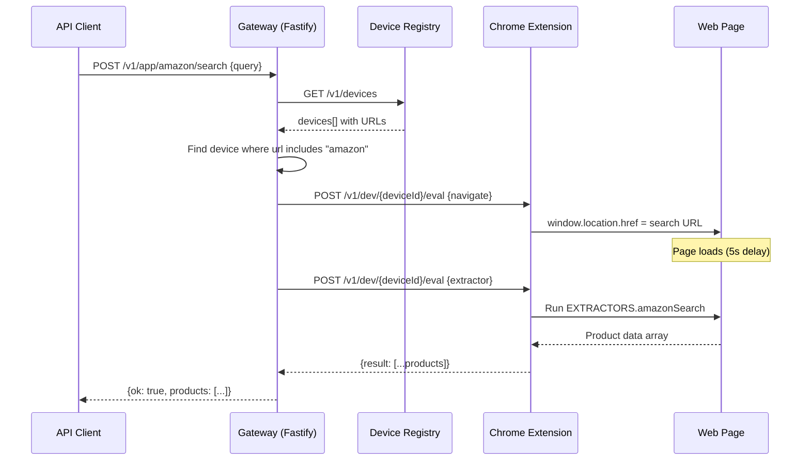
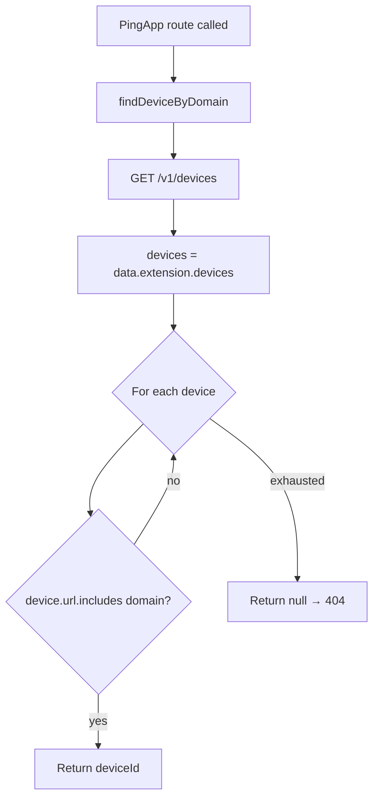

# PingApps — Deep Dive

A PingApp is a high-level orchestrator that wraps a live website tab into a structured API. Instead of callers knowing CSS selectors or page structure, they call named actions like `POST /v1/app/amazon/search { query: "laptop" }` and get back structured JSON.

**Source**: `packages/std/src/app-routes.ts` (814 lines)

## Table of Contents

- [What is a PingApp?](#what-is-a-pingapp)
- [Architecture](#architecture)
- [Anatomy of a PingApp Route](#anatomy-of-a-pingapp-route)
- [Core Infrastructure](#core-infrastructure)
- [Amazon Search Walkthrough](#amazon-search-walkthrough)
- [Claude Chat Walkthrough](#claude-chat-walkthrough)
- [All PingApp Endpoints](#all-pingapp-endpoints)
- [Tab Discovery](#tab-discovery)
- [Extractors](#extractors)
- [How to Create a New PingApp](#how-to-create-a-new-pingapp)

---

## What is a PingApp?

A PingApp is a "device driver" for a website. It:

1. **Finds** the right browser tab by URL pattern matching
2. **Navigates** to the correct page (search results, product detail, chat)
3. **Executes** device ops (eval, click, type, clean) via the Chrome extension bridge
4. **Parses** the results with inline JavaScript extractors
5. **Returns** structured data over HTTP

```mermaid
flowchart LR
    Client[API Client] -->|POST /v1/app/amazon/search| Gateway[Fastify Gateway]
    Gateway -->|findDeviceByDomain| Devices[Device Registry]
    Devices -->|deviceId| Gateway
    Gateway -->|deviceOp eval/click/type| Extension[Chrome Extension]
    Extension -->|Bridge Command| ContentScript[Content Script]
    ContentScript -->|DOM extraction| Page[Live Web Page]
    Page -->|Structured data| ContentScript
    ContentScript -->|JSON response| Extension
    Extension -->|Result| Gateway
    Gateway -->|{ ok: true, products: [...] }| Client
```

**Key principle**: PingApps don't use the extract engine directly. They inject their own JS extractors via `deviceOp('eval', { expression: ... })` for precise, site-specific parsing. The extract engine is for ad-hoc NL queries; PingApps are pre-built, reliable integrations.

---

## Architecture

### Route Registration

All PingApp routes are registered in a single function:

```typescript
export function registerAppRoutes(app: FastifyInstance, gatewayUrl: string)
```

This mounts routes on a Fastify instance using the pattern `/v1/app/:appName/:action`. The `gatewayUrl` is the base URL of the gateway server itself (used to call device ops via HTTP).

### Request Flow



### Constants

```typescript
const ROUTE_TIMEOUT_MS = 20_000;  // 20s timeout for all device ops
```

---

## Anatomy of a PingApp Route

Every PingApp route follows the same pattern:

```typescript
app.post('/v1/app/{appName}/{action}', async (req, reply) => {
  // 1. Validate input
  const { query } = req.body as any;
  if (!query) return reply.code(400).send({ ok: false, error: 'query required' });

  // 2. Find the target tab
  const deviceId = await findDeviceByDomain(gatewayUrl, 'amazon');
  if (!deviceId) return reply.code(404).send({ ok: false, error: 'No Amazon tab open' });

  // 3. Navigate to the right page
  await deviceOp(gatewayUrl, deviceId, 'eval', {
    expression: `window.location.href = "https://www.amazon.com/s?k=${encoded}"`
  });
  await delay(5000);  // Wait for page load

  // 4. Optional: clean the page (remove ads/clutter)
  await deviceOp(gatewayUrl, deviceId, 'clean', { mode: 'full' });

  // 5. Extract structured data
  const result = await deviceOp(gatewayUrl, deviceId, 'eval', {
    expression: EXTRACTORS.amazonSearch
  });

  // 6. Return structured response
  return { ok: true, action: 'search', query, products: result?.result || [], deviceId };
});
```

### Step-by-step:

| Step | What | How |
|------|------|-----|
| **Validate** | Check required fields | Manual `if (!field)` checks, 400 response |
| **Find tab** | Locate browser tab by domain | `findDeviceByDomain()` → scans `/v1/devices` |
| **Navigate** | Go to the right URL | `deviceOp('eval', { expression: 'window.location.href = ...' })` |
| **Wait** | Let the page load | `await delay(5000)` — fixed delays |
| **Clean** | Remove ads and clutter | `deviceOp('clean', { mode: 'full' })` |
| **Extract** | Run inline JS extractor | `deviceOp('eval', { expression: EXTRACTORS.xxx })` |
| **Return** | Wrap in `{ ok: true, ... }` | Direct return from route handler |

---

## Core Infrastructure

### `deviceOp()`

Calls a device operation on the Chrome extension bridge:

```typescript
async function deviceOp(
  gateway: string,
  deviceId: string,
  op: string,
  payload: any = {}
): Promise<any>
```

Makes a POST to `${gateway}/v1/dev/${deviceId}/${op}` with JSON body. All calls use `ROUTE_TIMEOUT_MS` (20s) via AbortController.

Supported ops: `eval`, `click`, `type`, `clean`, `recon`, `getUrl`, `upload`

### `findDeviceByDomain()`

Discovers the right browser tab:

```typescript
async function findDeviceByDomain(gateway: string, domain: string): Promise<string | null>
```

1. Fetches `GET /v1/devices` from the gateway
2. Reads `data.extension.devices[]`
3. Finds the first device whose `url` includes the given domain string
4. Returns `deviceId` or `null`

### `delay()`

Simple promise-based timeout for waiting on page loads:

```typescript
function delay(ms: number): Promise<void>
```

### `fetchJsonWithTimeout()`

HTTP fetch wrapper with AbortController timeout:

```typescript
async function fetchJsonWithTimeout(url: string, init?: RequestInit, timeoutMs = ROUTE_TIMEOUT_MS): Promise<any>
```

---

## Amazon Search Walkthrough

Let's trace every line of `POST /v1/app/amazon/search`:

```typescript
app.post('/v1/app/amazon/search', async (req, reply) => {
```

**1. Input validation:**
```typescript
const { query } = req.body as any;
if (!query) return reply.code(400).send({ ok: false, error: 'query required' });
```

**2. Find Amazon tab:**
```typescript
const deviceId = await findAmazonDevice(gatewayUrl);
// findAmazonDevice calls findDeviceByDomain(gateway, 'amazon')
if (!deviceId) return reply.code(404).send({ ok: false, error: 'No Amazon tab open' });
```

**3. Detect current Amazon domain** (supports .com, .ae, .co.uk, etc.):
```typescript
const encoded = encodeURIComponent(query);
const urlResult = await deviceOp(gatewayUrl, deviceId, 'getUrl', {});
const currentUrl = urlResult?.result || '';
const domainMatch = currentUrl.match(/https?:\/\/(www\.amazon\.[a-z.]+)/);
const amazonHost = domainMatch ? domainMatch[1] : 'www.amazon.com';
```

This is important — instead of hardcoding `amazon.com`, it reads the current tab URL to preserve the user's regional Amazon domain (amazon.ae, amazon.co.uk, etc.).

**4. Navigate to search:**
```typescript
await deviceOp(gatewayUrl, deviceId, 'eval', {
  expression: `window.location.href = "https://${amazonHost}/s?k=${encoded}"`
});
await delay(5000);
```

Note: **no `clean` step** for search results. The comment explains: "skip 'clean' for search results — fullCleanup strips price/rating elements." This was a hard-won lesson — the ad blocker was removing product data.

**5. Extract products:**
```typescript
const result = await deviceOp(gatewayUrl, deviceId, 'eval', {
  expression: EXTRACTORS.amazonSearch
});
```

The `amazonSearch` extractor:
- Queries `[data-component-type="s-search-result"][data-asin]` cards (with fallbacks)
- For each card, extracts: `asin`, `title` (brand + product name), `price` (with `cleanPrice` helper), `rating`, `reviews`, `img`, `prime` status
- Handles Amazon.ae's layout where brand is in `<h2>` and product name is in a separate link
- Returns up to 20 products

**6. Return:**
```typescript
return { ok: true, action: 'search', query, products: result?.result || [], deviceId };
```

---

## Claude Chat Walkthrough

Let's trace `POST /v1/app/claude/chat`:

```typescript
app.post('/v1/app/claude/chat', async (req, reply) => {
```

**1. Input validation:**
```typescript
const { message } = req.body as any;
if (!message) return reply.code(400).send({ ok: false, error: 'message required' });
```

**2. Find Claude tab:**
```typescript
const deviceId = await findClaudeDevice(gatewayUrl);
// findClaudeDevice calls findDeviceByDomain(gateway, 'claude.ai')
if (!deviceId) return reply.code(404).send({ ok: false, error: 'No Claude tab open' });
```

**3. Type the message into the chat input:**
```typescript
await deviceOp(gatewayUrl, deviceId, 'type', {
  selector: '[data-testid="chat-input"]',
  text: String(message),
  stealth: true,     // Human-like typing with jitter
  clear: true,       // Clear existing text first
});
```

**4. Click send (with Enter key fallback):**
```typescript
const sendResult = await deviceOp(gatewayUrl, deviceId, 'click', {
  selector: 'button[aria-label="Send message"]',
  stealth: true,
});

if (!sendResult?.ok) {
  // Fallback: dispatch Enter keydown event on the input box
  await deviceOp(gatewayUrl, deviceId, 'eval', {
    expression: `(() => {
      const box = document.querySelector('[data-testid="chat-input"]') ||
                  document.querySelector('[data-testid="chat-input-ssr"]');
      if (!box) return 'no-input';
      const evt = new KeyboardEvent('keydown', {
        key: 'Enter', code: 'Enter', bubbles: true, cancelable: true
      });
      box.dispatchEvent(evt);
      return 'enter-dispatched';
    })()`
  });
}
```

This two-step approach handles cases where the send button selector changes or isn't clickable.

**5. Wait and return:**
```typescript
await delay(3000);
return { ok: true, action: 'chat', sent: String(message) };
```

Note: This only confirms the message was *sent*, not that a response was received. Use `GET /v1/app/claude/chat/read` to read the response.

---

## All PingApp Endpoints

### AliExpress

| Method | Endpoint | Body | Description |
|--------|----------|------|-------------|
| POST | `/v1/app/aliexpress/search` | `{ query }` | Search products, returns up to 20 results |
| POST | `/v1/app/aliexpress/product` | `{ id }` | Get product details by product ID |
| POST | `/v1/app/aliexpress/cart/add` | — | Add current product to cart |
| POST | `/v1/app/aliexpress/cart/remove` | `{ index? }` | Remove nth item from cart (default 0) |
| GET | `/v1/app/aliexpress/cart` | — | View cart contents |
| GET | `/v1/app/aliexpress/orders` | — | List recent orders |
| GET | `/v1/app/aliexpress/orders/:orderId` | — | Track specific order |
| GET | `/v1/app/aliexpress/wishlist` | — | View wishlist |
| POST | `/v1/app/aliexpress/clean` | — | Remove ads/clutter |
| GET | `/v1/app/aliexpress/recon` | — | Page reconnaissance |

**Special behavior**: Sets USD locale cookies before navigation via `setAliExpressLocale()`.

### Amazon

| Method | Endpoint | Body | Description |
|--------|----------|------|-------------|
| POST | `/v1/app/amazon/search` | `{ query }` | Search products, auto-detects regional domain |
| POST | `/v1/app/amazon/product` | `{ asin }` | Get product details by ASIN |
| POST | `/v1/app/amazon/cart/add` | — | Click "Add to Cart" button |
| GET | `/v1/app/amazon/cart` | — | View cart contents |
| GET | `/v1/app/amazon/orders` | — | View order history |
| GET | `/v1/app/amazon/deals` | — | View current deals |
| POST | `/v1/app/amazon/clean` | — | Remove ads/clutter |
| GET | `/v1/app/amazon/recon` | — | Page reconnaissance |

**Special behavior**: Auto-detects current Amazon domain (amazon.com, amazon.ae, etc.) from the open tab URL. Skips `clean` on search results to preserve price/rating elements.

### Claude

| Method | Endpoint | Body | Description |
|--------|----------|------|-------------|
| POST | `/v1/app/claude/chat` | `{ message }` | Send a chat message |
| POST | `/v1/app/claude/chat/new` | — | Start a new conversation |
| GET | `/v1/app/claude/chat/read` | — | Read the last assistant response |
| GET | `/v1/app/claude/conversations` | — | List recent conversations |
| POST | `/v1/app/claude/conversation` | `{ id }` | Open a specific conversation |
| GET | `/v1/app/claude/model` | — | Get current model name |
| POST | `/v1/app/claude/model` | `{ model }` | Switch model (e.g., "opus", "sonnet") |
| GET | `/v1/app/claude/projects` | — | List projects |
| POST | `/v1/app/claude/project` | `{ id }` | Open a specific project |
| GET | `/v1/app/claude/artifacts` | — | List artifacts |
| POST | `/v1/app/claude/upload` | `{ filePath }` | Upload a file to the conversation |
| GET | `/v1/app/claude/search` | `?query=` | Search conversations by keyword |
| POST | `/v1/app/claude/clean` | — | Remove clutter (minimal mode) |
| GET | `/v1/app/claude/recon` | — | Page reconnaissance |

**Special behaviors**:
- Chat uses stealth typing with human-like jitter
- Send button click has Enter key fallback
- Model switching opens dropdown then clicks matching option
- Search navigates to `claude.ai/search?q=` and filters results

### Discovery

| Method | Endpoint | Description |
|--------|----------|-------------|
| GET | `/v1/apps` | Lists all registered apps with their available actions |

---

## Tab Discovery

PingApps find their target browser tab through domain-based matching:



Each app has a dedicated finder:

```typescript
function findDevice(gateway: string)       // AliExpress → 'aliexpress'
function findAmazonDevice(gateway: string)  // Amazon → 'amazon'
function findClaudeDevice(gateway: string)  // Claude → 'claude.ai'
```

**Limitation**: Only the **first** matching tab is used. If you have multiple Amazon tabs open, the PingApp uses whichever one the device registry returns first.

---

## Extractors

PingApps use inline JavaScript extractors — IIFEs that run in the page context via `deviceOp('eval', ...)`. They're defined in the `EXTRACTORS` object:

| Extractor | Used by | What it extracts |
|-----------|---------|-----------------|
| `searchResults` | AliExpress search | Product cards with id, title, price, rating, sold count, image |
| `productDetails` | AliExpress product | Title, prices, rating, reviews, store, shipping, variants |
| `cartItems` | AliExpress cart | Cart items with title, price, quantity, store, total |
| `amazonSearch` | Amazon search | Product cards with ASIN, title, price, rating, reviews, prime status |
| `amazonProduct` | Amazon product | Full product details including features, images, availability |
| `claudeResponse` | Claude chat read | Last assistant message text (up to 5000 chars) |
| `claudeConversations` | Claude conversations | List of {title, url, id} from sidebar links |
| `claudeModel` | Claude model | Current model name from selector dropdown |
| `claudeProjects` | Claude projects | List of {title, url, id} from project links |
| `claudeArtifacts` | Claude artifacts | List of {title, url, id} from artifact links |
| `orders` | AliExpress orders | Parsed order blocks with ID, date, total, status |

Each extractor is a self-contained IIFE string — no imports, no dependencies. This is intentional: they execute in the page's JavaScript context via eval, so they can't reference content script variables.

---

## How to Create a New PingApp

### Step 1: Add a device finder

```typescript
function findMyAppDevice(gateway: string): Promise<string | null> {
  return findDeviceByDomain(gateway, 'myapp.com');
}
```

### Step 2: Define extractors

Add inline IIFE strings to the `EXTRACTORS` object:

```typescript
const EXTRACTORS = {
  // ...existing extractors...

  myAppSearch: `(() => {
    const items = [];
    document.querySelectorAll('.result-card').forEach(card => {
      const title = card.querySelector('h3')?.textContent?.trim() || '';
      const url = card.querySelector('a')?.href || '';
      if (title) items.push({ title, url });
    });
    return items.slice(0, 20);
  })()`,
};
```

**Rules for extractors**:
- Must be a single IIFE string (no imports)
- Use vanilla DOM APIs only
- Limit results (usually 20 items)
- Truncate strings to prevent bloated responses
- Handle missing elements gracefully with `|| ''`

### Step 3: Register routes

Inside `registerAppRoutes()`:

```typescript
// POST /v1/app/myapp/search { query }
app.post('/v1/app/myapp/search', async (req, reply) => {
  const { query } = req.body as any;
  if (!query) return reply.code(400).send({ ok: false, error: 'query required' });

  const deviceId = await findMyAppDevice(gatewayUrl);
  if (!deviceId) return reply.code(404).send({ ok: false, error: 'No MyApp tab open' });

  const encoded = encodeURIComponent(query);
  await deviceOp(gatewayUrl, deviceId, 'eval', {
    expression: `window.location.href = "https://myapp.com/search?q=${encoded}"`
  });
  await delay(5000);

  const result = await deviceOp(gatewayUrl, deviceId, 'eval', {
    expression: EXTRACTORS.myAppSearch
  });

  return { ok: true, action: 'search', query, results: result?.result || [], deviceId };
});
```

### Step 4: Register in the app list

Add your app to the `GET /v1/apps` response:

```typescript
{
  name: 'myapp',
  displayName: 'MyApp',
  version: '0.1.0',
  actions: [
    'POST /v1/app/myapp/search { query }',
    // ...
  ],
}
```

### Step 5: Handle site-specific quirks

Common patterns to handle:
- **Locale/cookie setup**: Like AliExpress's `setAliExpressLocale()` — set cookies before navigation
- **Domain detection**: Like Amazon's domain auto-detection — read current URL to stay on the right regional site
- **Skip clean on data pages**: If `fullCleanup()` removes data you need (prices, ratings), skip the clean step
- **Fallback interactions**: Like Claude's Enter-key fallback when the send button isn't clickable
- **Stealth mode**: Use `stealth: true` on click/type ops for sites with bot detection

---

## PingApp Generator (from Recordings)

PingApps can be auto-generated from browser recordings. Record a workflow, then generate a complete PingApp definition with one API call.

### Flow

```
Record → Export → Generate → PingApp files
```

1. **Record**: Start recording on a device, interact with the page, stop recording
2. **Export**: Export the recording via `POST /v1/record/export`
3. **Generate**: Pass the recording to `POST /v1/recordings/generate`
4. **Result**: Get a complete PingApp with manifest, workflow, selectors, and test

### API

```bash
# Step 1: Record
curl -X POST http://localhost:3500/v1/record/start -H "Content-Type: application/json" -d '{"device": "chrome-111"}'
# ... interact with the page ...
curl -X POST http://localhost:3500/v1/record/stop -H "Content-Type: application/json" -d '{"device": "chrome-111"}'
curl -X POST http://localhost:3500/v1/record/export -H "Content-Type: application/json" -d '{"device": "chrome-111"}'

# Step 2: Generate PingApp from recording
curl -X POST http://localhost:3500/v1/recordings/generate \
  -H "Content-Type: application/json" \
  -d '{"recording": {...exported recording...}, "name": "my-app"}'
```

### Generated Output

| File | Content |
|------|---------|
| `manifest.json` | Site metadata: name, URL, version, action count |
| `workflows/{name}.json` | Ordered workflow steps with op, selector, description |
| `selectors.json` | Selector entries with primary, fallbacks, and confidence scores |
| `tests/test_{name}.json` | Smoke test replaying the first 5 click/type actions |

### Selector Confidence

Generated selectors are scored by reliability:

| Pattern | Confidence |
|---------|------------|
| `#id` or `[id=...]` | 0.90 |
| `[data-testid=...]` | 0.85 |
| `[aria-label=...]` | 0.80 |
| `[name=...]` | 0.75 |
| Other CSS | 0.50 |

See [ARCHITECTURE.md — PingApp Generator](ARCHITECTURE.md#pingapp-generator) for implementation details.

---

## Tab-as-a-Function: PingApp Actions

The Function Registry (`GET /v1/functions`) auto-exposes PingApp actions as callable functions when a matching tab is open. For example, when an Amazon tab is shared, these functions become available:

```bash
# List all available functions
curl -s http://localhost:3500/v1/functions | jq '.functions[].name'
# "amazon.extract", "amazon.click", "amazon.type", "amazon.read", "amazon.eval", "amazon.discover"
# "amazon.search", "amazon.product", "amazon.cart_add", ...

# Call a PingApp-specific function
curl -X POST http://localhost:3500/v1/functions/amazon/call \
  -H "Content-Type: application/json" \
  -d '{"function": "search", "params": {"query": "laptop"}}'
```

See [ARCHITECTURE.md — Function Registry](ARCHITECTURE.md#function-registry-tab-as-a-function) and [API.md — Tab-as-a-Function](API.md#10-tab-as-a-function) for details.
